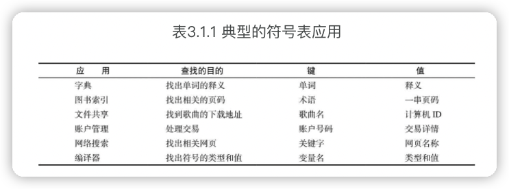

《算法（第4版）》笔记
---

在计算机领域，算法是一个永恒的主题。

算法并不仅仅是计算的方法，探究算法的过程反映出的是我们对这个世界的认知方法：是唯唯诺诺地将课本当做圣经，还是通过“实验——失败——再实验”循环的锤炼？数学是保证，数据是验证。

所有的算法都是先有API，再有实现，之后是证明，最后是数据。这种先接口后实现、强调测试的做法，无疑是在工作中摸爬滚打多年的程序员最熟悉的。

# 前言

算法和数据结构的学习是所有计算机科学教学计划的基础。

> 从物理中的N体模拟问题到分子生物学中的基因序列问题，我们描述的基本方法对科学研究而言已经必不可少；从建筑建模系统到模拟飞行器，这些算法已经成为工程领域极其重要的工具；从数据库系统到互联网搜索引擎，算法已成为现代软件系统中不可或缺的一部分。

配套网站：[algs4.cs.princeton.edu](https://algs4.cs.princeton.edu/)

# 1 基础

和算法关系最紧密的是数据结构，即便于算法操作的组织数据的方法。

数据抽象并定义抽象数据类型（ADT）以进行模块化编程。

性能是算法研究的一个核心问题。

在计算机科学领域，我们用算法这个词来描述一种有限、确定、有效的并适合用计算机程序来实现的解决问题的方法。

每种算法都是适合于在任何计算机上用任何编程语言实现的方法。

数据结构是算法的副产品或是结果，因此要理解算法必须学习数据结构。

对于大型问题（或者是需要解决大量小型问题的应用），我们就需要设计能够有效利用时间和空间的方法了。

学习算法的主要原因是它们能节约非常多的资源，甚至能够让我们完成一些本不可能完成的任务。

在编写庞大或者复杂的程序时，理解和定义问题、控制问题的复杂度和将其分解为更容易解决的子问题需要大量的工作。

实现这些基础算法的简化版本有助于我们更好地理解、使用和优化它们在库中的高级版本。

为一项任务选择最合适的算法是困难的，这可能会需要复杂的数学分析。**算法分析**

## 1.1 基础编程模型

把描**述和实现算法所用到的语言特性、软件库和操作系统特性**总称为**基础编程模型**。

### 1.1.1 Java程序的基本结构

### 1.1.2 原始数据类型与表达式

### 1.1.3 语句

### 1.1.4 简便记法

### 1.1.5 数组

### 1.1.6 静态方法

在许多语言中，静态方法被称为函数，因为它们和数学函数的性质类似。

### 1.1.7 API

### 1.1.8 字符串

### 1.1.9 输入输出

### 1.1.10 二分查找

## 1.2 数据抽象

数据类型指的是一组值和一组对这些值的操作的集合。

Java编程的基础主要是使用class关键字构造被称为引用类型的数据类型。

抽象数据类型（ADT）是一种能够对使用者隐藏数据表示的数据类型。

### 1.2.1 使用抽象数据类型

### 1.2.2 抽象数据类型举例

#### 几何对象

#### 信息处理

#### 字符串

#### 再谈输入输出

### 1.2.3 抽象数据类型的实现

### 1.2.4 更多抽象数据类型的实现

### 1.2.5 数据类型的设计

## 1.3 背包、队列和栈

## 1.4 算法分析

## 1.5 案例研究：union-find算法

# 2 排序

## 2.1 初级排序算法

### 2.1.1 游戏规则

### 2.1.2 选择排序

### 2.1.3 插入排序

### 2.1.4 排序算法的可视化

### 2.1.5 比较两种排序算法

### 2.1.6 希尔排序

## 2.2 归并排序

## 2.3 快速排序

## 2.4 优先队列

## 2.5 应用

### 2.5.1 将各种数据排序

#### 交易事务

#### 指针排序

#### 不可变的键

#### 廉价的交换

#### 多种排序方法

#### 多键数组

#### 使用比较器实现优先队列

#### 稳定性

### 2.5.2 我应该使用哪种排序算法

### 2.5.3 问题的归约

#### 找出重复元素

#### 排名

#### 优先队列

#### 中位数与顺序统计

### 2.5.4 排序应用一览

#### 商业计算

#### 信息搜索

#### 运筹学

#### 事件驱动模拟

#### 数值计算

#### 组合搜索

# 3 查找

## 3.1 符号表

符号表最主要的目的就是将一个键和一个值联系起来。

符号表是一种存储键值对的数据结构，支持两种操作：插入（put），即将一组新的键值对存入表中；查找（get），即根据给定的键得到相应的值。

### 3.1.1 API

### 3.1.2 有序符号表

#### 最大键和最小键

#### 向下取整和向上取整

#### 排名和选择

#### 范围查找

#### 例外情况

#### 便捷方法

#### （再谈）键的等价性

#### 成本模型

### 3.1.3 用例举例

#### 行为测试用例

#### 性能测试用例

### 3.1.4 无序链表中的顺序查找

### 3.1.5 有序数组中的二分查找

### 3.1.6 对二分查找的分析

## 3.2 二叉查找树

## 3.3 平衡查找树

### 3.3.1 2-3查找树

### 3.3.2 红黑二叉查找树

## 3.4 散列表

### 3.4.1 散列函数

### 3.4.2 基于拉链法的散列表

### 3.4.3 基于线性探测法的散列表

### 3.4.4 调整数组大小

## 3.5 应用

# 4 图

整个互联网就是一张图，结点是网页，连接就是超链接。图算法是帮助我们在网络上定位信息的搜索引擎的关键组件。

图的典型应用

| 应用       | 结点     | 连接     |
| ---------- | -------- | -------- |
| 地图       | 十字路口 | 公路     |
| 网络内容   | 网页     | 超链接   |
| 电路       | 元器件   | 导线     |
| 任务调度   | 任务     | 限制条件 |
| 商业交易   | 客户     | 交易     |
| 配对       | 学生     | 申请     |
| 计算机网络 | 网站     | 物理连接 |
| 软件       | 方法     | 调用关系 |
| 社交网络   | 人       | 友谊关系 |

4种最重要的图模型：无向图（简单连接）、有向图（连接有方向性）、加权图（连接带有权值）和加权有向图（连接既有方向性又带有权值）。

## 4.1 无向图

### 4.1.2 表示无向图的数据类型

### 4.1.3 深度优先搜索

### 4.1.4 寻找路径

### 4.1.5 广度优先搜索

### 4.1.6 连通分量

### 4.1.7 符号图

## 4.2 有向图

### 4.2.2 有向图的数据类型

### 4.2.3 有向图中的可达性

### 4.2.4 环和有向无环图

### 4.2.5 有向图中的强连通性

## 4.3 最小生成树

### 4.3.2 加权无向图的数据类型

### 4.3.3 最小生成树的API和测试用例

### 4.3.4 Prim算法

### 4.3.5 Prim算法的即时实现

### 4.3.6 Kruskal算法

## 4.4 最短路径

# 5 字符串

## 5.1 字符串排序

第一类方法会从右到左检查键中的字符。这种方法一般被称为低位优先（Least-Significant-Digit First, LSD）的字符串排序。

第二类方法会从左到右检查键中的字符，首先查看的是最高位的字符。这些方法通常称为高位优先（MSD）的字符串排序。

### 5.1.1 键索引计数法

#### 频率统计

#### 将频率转换为索引

#### 数据分类

#### 回写

### 5.1.2 低位优先的字符串排序

### 5.1.3 高位优先的字符串排序

#### 对字符串末尾的约定

#### 指定的字母表

#### 小型子数组

#### 等值键

#### 额外空间

#### 随机字符串模型

#### 性能

### 5.1.4 三向字符串快速排序

#### 小型子数组

#### 有限的字母表

#### 随机化

#### 性能

#### 举例：网站日志

### 5.1.5 字符串排序算法的选择

## 5.2 单词查找树

## 5.3 子字符串查找

### 5.3.2 暴力子字符串查找算法

### 5.3.3 Knuth-Morris-Pratt子字符串查找算法

### 5.3.4 Boyer-Moore字符串查找算法

### 5.3.5 Rabin-Karp指纹字符串查找算法

## 5.4 正则表达式

## 5.5 数据压缩

# 6 背景

20世纪是方程的世纪，但21世纪是算法的世纪。

商业应用

- 基础设施（操作系统、数据库、通信）；
- 应用程序（电子邮件、文档处理、数码照片）；
- 出版（书籍、杂志、网络内容）；
- 网络（无线网络、社交网络、互联网）；
- 交易处理（金融、零售、网络搜索）

科学计算

- 数学计算（多项式、矩阵、微分方程）；
- 数据处理（实验结果和观测资料，特别是基因组学）；
- 计算模型和模拟。

工程学

现代工程学的基础是技术，而现代技术的基础是计算机。

- 计算机辅助设计和生产；
- 基于算法的工程设计（网络、控制系统）；
- 图像和其他医学系统。

运筹学

- 任务调度；
- 决策；
- 资源分配。

计算机科学

- 计算几何；
- 密码学；
- 数据库；
- 编程语言与系统；
- 人工智能。

## 6.0.1 事件驱动模拟

### 刚性球体模型

### 时间驱动模拟

### 事件驱动模拟

### 碰撞预测

### 碰撞计算

### 排除无效事件

### 粒子

### 事件

### 模拟器代码

## 6.0.2 B-树

## 6.0.3 后缀数组

## 6.0.4 网络流算法

## 6.0.5 问题归约

## 6.0.6 不可解性
