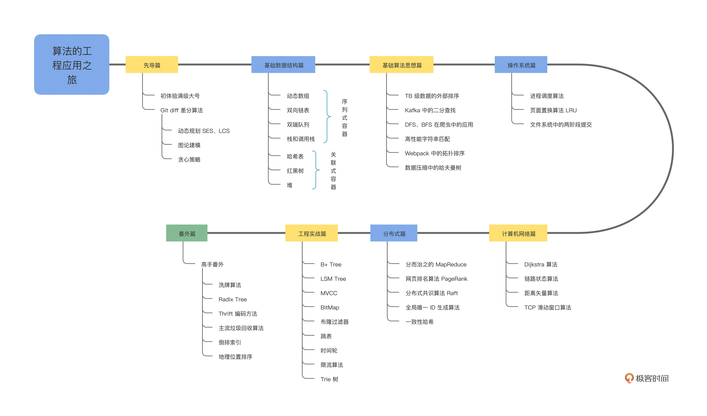

业务开发算法50讲
---

https://time.geekbang.org/column/intro/100100901  2021

# 开篇

开篇词｜真实世界的算法，和你想的不一样

先导篇｜诶，这个 git diff 好像不是很直观？

# 基础数据结构篇

01｜动态数组：按需分配的vector为什么要二倍扩容？

02｜双向链表：list如何实现高效地插入与删除？

03｜双端队列：并行计算中的工作窃取算法如何实现？

04｜栈：函数调用的秘密究竟是什么？

05｜HashMap：一个优秀的散列表是怎么来的？

06｜TreeMap：红黑树真的有那么难吗？

07｜堆：如何实现一个高效的优先队列？

# 基础算法篇

08｜外部排序：如何为TB级数据排序？

09｜二分：如何高效查询Kafka中的消息？

10｜搜索算法： 一起来写一个简单的爬虫？

11｜字符串匹配：如何实现最快的grep工具

12｜拓扑排序：Webpack是如何确定构建顺序的？

13｜哈夫曼树：HTTP2.0是如何更快传输协议头的？

# 操作系统篇

14｜调度算法：操作系统中的进程是如何调度的？

15｜LRU：在虚拟内存中页面是如何置换的？

16｜日志型文件系统：写入文件的时候断电了会发生什么？

# 计算机网络篇

17｜选路算法：Dijkstra是如何解决最短路问题的？

18｜选路算法：链路状态算法是如何分发全局信息的

19｜选路算法：距离矢量算法为什么会产生无穷计算问题？

20｜滑动窗口：TCP是如何进行流量控制和拥塞控制的？

# 分布式篇

21｜分而治之：MapReduce如何解决大规模分布式计算问题

22｜PageRank：谷歌是如何计算网页排名的

23｜Raft：分布式系统间如何达成共识？

24｜UUID：如何高效生成全局的唯一ID？

25｜一致性哈希：如何在集群上合理分配流量？

# 工程实战篇

26｜B+ Tree：PostgreSQL 的索引是如何建立的？

27｜LSM Tree：LevelDB的索引是如何建立的？

28｜MVCC：如何突破数据库并发读写性能瓶颈？

29｜位图：如何用更少空间对大量数据进行去重和排序？

30｜布隆过滤器：如何解决Redis缓存穿透问题？

31｜跳表：Redis是如何存储有序集合的？

32｜时间轮：Kafka是如何实现定时任务的？

33｜限流算法：如何防止系统过载？

34｜前缀树：Web框架中如何实现路由匹配？

# 高手番外篇

35｜洗牌算法：随机的哲学，如何用程序来洗一副牌？

36｜分布式事务：如何理解两阶段提交？

37｜Thrift编码方法：为什么RPC往往不采用JSON作为网络传输格式？

38｜倒排索引：搜索引擎是如何做全文检索的？

39｜Geohash：点外卖时我们是如何查找到附近餐厅的？

40｜垃圾回收：现代语言是如何自动管理回收内存的？

