hello-algo笔记
---

https://www.hello-algo.com/

go

## 0 前言


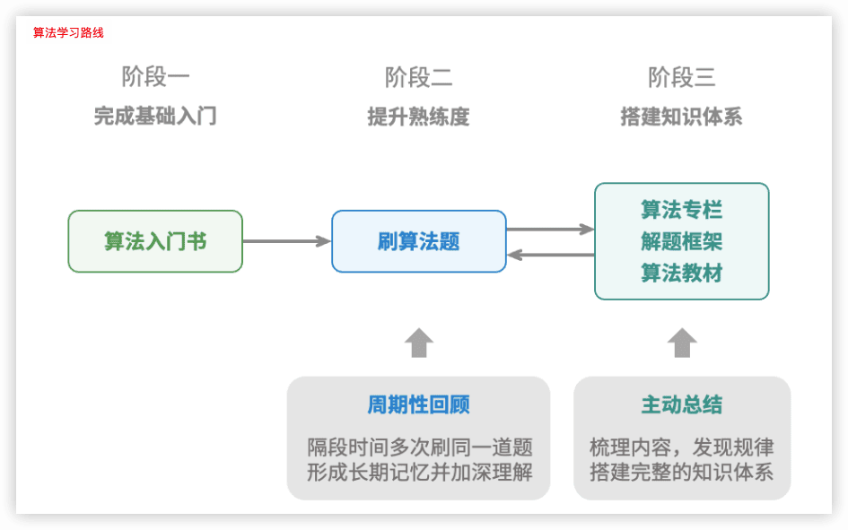

## 1 初识算法

### 1.1 算法无处不在

- 例一:查字典 。 “二分查找”

- 例二:整理扑克。 “插入排序”


- 例三:货币找零。 贪心”算法


小到烹饪一道菜，大到星际航行，几乎所有问题的解决都离不开算法。计算机的出现使得我们能够通过**编程**将**数据结构**存储在内存中，同时编写代码调用 CPU 和 GPU **执行**算法。这样一来，我们就能**把生活中的问题转移到计算机上**，以更高效的方式解决各种复杂问题。

### 1.2 算法是什么

#### 算法定义

「**算法 algorithm**」是在有限时间内解决特定问题的一组指令或操作步骤，它具有以下特性。

- 问题是**明确**的，包含清晰的输入和输出定义。  
- 具有**可行性**，能够在有限步骤、时间和内存空间下完成。  
- 各步骤都有**确定的含义**，在相同的输入和运行条件下，输出始终相同。

#### 数据结构定义

「**数据结构 data structure**」是计算机中**组织和存储**数据的方式，具有以下设计目标。 

- **空间**占用尽量少，以节省计算机内存。
- 数据**操作**尽可能快速，涵盖数据访问、添加、删除、更新等。 
- 提供简洁的**数据表示**和**逻辑信息**，以便算法高效运行。

数据结构设计是一个充满**权衡**的过程。如果想在某方面取得提升，往往需要在另一方面作出妥协。例如：

- 链表相较于数组，在数据添加和删除操作上更加便捷，但牺牲了数据访问速度。 
- 图相较于链表，提供了更丰富的逻辑信息，但需要占用更大的内存空间。

#### 数据结构与算法的关系

数据结构与算法高度相关、紧密结合，具体表现：

- 数据结构是算法的基石。数据结构为算法提供了**结构化存储的数据**，以及**操作数据的方法**。  
- 算法是数据结构发挥作用的舞台。数据结构本身仅存储数据信息，结合算法才能解决特定问题。 
- 算法通常可以基于不同的数据结构实现，但执行效率可能相差很大，选择合适的数据结构是关键。
  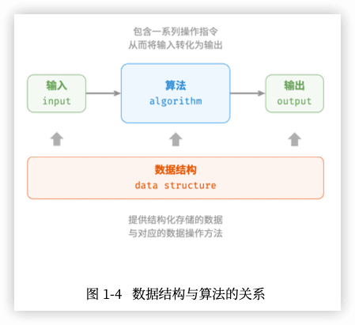

数据结构与算法犹如拼装积木。一套积木，除了包含许多零件之外，还附有详细的组装说明书。 我们按照说明书一步步操作，就能组装出精美的积木模型。

| 数据结构与算法 | 拼装积木                                 |
| -------------- | ---------------------------------------- |
| 输入数据       | 未拼装的积木                             |
| 数据结构       | 积木组织形式，包括形状、大小、连接方式等 |
| 算法           | 把积木拼成目标形态的一系列操作步骤       |
| 输出数据       | 积木模型                                 |

> 数据结构与算法是独立于编程语言的。
> 通常会将“数据结构与算法”简称为“算法”。

## 2 复杂度分析

> 复杂度分析犹如浩瀚的算法宇宙中的时空向导。它带领我们在时间与空间这两个维度上深入探索，寻找更优雅的解决方案。

### 2.1 算法效率评估

算法设计中两个层面的目标:

1. **找到问题解法**:算法需要在规定的输入范围内可靠地求得问题的正确解。
2. **寻求最优解法**:同一个问题可能存在多种解法，我们希望找到尽可能高效的算法。

也就是说，在能够解决问题的前提下，**算法效率**已成为衡量算法优劣的主要评价指标，它包括以下两个维度：

- 时间效率:算法运行速度的快慢。
- 空间效率:算法占用内存空间的大小。

既快又省

#### 实际测试

- 难以排除测试环境的干扰因素
- 展开完整测试非常耗费资源

#### 理论估算

「渐近复杂度分析 asymptotic complexity analysis」，简称「复杂度分析」

复杂度分析能够体现算法运行所需的时间和空间资源与输入数据大小之间的关系。它描述了随着**输入数据**大小的增加，算法执行所需时间和空间的**增长趋势**。三个重点理解：

- “时间和空间资源”分别对应「时间复杂度 time complexity」和「空间复杂度 space complexity」。 
- “随着输入数据大小的增加”意味着复杂度反映了算法运行效率与输入数据体量之间的关系。 
- “时间和空间的增长趋势”表示复杂度分析关注的不是运行时间或占用空间的具体值，而是时间或空间增长的“快慢”。

### 2.2 迭代与递归

重复执行某个任务是很常见的，它与复杂度分析息息相关。

如何在程序中实现重复执行任务，即两种基本的程序控制结构:迭代、递归。

#### 迭代

「**迭代 iteration**」是一种重复执行某个任务的控制结构。在迭代中，程序会在满足一定的条件下重复执行某 段代码，直到这个条件不再满足。

1. for 循环 适合在预先知道迭代次数时使用。
2. while 循环 while 循环比 for 循环的自由度更高。在 while 循环中，我们可以自由地设计条件变量的初始化和更新步 骤。
3. 嵌套循环1

```go

```


#### 递归

「递归 recursion」是一种算法策略，通过函数调用自身来解决问题。它主要包含两个阶段。 

1. **递**:程序不断深入地调用自身，通常传入更小或更简化的参数，直到达到“终止条件”。
2. **归**:触发“终止条件”后，程序从最深层的递归函数开始逐层返回，汇聚每一层的结果。

从实现的角度看，递归代码主要包含三个要素。

1. **终止条件**:用于决定什么时候由“递”转“归”。  
2. **递归调用**:对应“递”，函数调用自身，通常输入更小或更简化的参数。 
3. **返回结果**:对应“归”，将当前递归层级的结果返回至上一层。

1

```

```


虽然从计算角度看，迭代与递归可以得到相同的结果，但它们代表了两种完全不同的**思考和解决问题的范式**。

- 迭代:“**自下而上**”地解决问题。从最基础的步骤开始，然后不断重复或累加这些步骤，直到任务完成。
- 递归:“**自上而下**”地解决问题。将原问题分解为更小的子问题，这些子问题和原问题具有相同的形式。接下来将子问题继续分解为更小的子问题，直到基本情况时停止(基本情况的解是已知的)。

以上述求和函数为例，设问题 𝑓(𝑛) = 1 + 2 + ⋯ + 𝑛 。

- 迭代:在循环中模拟求和过程，从1遍历到𝑛，每轮执行求和操作，即可求得𝑓(𝑛)。
- 递归:将问题分解为子问题𝑓(𝑛)=𝑛+𝑓(𝑛−1)，不断(递归地)分解下去，直至基本情况𝑓(1)=1时终止。

##### 1 调用栈

递归函数每次调用自身时，系统都会为新开启的函数分配内存，以存储局部变量、调用地址和其他信息等。

这将导致两方面的结果：

- 函数的上下文数据都存储在称为“**栈帧空间**”的内存区域中，直至函数返回后才会被释放。因此，递归通常比迭代更加耗费内存空间。
- 递归调用函数会产生额外的开销。因此递归通常比循环的时间效率更低。  在触发终止条件前，同时存在 𝑛 个未返回的递归函数，**递归深度**为𝑛。

在实际中，编程语言允许的递归深度通常是有限的，过深的递归可能导致栈溢出错误。

##### 2 尾递归 🔖

**如果函数在返回前的最后一步才进行递归调用**，则该函数可以被编译器或解释器优化，使其在空间效率上与迭代相当。这种情况被称为「**尾递归 tail recursion**」。

- 普通递归:当函数返回到上一层级的函数后，需要继续执行代码，因此系统需要保存上一层调用的上下文。
- 尾递归:递归调用是函数返回前的最后一个操作，这意味着函数返回到上一层级后，无须继续执行其他操作，因此系统无须保存上一层函数的上下文。

以求和为例，可以将结果变量 res 设为函数参数，从而实现尾递归:


```go

```

如图 2‐5 所示。对比普通递归和尾递归，两者的求和操作的执行点是不同的。

- 普通递归:求和操作是在“归”的过程中执行的，每层返回后都要再执行一次求和操作。
- 尾递归:求和操作是在“递”的过程中执行的，“归”的过程只需层层返回。 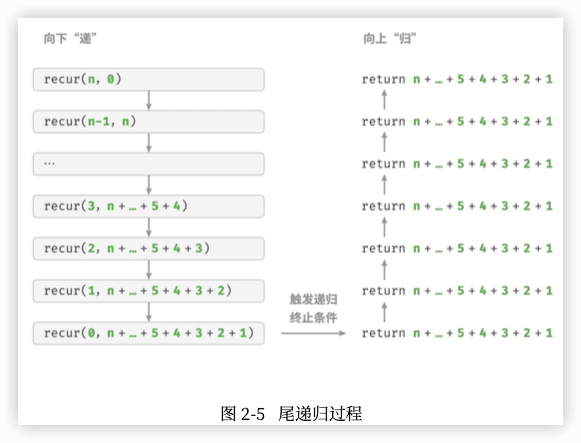

> 请注意，许多编译器或解释器并不支持尾递归优化。例如，Python默认不支持尾递归优化， 因此即使函数是尾递归形式，仍然可能会遇到栈溢出问题。

##### 3 递归树

当处理与“分治”相关的算法问题时，递归往往比迭代的思路更加直观、代码更加易读。

以“斐波那契数列” 为例。

- 数列的前两个数字为𝑓(1)=0和𝑓(2)=1。
- 数列中的每个数字是前两个数字的和，即 𝑓(𝑛) = 𝑓(𝑛 − 1) + 𝑓(𝑛 − 2) 。

按照递推关系进行递归调用，将前两个数字作为终止条件，便可写出递归代码。调用 fib(n) 即可得到斐波那 契数列的第 𝑛 个数字:

```go

```

在函数内递归调用了两个函数，这意味着**从一个调用产生了两个调用分支**。这样不断递归调用下去，最终将产生一棵层数为 𝑛 的「**递归树 recursion tree**」。 

从本质上看，递归体现了“将问题分解为更小子问题”的思维范式，这种**分治策略**至关重要。

- 从算法角度看，搜索、排序、回溯、分治、动态规划等许多重要算法策略直接或间接地应用了这种思维方式。
- 从数据结构角度看，递归天然适合处理链表、树和图的相关问题，因为它们非常适合用分治思想进行分析。

#### 两者对比

迭代和递归在实现、性能和适用性上有所不同。

|          | 迭代                                   | 递归                                                         |
| -------- | -------------------------------------- | ------------------------------------------------------------ |
| 实现方式 | 循环结构                               | 函数调用自身                                                 |
| 时间效率 | 效率通常较高，无函数调用开销           | 每次函数调用都会产生开销                                     |
| 内存使用 | 通常使用固定大小的内存空间             | 累积函数调用可能使用大量的栈帧空间                           |
| 适用问题 | 适用于简单循环任务，代码直观、可读性好 | 适用于子问题分解，如树、图、分治、回溯等，代码结构简洁、清晰 |

> 迭代和递归具有什么内在联系呢?

以上述递归函数为例，求和操作在递归的“归”阶段进行。这意味着最初被调用的函数实际上是最后完成其求和操作的，**这种工作机制与栈的“先入后出”原则异曲同工**。

事实上，“调用栈”和“栈帧空间”这类递归术语已经暗示了递归与栈之间的密切关系。

1. **递**:当函数被调用时，系统会在“调用栈”上为该函数分配新的栈帧，用于存储函数的局部变量、参数、 返回地址等数据。
2. **归**:当函数完成执行并返回时，对应的栈帧会被从“调用栈”上移除，恢复之前函数的执行环境。

因此，可以使用一个**显式的栈来模拟调用栈的行为**，从而将递归转化为迭代形式: 🔖


```go

```

观察以上代码，当递归转化为迭代后，代码变得更加复杂了。尽管迭代和递归在很多情况下可以互相转化， 但不一定值得这样做，有以下两点原因。

- 转化后的代码可能更加难以理解，可读性更差。  
- 对于某些复杂问题，模拟系统调用栈的行为可能非常困难。

总之，**选择迭代还是递归取决于特定问题的性质**。在编程实践中，**权衡**两者的优劣并根据情境选择合适的方法至关重要。

### 2.3 时间复杂度

运行时间可以直观且准确地反映算法的效率。如果我们想准确预估一段代码的运行时间，应该如何操作呢?

1. 确定运行平台，包括硬件配置、编程语言、系统环境等，这些因素都会影响代码的运行效率。
2. 评估各种计算操作所需的运行时间，例如加法操作 + 需要 1 ns ，乘法操作 * 需要 10 ns ，打印操作print() 需要 5 ns 等。
3. 统计代码中所有的计算操作，并将所有操作的执行时间求和，从而得到运行时间。

例如在以下代码中，输入数据大小为 𝑛 :


```go
```

运行时间为:   1 + 1 + 10 + (1 + 5) × 𝑛 = 6𝑛 + 12 ns

但实际上，**统计算法的运行时间既不合理也不现实**。首先，我们不希望将预估时间和运行平台绑定，因为算法需要在各种不同的平台上运行。其次，我们很难获知每种操作的运行时间，这给预估过程带来了极大的难度。

#### 统计时间增长趋势

时间复杂度分析统计的不是算法运行时间，而是**算法运行时间随着数据量变大时的增长趋势**。 “时间增长趋势”这个概念比较抽象，我们通过一个例子来加以理解。假设输入数据大小为 𝑛 ，给定三个算法 A、B 和 C :


```go
```

- 算法 A 只有 1 个打印操作，算法运行时间不随着 𝑛 增大而增长。我们称此算法的时间复杂度为“常数 阶”。
- 算法 B 中的打印操作需要循环 𝑛 次，算法运行时间随着 𝑛 增大呈线性增长。此算法的时间复杂度被称 为“线性阶”。
- 算法 C 中的打印操作需要循环 1000000 次，虽然运行时间很长，但它与输入数据大小 𝑛 无关。因此 C 的时间复杂度和 A 相同，仍为“常数阶”。 

相较于直接统计算法的运行时间，时间复杂度分析有哪些特点呢?

- 时间复杂度能够**有效评估算法效率**。例如，算法 B 的运行时间呈线性增长，在 𝑛 > 1 时比算法 A 更慢， 在 𝑛 > 1000000 时比算法 C 更慢。事实上，只要输入数据大小 𝑛 足够大，复杂度为“常数阶”的算法 一定优于“线性阶”的算法，这正是时间增长趋势的含义。
- 时间复杂度的**推算方法更简便**。显然，运行平台和计算操作类型都与算法运行时间的增长趋势无关。因此在时间复杂度分析中，我们可以简单地将所有计算操作的执行时间视为相同的“单位时间”，从而将“计算操作运行时间统计”简化为“计算操作数量统计”，这样一来估算难度就大大降低了。  
- 时间复杂度也存在一定的局限性。例如，尽管算法 A 和 C 的时间复杂度相同，但实际运行时间差别很大。同样，尽管算法 B 的时间复杂度比 C 高，但在输入数据大小 𝑛 较小时，算法 B 明显优于算法 C 。在 这些情况下，我们很难仅凭时间复杂度判断算法效率的高低。当然，尽管存在上述问题，复杂度分析仍然是评判算法效率最有效且常用的方法。

#### 函数渐近上界 🔖

「大O记号 big-O notation」 「渐近上界 asymptotic upper bound」

#### 推算方法 

##### 1 第一步：统计操作数量

##### 2 第二步：判断渐近上界

时间复杂度由T(n)中最高阶的项来决定。 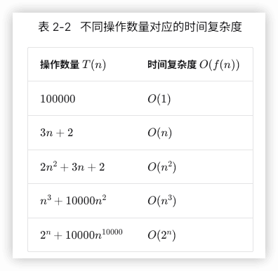

#### 常见类型

 

##### 指数阶

生物学的“细胞分裂”是指数阶增长的典型例子：初始状态为 1 个细胞，分裂一轮后变为 2 个，分裂两轮后变为 4 个，以此类推，分裂 n 轮后有 2n 个细胞。

在实际算法中，指数阶常出现于递归函数中。

指数阶增长非常迅速，在穷举法（暴力搜索、回溯等）中比较常见。对于数据规模较大的问题，指数阶是不可接受的，通常需要使用动态规划或贪心算法等来解决。

##### 对数阶

与指数阶相反，对数阶反映了“每轮缩减到一半”的情况。设输入数据大小为n，由于每轮缩减到一半，因此循环次数是log2n，即2n 的反函数。


```go

```

对数阶常出现于基于分治策略的算法中，体现了“一分为多”和“化繁为简”的算法思想。它增长缓慢，是仅次于常数阶的理想的时间复杂度。

##### 线性对数阶


```go

```


主流排序算法的时间复杂度通常为O(nlogn)，例如快速排序、归并排序、堆排序等。

##### 阶乘阶

阶乘阶对应数学上的“全排列”问题。给定n个互不重复的元素，求其所有可能的排列方案，方案数量为： n!=n∗(n−1)∗(n−2)∗...∗2∗1 阶乘通常使用递归实现。如图 2-14 和以下代码所示，第一层分裂出 n 个，第二层分裂出 n−1 个，以此类推，直至第 n 层时停止分裂：


```go

```


请注意，因为当 n≥4 时恒有 n!>2n ，所以阶乘阶比指数阶增长得更快，在 n 较大时也是不可接受的。

#### 最差、最佳、平均时间复杂度 🔖

**算法的时间效率往往不是固定的，而是与输入数据的分布有关**。

### 2.4 空间复杂度

#### 算法相关空间

算法在运行过程中使用的内存空间主要包括以下几种。

- **输入空间**:用于存储算法的输入数据。  
- **暂存空间**:用于存储算法在运行过程中的变量、对象、函数上下文等数据。 
- **输出空间**:用于存储算法的输出数据。

一般情况下，空间复杂度的统计范围是“暂存空间”加上“输出空间”。 暂存空间可以进一步划分为三个部分。

- **暂存数据**:用于保存算法运行过程中的各种常量、变量、对象等。
- **栈帧空间**:用于保存调用函数的上下文数据。系统在每次调用函数时都会在栈顶部创建一个栈帧，函数返回后，栈帧空间会被释放。
- **指令空间**:用于保存编译后的程序指令，在实际统计中通常忽略不计。

在分析一段程序的空间复杂度时，我们通常统计暂存数据、栈帧空间和输出数据三部分： 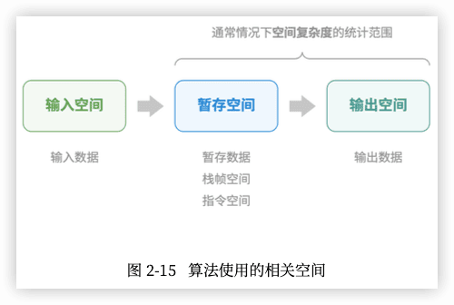


```go

```

#### 推算方法

最差空间复杂度


#### 常见类型


#### 权衡时间与空间

理想情况下，我们希望算法的时间复杂度和空间复杂度都能达到最优。然而在实际情况中，同时优化时间复杂度和空间复杂度通常非常困难。

**降低时间复杂度通常需要以提升空间复杂度为代价，反之亦然**。 将牺牲内存空间来提升算法运行速度的思路称为“以空间换时间”；反之，则称为“以时间换空间”。

选择哪种思路取决于我们更看重哪个方面。在大多数情况下，时间比空间更宝贵，因此“以空间换时间”通常是更常用的策略。当然，在数据量很大的情况下，控制空间复杂度也非常重要。

### 2.5 小节

#### 1 重点回顾

**算法效率评估**

- 时间效率和空间效率是衡量算法优劣的两个主要评价指标。
- 我们可以通过实际测试来评估算法效率，但难以消除测试环境的影响，且会耗费大量计算资源。
- 复杂度分析可以消除实际测试的弊端，分析结果适用于所有运行平台，并且能够揭示算法在不同数据规模下的效率。

**时间复杂度**

- 时间复杂度用于衡量算法运行时间随数据量增长的趋势，可以有效评估算法效率，但在某些情况下可能失效，如在输入的数据量较小或时间复杂度相同时，无法精确对比算法效率的优劣。
- 最差时间复杂度使用大O符号表示，对应函数渐近上界，反映当n趋向正无穷时，操作数量T(n)的增长级别。
- 推算时间复杂度分为两步，首先统计操作数量，然后判断渐近上界。
- 常见时间复杂度从低到高排列有 O(1)、O(log⁡n)、O(n)、O(nlog⁡n)、O(n2)、O(2n)和O(n!) 等。
- 某些算法的时间复杂度非固定，而是与输入数据的分布有关。时间复杂度分为最差、最佳、平均时间复杂度，最佳时间复杂度几乎不用，因为输入数据一般需要满足严格条件才能达到最佳情况。
- 平均时间复杂度反映算法在随机数据输入下的运行效率，最接近实际应用中的算法性能。计算平均时间复杂度需要统计输入数据分布以及综合后的数学期望。

**空间复杂度**

- 空间复杂度的作用类似于时间复杂度，用于衡量算法占用内存空间随数据量增长的趋势。
- 算法运行过程中的相关内存空间可分为输入空间、暂存空间、输出空间。通常情况下，输入空间不纳入空间复杂度计算。暂存空间可分为暂存数据、栈帧空间和指令空间，其中栈帧空间通常仅在递归函数中影响空间复杂度。
- 我们通常只关注最差空间复杂度，即统计算法在最差输入数据和最差运行时刻下的空间复杂度。
- 常见空间复杂度从低到高排列有 O(1)、O(log⁡n)、O(n)、O(n2)、O(2n)等。

#### 2 Q & A

**Q**：尾递归的空间复杂度是 O(1) 吗？

理论上，尾递归函数的空间复杂度可以优化至 O(1) 。不过绝大多数编程语言（例如 Java、Python、C++、Go、C# 等）不支持自动优化尾递归，因此通常认为空间复杂度是 O(n) 。

**Q**：函数和方法这两个术语的区别是什么？

「函数 function」可以被独立执行，所有参数都以显式传递。「方法 method」与一个对象关联，被隐式传递给调用它的对象，能够对类的实例中包含的数据进行操作。

下面以几种常见的编程语言为例来说明。

- C 语言是过程式编程语言，没有面向对象的概念，所以只有函数。但我们可以通过创建结构体（struct）来模拟面向对象编程，与结构体相关联的函数就相当于其他编程语言中的方法。
- Java 和 C# 是面向对象的编程语言，代码块（方法）通常作为某个类的一部分。静态方法的行为类似于函数，因为它被绑定在类上，不能访问特定的实例变量。
- C++ 和 Python 既支持过程式编程（函数），也支持面向对象编程（方法）。

**Q**：图解“常见的空间复杂度类型”反映的是否是占用空间的绝对大小？

不是，该图展示的是空间复杂度，其反映的是增长趋势，而不是占用空间的绝对大小。

假设取 n=8 ，你可能会发现每条曲线的值与函数对应不上。这是因为每条曲线都包含一个常数项，用于将取值范围压缩到一个视觉舒适的范围内。

在实际中，因为我们通常不知道每个方法的“常数项”复杂度是多少，所以一般无法仅凭复杂度来选择 n=8 之下的最优解法。但对于 n=85 就很好选了，这时增长趋势已经占主导了。


## 3 数据结构

### 3.1 数据结构分类

常见的数据结构包括数组、链表、栈、队列、哈希表、树、堆、图，它们可以从“逻辑结构”和“物理结构” 两个维度进行分类。

#### 逻辑结构:线性与非线性

**逻辑结构揭示了数据元素之间的逻辑关系**。在数组和链表中，数据按照一定顺序排列，体现了数据之间的线 性关系;而在树中，数据从顶部向下按层次排列，表现出“祖先”与“后代”之间的派生关系;图则由节点 和边构成，反映了复杂的网络关系。

线性结构比较直观，指数据在逻辑关系上呈 线性排列;非线性结构则相反，呈非线性排列。

- 线性数据结构:数组、链表、栈、队列、哈希表，元素之间是一对一的顺序关系。 
- 非线性数据结构:树、堆、图、哈希表。

非线性数据结构可分为： 

- 树形结构:树、堆、哈希表，元素之间是一对多的关系。
- 网状结构:图，元素之间是多对多的关系。

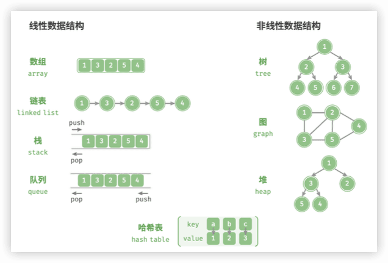

#### 物理结构:连续与分散

当算法程序运行时，**正在处理的数据主要存储在内存中**。图 3‐2 展示了一个计算机内存条，其中每个黑色方 块都包含一块内存空间。我们可以将内存想象成一个巨大的 Excel 表格，其中每个单元格都可以存储一定大 小的数据。

**系统通过内存地址来访问目标位置的数据**。如图 3‐2 所示，计算机根据特定规则为表格中的每个单元格分配 编号，确保每个内存空间都有唯一的内存地址。有了这些地址，程序便可以访问内存中的数据。 

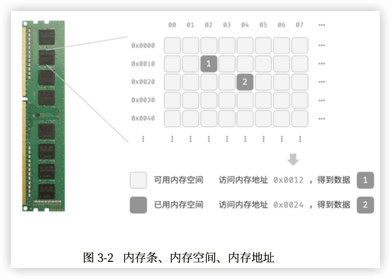

> 将内存比作 Excel 表格是一个简化的类比，实际内存的工作机制比较复杂，涉 及地址空间、内存管理、缓存机制、虚拟内存和物理内存等概念。

内存是所有程序的共享资源，当某块内存被某个程序占用时，则无法被其他程序同时使用了。因此**在数据结构与算法的设计中，内存资源是一个重要的考虑因素**。比如，算法所占用的内存峰值不应超过系统剩余空闲 内存;如果缺少连续大块的内存空间，那么所选用的数据结构必须能够存储在分散的内存空间内。

如图 3‐3 所示，**物理结构反映了数据在计算机内存中的存储方式**，可分为连续空间存储(数组)和分散空间 存储(链表)。物理结构从底层决定了数据的访问、更新、增删等操作方法，两种物理结构在时间效率和空间 效率方面呈现出互补的特点。


值得说明的是，**所有数据结构都是基于数组、链表或二者的组合实现的**。例如，栈和队列既可以使用数组实 现，也可以使用链表实现;而哈希表的实现可能同时包含数组和链表。

- 基于数组可实现:栈、队列、哈希表、树、堆、图、矩阵、张量(维度 ≥ 3 的数组)等。 【“静态数据结构”，意味着此类数据结构在初始化后长度不可变】
- 基于链表可实现:栈、队列、哈希表、树、堆、图等。【动态数据结构”，这类数据结构在初始化后，仍可以在程序运行过程中对其长 度进行调整】

### 3.2 基本数据类型

计算机中有文本、图片、视频、语音、3D 模型等各种形式的数据。尽管这些数据的组织形式各异，但它们都由各种基本数据类型构成。

**基本数据类型是 CPU 可以直接进行运算的类型**，在算法中直接被使用，主要包括以下几种：

- 整数类型 byte、short、int、long 。  
- 浮点数类型 float、double ，用于表示小数。  
- 字符类型 char ，用于表示各种语言的字母、标点符号甚至表情符号等。 
- 布尔类型 bool ，用于表示“是”与“否”判断。

**基本数据类型以二进制的形式存储在计算机中**。一个二进制位即为 1 比特。在绝大多数现代操作系统中，1 字节(byte)由 8 比特(bit)组成。

基本数据类型的取值范围取决于其占用的空间大小。下面以 Java 为例。 

- 整数类型byte占用1字节=8比特，可以表示 个数字。
- 整数类型 int 占用 4 字节 = 32 比特，可以表示  个数字。

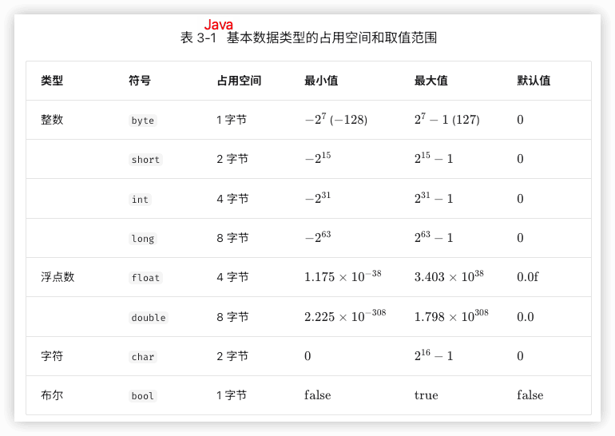

每种编程语言都有各自的数据类型定义，它们的占用 空间、取值范围和默认值可能会有所不同。

- 在 Python 中，整数类型 int 可以是任意大小，只受限于可用内存;浮点数 float 是双精度 64 位;没 有 char 类型，单个字符实际上是长度为 1 的字符串 str 。
- C 和 C++ 未明确规定基本数据类型的大小，而因实现和平台各异。表 3‐1 遵循 LP64 [数据模型](https://en.cppreference.com/w/cpp/language/types#Properties)，其用于 包括 Linux 和 macOS 在内的 Unix 64 位操作系统。
- 字符 char 的大小在 C 和 C++ 中为 1 字节，在大多数编程语言中取决于特定的字符编码方法，详见“字符编码”章节。
- 即使表示布尔量仅需 1 位(0 或 1)，它在内存中通常也存储为 1 字节。这是因为现代计算机 CPU 通常 将 1 字节作为最小寻址内存单元。

基本数据类型与数据结构之间有什么联系呢?

**基本数据类型提供了数据的“内容类型”，而数据结构提供了数据的“组织方式”**。

### 3.3 数字编码  

#### 原码、反码和补码

所有整数类型能够表示的负数都比正数多一个，例如 `byte` 的取值范围是 [−128,127] 。这个现象比较反直觉，它的内在原因涉及原码、反码、补码的相关知识。

**数字是以“补码”的形式存储在计算机中的**。

- **原码**：将数字的二进制表示的最高位视为符号位，其中 0 表示正数，1 表示负数，其余位表示数字的值。
- **反码**：正数的反码与其原码相同，负数的反码是对其原码除符号位外的所有位取反。
- **补码**：正数的补码与其原码相同，负数的补码是在其反码的基础上加 1 。 


「原码 sign-magnitude」虽然最直观，但存在一些局限性。一方面，**负数的原码不能直接用于运算**。例如在原码下计算 1+(−2) ，得到的结果是 −3 ，这显然是不对的。  为了解决此问题，计算机引入了「**反码 1's complement**」。如果我们先将原码转换为反码，并在反码下计算 1+(−2) ，最后将结果从反码转换回原码，则可得到正确结果 −1 。  另一方面，**数字零的原码有 +0 和 −0 两种表示方式**。这意味着数字零对应两个不同的二进制编码，这可能会带来歧义。比如在条件判断中，如果没有区分正零和负零，则可能会导致判断结果出错。而如果我们想处理正零和负零歧义，则需要引入额外的判断操作，这可能会降低计算机的运算效率。  与原码一样，反码也存在正负零歧义问题，因此计算机进一步引入了「**补码 2's complement**」。我们先来观察一下负零的原码、反码、补码的转换过程： 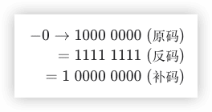 在负零的反码基础上加 1 会产生进位，但 `byte` 类型的长度只有 8 位，因此溢出到第 9 位的 1 会被舍弃。也就是说，**负零的补码为 00000000 ，与正零的补码相同**。这意味着在补码表示中只存在一个零，正负零歧义从而得到解决。

> 还剩最后一个疑惑：`byte` 类型的取值范围是 [−128,127] ，多出来的一个负数 −128 是如何得到的呢？

我们注意到，区间 [−127,+127] 内的所有整数都有对应的原码、反码和补码，并且原码和补码之间可以互相转换。

然而，**补码 1000 0000 是一个例外，它并没有对应的原码**。根据转换方法，我们得到该补码的原码为 00000000 。这显然是矛盾的，因为该原码表示数字 0 ，它的补码应该是自身。计算机规定这个特殊的补码 10000000 代表 −128 。实际上，(−1)+(−127) 在补码下的计算结果就是 −128 。 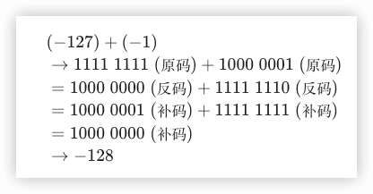

上述所有计算都是加法运算。这暗示着一个重要事实：**计算机内部的硬件电路主要是基于加法运算设计的**。这是因为加法运算相对于其他运算（比如乘法、除法和减法）来说，硬件实现起来更简单，更容易进行并行化处理，运算速度更快。

请注意，这并不意味着计算机只能做加法。**通过将加法与一些基本逻辑运算结合，计算机能够实现各种其他的数学运算**。例如，计算减法 a−b 可以转换为计算加法 a+(−b) ；计算乘法和除法可以转换为计算多次加法或减法。

总结出计算机使用补码的原因：**基于补码表示，计算机可以用同样的电路和操作来处理正数和负数的加法，不需要设计特殊的硬件电路来处理减法，并且无须特别处理正负零的歧义问题**。这大大简化了硬件设计，提高了运算效率。

#### 浮点数编码

> `int` 和 `float` 长度相同，都是 4 字节 ，但为什么 `float` 的取值范围远大于 `int` ？ 这非常反直觉，因为按理说 `float` 需要表示小数，取值范围应该变小才对。

**这是因为浮点数 `float` 采用了不同的表示方式**。记一个 32 比特长度的二进制数为： 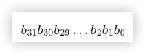 根据 IEEE 754 标准，32-bit 长度的 `float` 由以下三个部分构成。

- 符号位 S ：占 1 位 ，对应 b31 。
- 指数位 E ：占 8 位 ，对应 b30b29…b23 。
- 分数位 N ：占 23 位 ，对应 b22b21…b0 。

二进制数 `float` 对应值的计算方法为： 

转化到十进制下的计算公式为： 

其中各项的取值范围为： 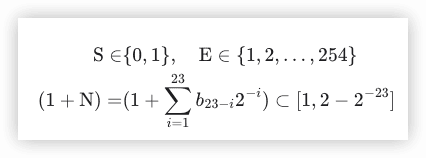


回答最初的问题：**`float` 的表示方式包含指数位，导致其取值范围远大于 `int`** 。根据以上计算，`float` 可表示的最大正数为，切换符号位便可得到最小负数。

**尽管浮点数 `float` 扩展了取值范围，但其副作用是牺牲了精度**。整数类型 `int` 将全部 32 比特用于表示数字，数字是均匀分布的；而由于指数位的存在，浮点数 `float` 的数值越大，相邻两个数字之间的差值就会趋向越大。

如表 3-2 所示，指数位 E=0 和 E=255 具有特殊含义，**用于表示零、无穷大、NaN 等**。 

值得说明的是，次正规数显著提升了浮点数的精度。最小正正规数为 ，最小正次正规数为 。

双精度 `double` 也采用类似于 `float` 的表示方法。

### 3.4 字符编码

在计算机中，所有数据都是以二进制数的形式存储的，字符 `char` 也不例外。为了表示字符，我们需要建立一套“字符集”，规定每个字符和二进制数之间的一一对应关系。有了字符集之后，计算机就可以通过查表完成二进制数到字符的转换。

#### ASCII字符集

「ASCII 码」是最早出现的字符集，其全称为 American Standard Code for Information Interchange（美国标准信息交换代码）。它使用 7 位二进制数（一个字节的低 7 位）表示一个字符，最多能够表示 128 个不同的字符。如图 ，ASCII 码包括英文字母的大小写、数字 0 ~ 9、一些标点符号，以及一些控制字符（如换行符和制表符）。 

然而，**ASCII 码仅能够表示英文**。随着计算机的全球化，诞生了一种能够表示更多语言的「EASCII」字符集。它在 ASCII 的 7 位基础上扩展到 8 位，能够表示 256 个不同的字符。

在世界范围内，陆续出现了一批适用于不同地区的 EASCII 字符集。这些字符集的前 128 个字符统一为 ASCII 码，后 128 个字符定义不同，以适应不同语言的需求。

#### GBK字符集

**EASCII 码仍然无法满足许多语言的字符数量要求**。比如汉字有近十万个，光日常使用的就有几千个。中国国家标准总局于 1980 年发布了「GB2312」字符集，其收录了 6763 个汉字，基本满足了汉字的计算机处理需要。

然而，GB2312 无法处理部分罕见字和繁体字。「GBK」字符集是在 GB2312 的基础上扩展得到的，它共收录了 21886 个汉字。在 GBK 的编码方案中，ASCII 字符使用一个字节表示，汉字使用两个字节表示。

#### Unicode字符集

随着计算机技术的蓬勃发展，字符集与编码标准百花齐放，而这带来了许多问题。一方面，这些字符集一般只定义了特定语言的字符，无法在多语言环境下正常工作。另一方面，同一种语言存在多种字符集标准，如果两台计算机使用的是不同的编码标准，则在信息传递时就会出现乱码。

那个时代的研究人员就在想：**如果推出一个足够完整的字符集，将世界范围内的所有语言和符号都收录其中，不就可以解决跨语言环境和乱码问题了吗**？在这种想法的驱动下，一个大而全的字符集 Unicode 应运而生。

「Unicode」的中文名称为“统一码”，理论上能容纳 100 多万个字符。它致力于将全球范围内的字符纳入统一的字符集之中，提供一种通用的字符集来处理和显示各种语言文字，减少因为编码标准不同而产生的乱码问题。

自 1991 年发布以来，Unicode 不断扩充新的语言与字符。截至 2022 年 9 月，Unicode 已经包含 149186 个字符，包括各种语言的字符、符号甚至表情符号等。在庞大的 Unicode 字符集中，常用的字符占用 2 字节，有些生僻的字符占用 3 字节甚至 4 字节。

Unicode 是一种通用字符集，本质上是给每个字符分配一个编号（称为“码点”），**但它并没有规定在计算机中如何存储这些字符码点**。我们不禁会问：当多种长度的 Unicode 码点同时出现在一个文本中时，系统如何解析字符？例如给定一个长度为 2 字节的编码，系统如何确认它是一个 2 字节的字符还是两个 1 字节的字符？

对于以上问题，**一种直接的解决方案是将所有字符存储为等长的编码**。如图 3-7 所示，“Hello”中的每个字符占用 1 字节，“算法”中的每个字符占用 2 字节。我们可以通过高位填 0 将“Hello 算法”中的所有字符都编码为 2 字节长度。这样系统就可以每隔 2 字节解析一个字符，恢复这个短语的内容了。 

然而 ASCII 码已经向我们证明，编码英文只需 1 字节。若采用上述方案，英文文本占用空间的大小将会是 ASCII 编码下的两倍，非常浪费内存空间。因此，我们需要一种更加高效的 Unicode **编码方法**。

#### UTF‐8编码

目前，UTF-8 已成为国际上使用最广泛的 Unicode 编码方法。**它是一种可变长度的编码**，使用 1 到 4 字节来表示一个字符，根据字符的复杂性而变。ASCII 字符只需 1 字节，拉丁字母和希腊字母需要 2 字节，常用的中文字符需要 3 字节，其他的一些生僻字符需要 4 字节。

UTF-8 的编码规则并不复杂，分为以下两种情况。

- 对于长度为 1 字节的字符，将最高位设置为 0 ，其余 7 位设置为 Unicode 码点。值得注意的是，ASCII 字符在 Unicode 字符集中占据了前 128 个码点。也就是说，**UTF-8 编码可以向下兼容 ASCII 码**。这意味着我们可以使用 UTF-8 来解析年代久远的 ASCII 码文本。
- 对于长度为 n 字节的字符（其中 n>1），将首个字节的高 n 位都设置为 1 ，第 n+1 位设置为 0 ；从第二个字节开始，将每个字节的高 2 位都设置为 10 ；其余所有位用于填充字符的 Unicode 码点。

图 3-8 展示了“Hello算法”对应的 UTF-8 编码。观察发现，由于最高 n 位都设置为 1 ，因此系统可以通过读取最高位 1 的个数来解析出字符的长度为 n 。

但为什么要将其余所有字节的高 2 位都设置为 10 呢？实际上，这个 10 能够起到校验符的作用。假设系统从一个错误的字节开始解析文本，字节头部的 10 能够帮助系统快速判断出异常。

之所以将 10 当作校验符，是因为在 UTF-8 编码规则下，不可能有字符的最高两位是 10 。这个结论可以用反证法来证明：假设一个字符的最高两位是 10 ，说明该字符的长度为 1 ，对应 ASCII 码。而 ASCII 码的最高位应该是 0 ，与假设矛盾。 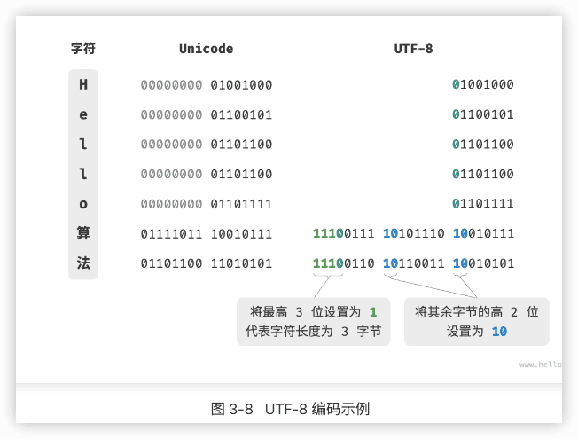

除了 UTF-8 之外，常见的编码方式还包括以下两种。

- **UTF-16 编码**：使用 2 或 4 字节来表示一个字符。所有的 ASCII 字符和常用的非英文字符，都用 2 字节表示；少数字符需要用到 4 字节表示。对于 2 字节的字符，UTF-16 编码与 Unicode 码点相等。 🔖java
- **UTF-32 编码**：每个字符都使用 4 字节。这意味着 UTF-32 比 UTF-8 和 UTF-16 更占用空间，特别是对于 ASCII 字符占比较高的文本。

从存储空间占用的角度看，使用 UTF-8 表示英文字符非常高效，因为它仅需 1 字节；使用 UTF-16 编码某些非英文字符（例如中文）会更加高效，因为它仅需 2 字节，而 UTF-8 可能需要 3 字节。

从兼容性的角度看，UTF-8 的通用性最佳，许多工具和库优先支持 UTF-8 。

#### 编程语言的字符编码

对于以往的大多数编程语言，程序运行中的字符串都采用 UTF-16 或 UTF-32 这类等长编码。在等长编码下，我们可以将字符串看作数组来处理，这种做法具有以下优点。

- **随机访问**：UTF-16 编码的字符串可以很容易地进行随机访问。UTF-8 是一种变长编码，要想找到第 i个字符，我们需要从字符串的开始处遍历到第 i 个字符，这需要 O(n) 的时间。
- **字符计数**：与随机访问类似，计算 UTF-16 编码的字符串的长度也是 O(1) 的操作。但是，计算 UTF-8 编码的字符串的长度需要遍历整个字符串。
- **字符串操作**：在 UTF-16 编码的字符串上，很多字符串操作（如分割、连接、插入、删除等）更容易进行。在 UTF-8 编码的字符串上，进行这些操作通常需要额外的计算，以确保不会产生无效的 UTF-8 编码。

实际上，编程语言的字符编码方案设计是一个很有趣的话题，涉及许多因素。

- Java 的 `String` 类型使用 UTF-16 编码，每个字符占用 2 字节。这是因为 Java 语言设计之初，人们认为 16 位足以表示所有可能的字符。然而，这是一个不正确的判断。后来 Unicode 规范扩展到了超过 16 位，所以 Java 中的字符现在可能由一对 16 位的值（称为“代理对”）表示。
- JavaScript 和 TypeScript 的字符串使用 UTF-16 编码的原因与 Java 类似。当 1995 年 Netscape 公司首次推出 JavaScript 语言时，Unicode 还处于发展早期，那时候使用 16 位的编码就足以表示所有的 Unicode 字符了。
- C# 使用 UTF-16 编码，主要是因为 .NET 平台是由 Microsoft 设计的，而 Microsoft 的很多技术（包括 Windows 操作系统）都广泛使用 UTF-16 编码。

由于以上编程语言对字符数量的低估，它们不得不采取“代理对”的方式来表示超过 16 位长度的 Unicode 字符。这是一个不得已为之的无奈之举。一方面，包含代理对的字符串中，一个字符可能占用 2 字节或 4 字节，从而丧失了等长编码的优势。另一方面，处理代理对需要额外增加代码，这提高了编程的复杂性和调试难度。

出于以上原因，部分编程语言提出了一些不同的编码方案。

- Python 中的 `str` 使用 Unicode 编码，并采用一种灵活的字符串表示，存储的字符长度取决于字符串中最大的 Unicode 码点。若字符串中全部是 ASCII 字符，则每个字符占用 1 字节；如果有字符超出了 ASCII 范围，但全部在基本多语言平面（BMP）内，则每个字符占用 2 字节；如果有超出 BMP 的字符，则每个字符占用 4 字节。
- Go 语言的 `string` 类型在内部使用 UTF-8 编码。Go 语言还提供了 `rune` 类型，它用于表示单个 Unicode 码点。
- Rust 语言的 `str` 和 `String` 类型在内部使用 UTF-8 编码。Rust 也提供了 `char` 类型，用于表示单个 Unicode 码点。

需要注意的是，以上讨论的都是字符串在编程语言中的存储方式，**这和字符串如何在文件中存储或在网络中传输是不同的问题**。在文件存储或网络传输中，我们通常会将字符串编码为 UTF-8 格式，以达到最优的兼容性和空间效率。

### 小节

#### Q & A

**Q**：为什么哈希表同时包含线性数据结构和非线性数据结构？

哈希表底层是数组，而为了解决哈希冲突，我们可能会使用“链式地址”（后续“哈希冲突”章节会讲）：数组中每个桶指向一个链表，当链表长度超过一定阈值时，又可能被转化为树（通常为红黑树）。

从存储的角度来看，哈希表的底层是数组，其中每一个桶槽位可能包含一个值，也可能包含一个链表或一棵树。因此，哈希表可能同时包含线性数据结构（数组、链表）和非线性数据结构（树）。

**Q**：`char` 类型的长度是 1 字节吗？

`char` 类型的长度由编程语言采用的编码方法决定。例如，Java、JavaScript、TypeScript、C# 都采用 UTF-16 编码（保存 Unicode 码点），因此 `char` 类型的长度为 2 字节。

**Q**：基于数组实现的数据结构也称“静态数据结构” 是否有歧义？栈也可以进行出栈和入栈等操作，这些操作都是“动态”的。

栈确实可以实现动态的数据操作，但数据结构仍然是“静态”（长度不可变）的。尽管基于数组的数据结构可以动态地添加或删除元素，但它们的容量是固定的。如果数据量超出了预分配的大小，就需要创建一个新的更大的数组，并将旧数组的内容复制到新数组中。

**Q**：在构建栈（队列）的时候，未指定它的大小，为什么它们是“静态数据结构”呢？

在高级编程语言中，我们无须人工指定栈（队列）的初始容量，这个工作由类内部自动完成。例如，Java 的 `ArrayList` 的初始容量通常为 10。另外，扩容操作也是自动实现的。详见后续的“列表”章节。
