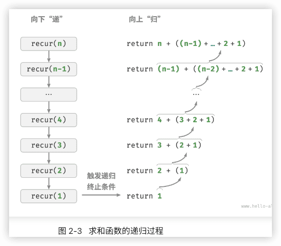
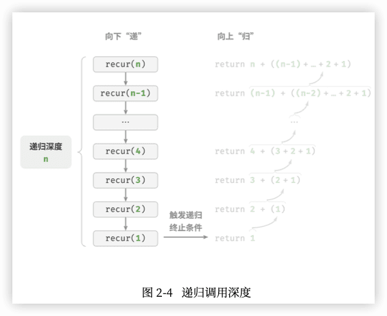
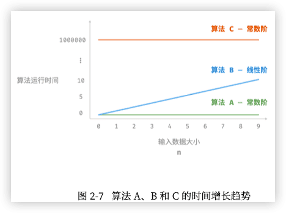
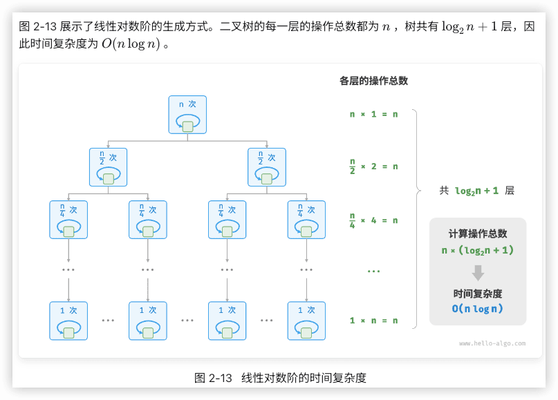
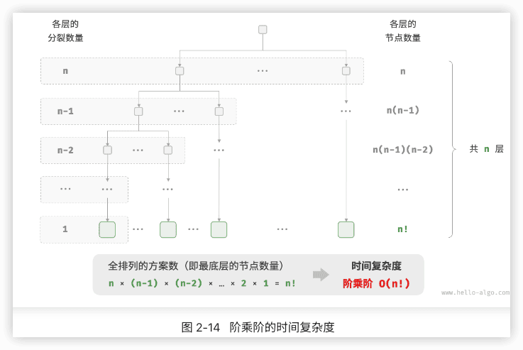
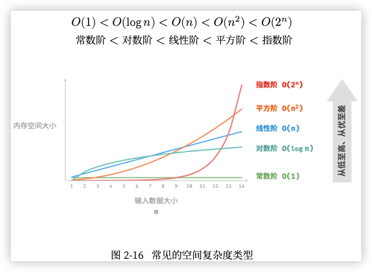

hello-algo笔记
---

https://www.hello-algo.com/

go

## 0 前言


## 1 初识算法

### 1.1 算法无处不在

例一:查字典 。 “二分查找”

例二:整理扑克。 “插入排序”


例三:货币找零。 贪心”算法


小到烹饪一道菜，大到星际航行，几乎所有问题的解决都离不开算法。计算机的出现使得我们能够通过**编程**将**数据结构**存储在内存中，同时编写代码调用 CPU 和 GPU **执行**算法。这样一来，我们就能**把生活中的问题转移到计算机上**，以更高效的方式解决各种复杂问题。

### 1.2 算法是什么

#### 算法定义

「**算法 algorithm**」是在有限时间内解决特定问题的一组指令或操作步骤，它具有以下特性。

- 问题是**明确**的，包含清晰的输入和输出定义。  
- 具有**可行性**，能够在有限步骤、时间和内存空间下完成。  
- 各步骤都有**确定的含义**，在相同的输入和运行条件下，输出始终相同。

#### 数据结构定义

「**数据结构 data structure**」是计算机中**组织和存储**数据的方式，具有以下设计目标。 

- **空间**占用尽量少，以节省计算机内存。
- 数据**操作**尽可能快速，涵盖数据访问、添加、删除、更新等。 
- 提供简洁的**数据表示**和**逻辑信息**，以便算法高效运行。

数据结构设计是一个充满**权衡**的过程。如果想在某方面取得提升，往往需要在另一方面作出妥协。例如：

- 链表相较于数组，在数据添加和删除操作上更加便捷，但牺牲了数据访问速度。 
- 图相较于链表，提供了更丰富的逻辑信息，但需要占用更大的内存空间。

#### 数据结构与算法的关系

数据结构与算法高度相关、紧密结合，具体表现：

- 数据结构是算法的基石。数据结构为算法提供了**结构化存储的数据**，以及**操作数据的方法**。  
- 算法是数据结构发挥作用的舞台。数据结构本身仅存储数据信息，结合算法才能解决特定问题。 
- 算法通常可以基于不同的数据结构实现，但执行效率可能相差很大，选择合适的数据结构是关键。
  

数据结构与算法犹如拼装积木。一套积木，除了包含许多零件之外，还附有详细的组装说明书。 我们按照说明书一步步操作，就能组装出精美的积木模型。

| 数据结构与算法 | 拼装积木                                 |
| -------------- | ---------------------------------------- |
| 输入数据       | 未拼装的积木                             |
| 数据结构       | 积木组织形式，包括形状、大小、连接方式等 |
| 算法           | 把积木拼成目标形态的一系列操作步骤       |
| 输出数据       | 积木模型                                 |

> 数据结构与算法是独立于编程语言的。
> 通常会将“数据结构与算法”简称为“算法”。

## 2 复杂度分析

> 复杂度分析犹如浩瀚的算法宇宙中的时空向导。它带领我们在时间与空间这两个维度上深入探索，寻找更优雅的解决方案。

### 2.1 算法效率评估

算法设计中两个层面的目标:

1. **找到问题解法**:算法需要在规定的输入范围内可靠地求得问题的正确解。
2. **寻求最优解法**:同一个问题可能存在多种解法，我们希望找到尽可能高效的算法。

也就是说，在能够解决问题的前提下，**算法效率**已成为衡量算法优劣的主要评价指标，它包括以下两个维度：

- 时间效率:算法运行速度的快慢。
- 空间效率:算法占用内存空间的大小。

既快又省

#### 实际测试

- 难以排除测试环境的干扰因素
- 展开完整测试非常耗费资源

#### 理论估算

「渐近复杂度分析 asymptotic complexity analysis」，简称「复杂度分析」

复杂度分析能够体现算法运行所需的时间和空间资源与输入数据大小之间的关系。它描述了随着**输入数据**大小的增加，算法执行所需时间和空间的**增长趋势**。三个重点理解：

- “时间和空间资源”分别对应「时间复杂度 time complexity」和「空间复杂度 space complexity」。 
- “随着输入数据大小的增加”意味着复杂度反映了算法运行效率与输入数据体量之间的关系。 
- “时间和空间的增长趋势”表示复杂度分析关注的不是运行时间或占用空间的具体值，而是时间或空间增长的“快慢”。

### 2.2 迭代与递归

重复执行某个任务是很常见的，它与复杂度分析息息相关。

如何在程序中实现重复执行任务，即两种基本的程序控制结构:迭代、递归。

#### 迭代

「**迭代 iteration**」是一种重复执行某个任务的控制结构。在迭代中，程序会在满足一定的条件下重复执行某 段代码，直到这个条件不再满足。

1. for 循环 适合在预先知道迭代次数时使用。
2. while 循环 while 循环比 for 循环的自由度更高。在 while 循环中，我们可以自由地设计条件变量的初始化和更新步 骤。
3. 嵌套循环1

```go

```


#### 递归

「递归 recursion」是一种算法策略，通过函数调用自身来解决问题。它主要包含两个阶段。 

1. **递**:程序不断深入地调用自身，通常传入更小或更简化的参数，直到达到“终止条件”。
2. **归**:触发“终止条件”后，程序从最深层的递归函数开始逐层返回，汇聚每一层的结果。

从实现的角度看，递归代码主要包含三个要素。

1. **终止条件**:用于决定什么时候由“递”转“归”。  
2. **递归调用**:对应“递”，函数调用自身，通常输入更小或更简化的参数。 
3. **返回结果**:对应“归”，将当前递归层级的结果返回至上一层。

1

```

```



虽然从计算角度看，迭代与递归可以得到相同的结果，但它们代表了两种完全不同的**思考和解决问题的范式**。

- 迭代:“**自下而上**”地解决问题。从最基础的步骤开始，然后不断重复或累加这些步骤，直到任务完成。
- 递归:“**自上而下**”地解决问题。将原问题分解为更小的子问题，这些子问题和原问题具有相同的形式。接下来将子问题继续分解为更小的子问题，直到基本情况时停止(基本情况的解是已知的)。

以上述求和函数为例，设问题 𝑓(𝑛) = 1 + 2 + ⋯ + 𝑛 。

- 迭代:在循环中模拟求和过程，从1遍历到𝑛，每轮执行求和操作，即可求得𝑓(𝑛)。
- 递归:将问题分解为子问题𝑓(𝑛)=𝑛+𝑓(𝑛−1)，不断(递归地)分解下去，直至基本情况𝑓(1)=1时终止。

##### 1 调用栈

递归函数每次调用自身时，系统都会为新开启的函数分配内存，以存储局部变量、调用地址和其他信息等。

这将导致两方面的结果：

- 函数的上下文数据都存储在称为“**栈帧空间**”的内存区域中，直至函数返回后才会被释放。因此，递归通常比迭代更加耗费内存空间。
- 递归调用函数会产生额外的开销。因此递归通常比循环的时间效率更低。  在触发终止条件前，同时存在 𝑛 个未返回的递归函数，**递归深度**为𝑛。

在实际中，编程语言允许的递归深度通常是有限的，过深的递归可能导致栈溢出错误。

##### 2 尾递归 🔖

**如果函数在返回前的最后一步才进行递归调用**，则该函数可以被编译器或解释器优化，使其在空间效率上与迭代相当。这种情况被称为「**尾递归 tail recursion**」。

- 普通递归:当函数返回到上一层级的函数后，需要继续执行代码，因此系统需要保存上一层调用的上下文。
- 尾递归:递归调用是函数返回前的最后一个操作，这意味着函数返回到上一层级后，无须继续执行其他操作，因此系统无须保存上一层函数的上下文。

以求和为例，可以将结果变量 res 设为函数参数，从而实现尾递归:


```go

```

如图 2‐5 所示。对比普通递归和尾递归，两者的求和操作的执行点是不同的。

- 普通递归:求和操作是在“归”的过程中执行的，每层返回后都要再执行一次求和操作。
- 尾递归:求和操作是在“递”的过程中执行的，“归”的过程只需层层返回。 

> 请注意，许多编译器或解释器并不支持尾递归优化。例如，Python默认不支持尾递归优化， 因此即使函数是尾递归形式，仍然可能会遇到栈溢出问题。

##### 3 递归树

当处理与“分治”相关的算法问题时，递归往往比迭代的思路更加直观、代码更加易读。

以“斐波那契数列” 为例。

- 数列的前两个数字为𝑓(1)=0和𝑓(2)=1。
- 数列中的每个数字是前两个数字的和，即 𝑓(𝑛) = 𝑓(𝑛 − 1) + 𝑓(𝑛 − 2) 。

按照递推关系进行递归调用，将前两个数字作为终止条件，便可写出递归代码。调用 fib(n) 即可得到斐波那 契数列的第 𝑛 个数字:

```go

```

在函数内递归调用了两个函数，这意味着**从一个调用产生了两个调用分支**。这样不断递归调用下去，最终将产生一棵层数为 𝑛 的「**递归树 recursion tree**」。 

从本质上看，递归体现了“将问题分解为更小子问题”的思维范式，这种**分治策略**至关重要。

- 从算法角度看，搜索、排序、回溯、分治、动态规划等许多重要算法策略直接或间接地应用了这种思维方式。
- 从数据结构角度看，递归天然适合处理链表、树和图的相关问题，因为它们非常适合用分治思想进行分析。

#### 两者对比

迭代和递归在实现、性能和适用性上有所不同。

|          | 迭代                                   | 递归                                                         |
| -------- | -------------------------------------- | ------------------------------------------------------------ |
| 实现方式 | 循环结构                               | 函数调用自身                                                 |
| 时间效率 | 效率通常较高，无函数调用开销           | 每次函数调用都会产生开销                                     |
| 内存使用 | 通常使用固定大小的内存空间             | 累积函数调用可能使用大量的栈帧空间                           |
| 适用问题 | 适用于简单循环任务，代码直观、可读性好 | 适用于子问题分解，如树、图、分治、回溯等，代码结构简洁、清晰 |

> 迭代和递归具有什么内在联系呢?

以上述递归函数为例，求和操作在递归的“归”阶段进行。这意味着最初被调用的函数实际上是最后完成其求和操作的，**这种工作机制与栈的“先入后出”原则异曲同工**。

事实上，“调用栈”和“栈帧空间”这类递归术语已经暗示了递归与栈之间的密切关系。

1. **递**:当函数被调用时，系统会在“调用栈”上为该函数分配新的栈帧，用于存储函数的局部变量、参数、 返回地址等数据。
2. **归**:当函数完成执行并返回时，对应的栈帧会被从“调用栈”上移除，恢复之前函数的执行环境。

因此，可以使用一个**显式的栈来模拟调用栈的行为**，从而将递归转化为迭代形式: 🔖


```go

```

观察以上代码，当递归转化为迭代后，代码变得更加复杂了。尽管迭代和递归在很多情况下可以互相转化， 但不一定值得这样做，有以下两点原因。

- 转化后的代码可能更加难以理解，可读性更差。  
- 对于某些复杂问题，模拟系统调用栈的行为可能非常困难。

总之，**选择迭代还是递归取决于特定问题的性质**。在编程实践中，**权衡**两者的优劣并根据情境选择合适的方法至关重要。

### 2.3 时间复杂度

运行时间可以直观且准确地反映算法的效率。如果我们想准确预估一段代码的运行时间，应该如何操作呢?

1. 确定运行平台，包括硬件配置、编程语言、系统环境等，这些因素都会影响代码的运行效率。
2. 评估各种计算操作所需的运行时间，例如加法操作 + 需要 1 ns ，乘法操作 * 需要 10 ns ，打印操作print() 需要 5 ns 等。
3. 统计代码中所有的计算操作，并将所有操作的执行时间求和，从而得到运行时间。

例如在以下代码中，输入数据大小为 𝑛 :


```go
```

运行时间为:   1 + 1 + 10 + (1 + 5) × 𝑛 = 6𝑛 + 12 ns

但实际上，**统计算法的运行时间既不合理也不现实**。首先，我们不希望将预估时间和运行平台绑定，因为算法需要在各种不同的平台上运行。其次，我们很难获知每种操作的运行时间，这给预估过程带来了极大的难度。

#### 统计时间增长趋势

时间复杂度分析统计的不是算法运行时间，而是**算法运行时间随着数据量变大时的增长趋势**。 “时间增长趋势”这个概念比较抽象，我们通过一个例子来加以理解。假设输入数据大小为 𝑛 ，给定三个算法 A、B 和 C :


```go
```

- 算法 A 只有 1 个打印操作，算法运行时间不随着 𝑛 增大而增长。我们称此算法的时间复杂度为“常数 阶”。
- 算法 B 中的打印操作需要循环 𝑛 次，算法运行时间随着 𝑛 增大呈线性增长。此算法的时间复杂度被称 为“线性阶”。
- 算法 C 中的打印操作需要循环 1000000 次，虽然运行时间很长，但它与输入数据大小 𝑛 无关。因此 C 的时间复杂度和 A 相同，仍为“常数阶”。 

相较于直接统计算法的运行时间，时间复杂度分析有哪些特点呢?

- 时间复杂度能够**有效评估算法效率**。例如，算法 B 的运行时间呈线性增长，在 𝑛 > 1 时比算法 A 更慢， 在 𝑛 > 1000000 时比算法 C 更慢。事实上，只要输入数据大小 𝑛 足够大，复杂度为“常数阶”的算法 一定优于“线性阶”的算法，这正是时间增长趋势的含义。
- 时间复杂度的**推算方法更简便**。显然，运行平台和计算操作类型都与算法运行时间的增长趋势无关。因此在时间复杂度分析中，我们可以简单地将所有计算操作的执行时间视为相同的“单位时间”，从而将“计算操作运行时间统计”简化为“计算操作数量统计”，这样一来估算难度就大大降低了。  
- 时间复杂度也存在一定的局限性。例如，尽管算法 A 和 C 的时间复杂度相同，但实际运行时间差别很大。同样，尽管算法 B 的时间复杂度比 C 高，但在输入数据大小 𝑛 较小时，算法 B 明显优于算法 C 。在 这些情况下，我们很难仅凭时间复杂度判断算法效率的高低。当然，尽管存在上述问题，复杂度分析仍然是评判算法效率最有效且常用的方法。

#### 函数渐近上界 🔖

「大O记号 big-O notation」 「渐近上界 asymptotic upper bound」

#### 推算方法 

##### 1 第一步：统计操作数量

##### 2 第二步：判断渐近上界

时间复杂度由T(n)中最高阶的项来决定。 

#### 常见类型

 

##### 指数阶

生物学的“细胞分裂”是指数阶增长的典型例子：初始状态为 1 个细胞，分裂一轮后变为 2 个，分裂两轮后变为 4 个，以此类推，分裂 n 轮后有 2n 个细胞。

在实际算法中，指数阶常出现于递归函数中。

指数阶增长非常迅速，在穷举法（暴力搜索、回溯等）中比较常见。对于数据规模较大的问题，指数阶是不可接受的，通常需要使用动态规划或贪心算法等来解决。

##### 对数阶

与指数阶相反，对数阶反映了“每轮缩减到一半”的情况。设输入数据大小为n，由于每轮缩减到一半，因此循环次数是log2n，即2n 的反函数。


```go

```

对数阶常出现于基于分治策略的算法中，体现了“一分为多”和“化繁为简”的算法思想。它增长缓慢，是仅次于常数阶的理想的时间复杂度。

##### 线性对数阶


```go

```



主流排序算法的时间复杂度通常为O(nlogn)，例如快速排序、归并排序、堆排序等。

##### 阶乘阶

阶乘阶对应数学上的“全排列”问题。给定n个互不重复的元素，求其所有可能的排列方案，方案数量为： n!=n∗(n−1)∗(n−2)∗...∗2∗1 阶乘通常使用递归实现。如图 2-14 和以下代码所示，第一层分裂出 n 个，第二层分裂出 n−1 个，以此类推，直至第 n 层时停止分裂：


```go

```



请注意，因为当 n≥4 时恒有 n!>2n ，所以阶乘阶比指数阶增长得更快，在 n 较大时也是不可接受的。

#### 最差、最佳、平均时间复杂度 🔖

**算法的时间效率往往不是固定的，而是与输入数据的分布有关**。

### 2.4 空间复杂度

#### 算法相关空间

算法在运行过程中使用的内存空间主要包括以下几种。

- **输入空间**:用于存储算法的输入数据。  
- **暂存空间**:用于存储算法在运行过程中的变量、对象、函数上下文等数据。 
- **输出空间**:用于存储算法的输出数据。

一般情况下，空间复杂度的统计范围是“暂存空间”加上“输出空间”。 暂存空间可以进一步划分为三个部分。

- **暂存数据**:用于保存算法运行过程中的各种常量、变量、对象等。
- **栈帧空间**:用于保存调用函数的上下文数据。系统在每次调用函数时都会在栈顶部创建一个栈帧，函数返回后，栈帧空间会被释放。
- **指令空间**:用于保存编译后的程序指令，在实际统计中通常忽略不计。

在分析一段程序的空间复杂度时，我们通常统计暂存数据、栈帧空间和输出数据三部分： 


```go

```

#### 推算方法

最差空间复杂度


#### 常见类型



#### 权衡时间与空间

理想情况下，我们希望算法的时间复杂度和空间复杂度都能达到最优。然而在实际情况中，同时优化时间复杂度和空间复杂度通常非常困难。

**降低时间复杂度通常需要以提升空间复杂度为代价，反之亦然**。 将牺牲内存空间来提升算法运行速度的思路称为“以空间换时间”；反之，则称为“以时间换空间”。

选择哪种思路取决于我们更看重哪个方面。在大多数情况下，时间比空间更宝贵，因此“以空间换时间”通常是更常用的策略。当然，在数据量很大的情况下，控制空间复杂度也非常重要。

### 2.5 小节

#### 1 重点回顾

**算法效率评估**

- 时间效率和空间效率是衡量算法优劣的两个主要评价指标。
- 我们可以通过实际测试来评估算法效率，但难以消除测试环境的影响，且会耗费大量计算资源。
- 复杂度分析可以消除实际测试的弊端，分析结果适用于所有运行平台，并且能够揭示算法在不同数据规模下的效率。

**时间复杂度**

- 时间复杂度用于衡量算法运行时间随数据量增长的趋势，可以有效评估算法效率，但在某些情况下可能失效，如在输入的数据量较小或时间复杂度相同时，无法精确对比算法效率的优劣。
- 最差时间复杂度使用大O符号表示，对应函数渐近上界，反映当n趋向正无穷时，操作数量T(n)的增长级别。
- 推算时间复杂度分为两步，首先统计操作数量，然后判断渐近上界。
- 常见时间复杂度从低到高排列有 O(1)、O(log⁡n)、O(n)、O(nlog⁡n)、O(n2)、O(2n)和O(n!) 等。
- 某些算法的时间复杂度非固定，而是与输入数据的分布有关。时间复杂度分为最差、最佳、平均时间复杂度，最佳时间复杂度几乎不用，因为输入数据一般需要满足严格条件才能达到最佳情况。
- 平均时间复杂度反映算法在随机数据输入下的运行效率，最接近实际应用中的算法性能。计算平均时间复杂度需要统计输入数据分布以及综合后的数学期望。

**空间复杂度**

- 空间复杂度的作用类似于时间复杂度，用于衡量算法占用内存空间随数据量增长的趋势。
- 算法运行过程中的相关内存空间可分为输入空间、暂存空间、输出空间。通常情况下，输入空间不纳入空间复杂度计算。暂存空间可分为暂存数据、栈帧空间和指令空间，其中栈帧空间通常仅在递归函数中影响空间复杂度。
- 我们通常只关注最差空间复杂度，即统计算法在最差输入数据和最差运行时刻下的空间复杂度。
- 常见空间复杂度从低到高排列有 O(1)、O(log⁡n)、O(n)、O(n2)、O(2n)等。

#### 2 Q & A

**Q**：尾递归的空间复杂度是 O(1) 吗？

理论上，尾递归函数的空间复杂度可以优化至 O(1) 。不过绝大多数编程语言（例如 Java、Python、C++、Go、C# 等）不支持自动优化尾递归，因此通常认为空间复杂度是 O(n) 。

**Q**：函数和方法这两个术语的区别是什么？

「函数 function」可以被独立执行，所有参数都以显式传递。「方法 method」与一个对象关联，被隐式传递给调用它的对象，能够对类的实例中包含的数据进行操作。

下面以几种常见的编程语言为例来说明。

- C 语言是过程式编程语言，没有面向对象的概念，所以只有函数。但我们可以通过创建结构体（struct）来模拟面向对象编程，与结构体相关联的函数就相当于其他编程语言中的方法。
- Java 和 C# 是面向对象的编程语言，代码块（方法）通常作为某个类的一部分。静态方法的行为类似于函数，因为它被绑定在类上，不能访问特定的实例变量。
- C++ 和 Python 既支持过程式编程（函数），也支持面向对象编程（方法）。

**Q**：图解“常见的空间复杂度类型”反映的是否是占用空间的绝对大小？

不是，该图展示的是空间复杂度，其反映的是增长趋势，而不是占用空间的绝对大小。

假设取 n=8 ，你可能会发现每条曲线的值与函数对应不上。这是因为每条曲线都包含一个常数项，用于将取值范围压缩到一个视觉舒适的范围内。

在实际中，因为我们通常不知道每个方法的“常数项”复杂度是多少，所以一般无法仅凭复杂度来选择 n=8 之下的最优解法。但对于 n=85 就很好选了，这时增长趋势已经占主导了。
