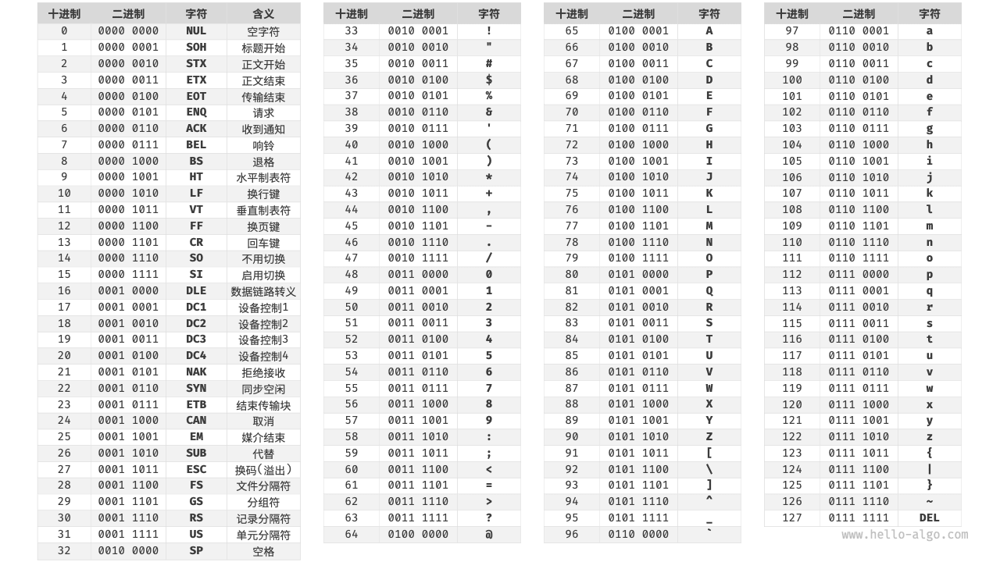
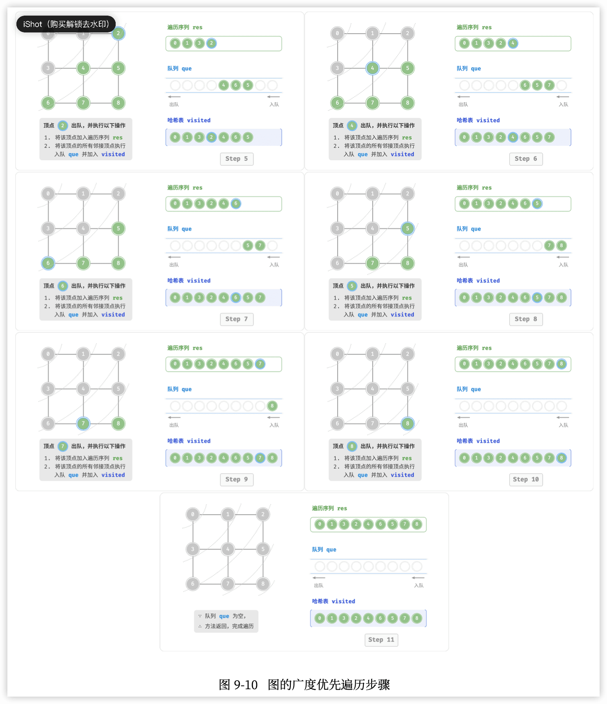
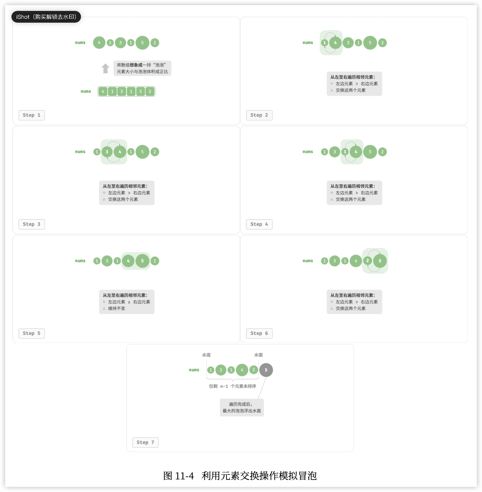
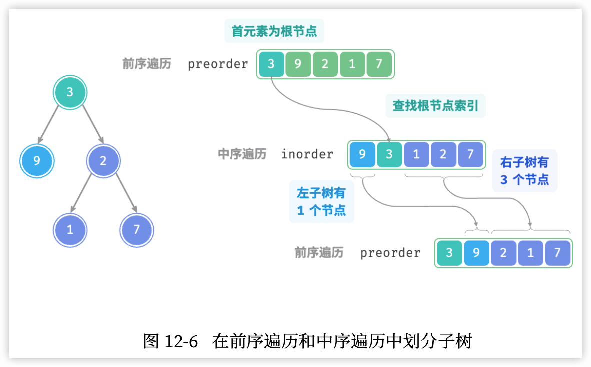
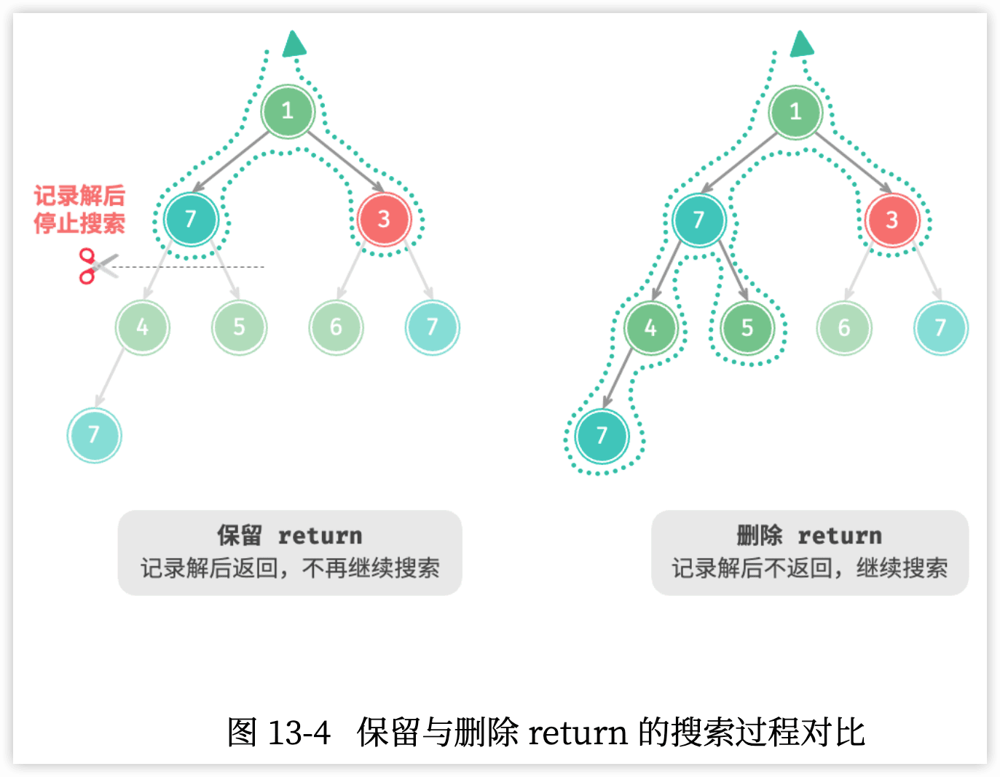
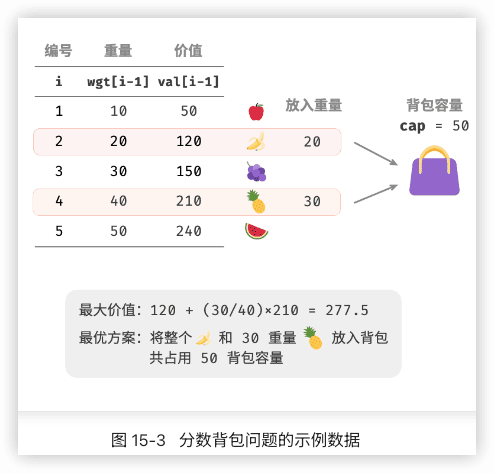

Hello-algo-go笔记
---


https://www.hello-algo.com/

https://github.com/krahets/hello-algo

go

## 0 前言


## 1 初识算法

### 1.1 算法无处不在

- 例一:查字典 。 “二分查找”


- 例二:整理扑克。 “插入排序”


- 例三:货币找零。 “贪心”算法


小到烹饪一道菜，大到星际航行，几乎所有问题的解决都离不开算法。计算机的出现使得我们能够通过**编程**将**数据结构**存储在内存中，同时编写代码调用 CPU 和 GPU **执行**算法。这样一来，我们就能**把生活中的问题转移到计算机上**，以更高效的方式解决各种复杂问题。

### 1.2 算法是什么

#### 算法定义

「**算法 algorithm**」是**在==有限==时间内==解决====特定==问题的一组==指令==或==操作步骤==**，它具有以下特性。

- 问题是**明确**的，包含清晰的输入和输出定义。  
- 具有**可行性**，能够在有限步骤、时间和内存空间下完成。  
- 各步骤都有**确定的含义**，在相同的输入和运行条件下，输出始终相同。

#### 数据结构定义

「**数据结构 data structure**」是计算机中**组织和存储**数据的方式，具有以下设计目标。 

- **空间**占用尽量少，以节省计算机内存。
- 数据**操作**尽可能快速，涵盖数据访问、添加、删除、更新等。 
- 提供简洁的**数据表示**和**逻辑信息**，以便算法高效运行。

数据结构设计是一个充满**==权衡==**的过程。如果想在某方面取得提升，往往需要在另一方面作出妥协。例如：

- 链表相较于数组，在数据添加和删除操作上更加便捷，但牺牲了数据访问速度。 
- 图相较于链表，提供了更丰富的**逻辑信息**，但需要占用更大的内存空间。

#### 数据结构与算法的关系

数据结构与算法高度相关、紧密结合，具体表现：

- 数据结构是算法的基石。数据结构为算法提供了**结构化存储的数据**，以及**操作数据的方法**。  
- 算法是数据结构发挥作用的舞台。数据结构本身仅存储数据信息，结合算法才能解决特定问题。 
- 算法通常可以基于不同的数据结构实现，但执行效率可能相差很大，选择合适的数据结构是关键。
  

数据结构与算法犹如拼装积木。一套积木，除了包含许多零件之外，还附有详细的组装说明书。 我们按照说明书一步步操作，就能组装出精美的积木模型。

| 数据结构与算法 | 拼装积木                                 |
| -------------- | ---------------------------------------- |
| 输入数据       | 未拼装的积木                             |
| 数据结构       | 积木组织形式，包括形状、大小、连接方式等 |
| 算法           | 把积木拼成目标形态的一系列操作步骤       |
| 输出数据       | 积木模型                                 |

> 数据结构与算法是独立于编程语言的。
> 通常会将“数据结构与算法”简称为“算法”。

## 2 复杂度分析

> 复杂度分析犹如浩瀚的算法宇宙中的时空向导。它带领我们在时间与空间这两个维度上深入探索，寻找更优雅的解决方案。

### 2.1 算法效率评估

算法设计中两个层面的目标:

1. **找到问题解法**:算法需要在规定的输入范围内可靠地求得问题的正确解。
2. **寻求最优解法**:同一个问题可能存在多种解法，我们希望找到尽可能高效的算法。

也就是说，在能够解决问题的前提下，**算法效率**已成为衡量算法优劣的主要评价指标，它包括以下两个维度：

- 时间效率:算法运行速度的快慢。
- 空间效率:算法占用内存空间的大小。

既快又省

#### 实际测试

- 难以排除测试环境的干扰因素
- 展开完整测试非常耗费资源

#### 理论估算

「渐近复杂度分析 asymptotic complexity analysis」，简称「复杂度分析」

复杂度分析能够体现算法运行所需的时间和空间资源与输入数据大小之间的关系。它描述了随着**输入数据**大小的增加，算法执行所需时间和空间的**==增长趋势==**。三个重点理解：

- “时间和空间资源”分别对应「时间复杂度 time complexity」和「空间复杂度 space complexity」。 
- “随着输入数据大小的增加”意味着复杂度反映了算法运行效率与输入数据体量之间的关系。 
- “时间和空间的增长趋势”表示复杂度分析关注的不是运行时间或占用空间的具体值，而是时间或空间增长的“快慢”。

### 2.2 迭代与递归

重复执行某个任务是很常见的，它与复杂度分析息息相关。

如何在程序中实现重复执行任务，即两种基本的程序控制结构:迭代、递归。

#### 迭代

「**==迭代== iteration**」是一种重复执行某个任务的控制结构。在迭代中，程序会在满足一定的条件下重复执行某 段代码，直到这个条件不再满足。

1. for循环。适合在预先知道迭代次数时使用。
2. while循环。while 循环比 for 循环的自由度更高。在 while 循环中，我们可以自由地设计条件变量的初始化和更新步 骤。
3. 嵌套循环

```go
/* 双层 for 循环 */
func nestedForLoop(n int) string {
    res := ""
    // 循环 i = 1, 2, ..., n-1, n
    for i := 1; i <= n; i++ {
        for j := 1; j <= n; j++ {
            // 循环 j = 1, 2, ..., n-1, n
            res += fmt.Sprintf("(%d, %d), ", i, j)
        }
    }
    return res
}
```


#### 递归

「==递归== recursion」是一种算法策略，通过函数调用自身来解决问题。它主要包含两个阶段。 

1. **==递==**:程序不断深入地调用自身，通常传入更小或更简化的参数，直到达到“终止条件”。
2. **==归==**:触发“终止条件”后，程序从最深层的递归函数开始逐层返回，汇聚每一层的结果。

从实现的角度看，递归代码主要包含三个要素。

1. **终止条件**:用于决定什么时候由“递”转“归”。  
2. **递归调用**:对应“递”，函数调用自身，通常输入更小或更简化的参数。 
3. **返回结果**:对应“归”，将当前递归层级的结果返回至上一层。

```go
// 递归
func recur(n int) int {
	// 终止条件
	if n == 1 {
		return 1
	}
	// 递：递归调用
	res := recur(n - 1)
	// 归：返回接结果
	return n + res
}
```


虽然从计算角度看，迭代与递归可以得到相同的结果，但它们代表了两种完全不同的**思考和解决问题的范式**。

- 迭代:“**自下而上**”地解决问题。从最基础的步骤开始，然后不断重复或累加这些步骤，直到任务完成。
- 递归:“**自上而下**”地解决问题。将原问题分解为更小的子问题，这些子问题和原问题具有相同的形式。接下来将子问题继续分解为更小的子问题，直到基本情况时停止(基本情况的解是已知的)。

以上述求和函数为例，设问题 `𝑓(𝑛) = 1 + 2 + ⋯ + 𝑛` 。

- 迭代:在循环中**模拟求和过程**，从1遍历到𝑛，每轮执行求和操作，即可求得𝑓(𝑛)。
- 递归:**将问题分解为子问题`**𝑓(𝑛)=𝑛+𝑓(𝑛−1)`，不断(递归地)分解下去，直至基本情况𝑓(1)=1时终止。

##### 1️⃣ 调用栈

递归函数每次调用自身时，系统都会为新开启的函数分配内存，以存储局部变量、调用地址和其他信息等。

这将导致两方面的结果：

- 函数的上下文数据都存储在称为“**栈帧空间**”的内存区域中，直至函数返回后才会被释放。因此，递归通常比迭代更加耗费内存空间。
- 递归调用函数会产生额外的开销。因此递归通常比循环的时间效率更低。 


在触发终止条件前，同时存在 𝑛 个未返回的递归函数，**递归深度**为𝑛。

在实际中，编程语言允许的递归深度通常是有限的，过深的递归可能导致栈溢出错误。

##### 2️⃣ 尾递归 ❤️

**如果函数在返回前的最后一步才进行递归调用**，则该函数可以被编译器或解释器优化，使其在空间效率上与迭代相当。这种情况被称为「**尾递归 tail recursion**」。

- 普通递归:当函数返回到上一层级的函数后，需要继续执行代码，因此系统需要保存上一层调用的上下文。
- 尾递归:递归调用是函数返回前的最后一个操作，这意味着函数返回到上一层级后，无须继续执行其他操作，因此系统无须保存上一层函数的上下文。

以求和为例，可以将结果变量 res 设为函数参数，从而实现尾递归:

```go
// 尾递归
func tailRecur(n int, res int) int {
	// 终止条件
	if n == 0 {
		return res
	}
	// 尾递归调用
	return tailRecur(n-1, res+n)
}
```

如图 2‐5 所示。对比普通递归和尾递归，两者的求和操作的执行点是不同的。

- 普通递归:求和操作是在“归”的过程中执行的，每层返回后都要再执行一次求和操作。
- 尾递归:求和操作是在“递”的过程中执行的，“归”的过程只需层层返回。 

> 请注意，许多编译器或解释器并不支持尾递归优化。例如，Python默认不支持尾递归优化， 因此即使函数是尾递归形式，仍然可能会遇到栈溢出问题。

##### 3️⃣ 递归树

当处理与“分治”相关的算法问题时，递归往往比迭代的思路更加直观、代码更加易读。

以“斐波那契数列” 为例。

- 数列的前两个数字为𝑓(1)=0和𝑓(2)=1。
- 数列中的每个数字是前两个数字的和，即 𝑓(𝑛) = 𝑓(𝑛 − 1) + 𝑓(𝑛 − 2) 。

按照递推关系进行递归调用，将前两个数字作为终止条件，便可写出递归代码。调用 fib(n) 即可得到斐波那 契数列的第 𝑛 个数字:

```go
// 斐波那契数列：递归
func fib(n int) int {
	// 终止条件
	if n == 1 || n == 2 {
		return n - 1
	}
	// 递归调用 f(n) = f(n-1) + f(n-2)
	res := fib(n-1) + fib(n-2)
	// 返回结果 f(n)
	return res
}
```

在函数内递归调用了两个函数，这意味着**从一个调用产生了两个调用分支**。这样不断递归调用下去，最终将产生一棵层数为 𝑛 的「**递归树 recursion tree**」。 


从本质上看，递归体现了“将问题分解为更小子问题”的思维范式，这种**分治策略**至关重要。

- 从算法角度看，搜索、排序、回溯、分治、动态规划等许多重要算法策略直接或间接地应用了这种思维方式。
- 从数据结构角度看，递归天然适合处理链表、树和图的相关问题，因为它们非常适合用分治思想进行分析。

#### 两者对比

迭代和递归在实现、性能和适用性上有所不同。

|          | 迭代                                   | 递归                                                         |
| -------- | -------------------------------------- | ------------------------------------------------------------ |
| 实现方式 | 循环结构                               | 函数调用自身                                                 |
| 时间效率 | 效率通常较高，无函数调用开销           | 每次函数调用都会产生开销                                     |
| 内存使用 | 通常使用固定大小的内存空间             | 累积函数调用可能使用大量的栈帧空间                           |
| 适用问题 | 适用于简单循环任务，代码直观、可读性好 | 适用于子问题分解，如树、图、分治、回溯等，代码结构简洁、清晰 |

> 迭代和递归具有什么内在联系呢?

以上述递归函数为例，求和操作在递归的“归”阶段进行。这意味着最初被调用的函数实际上是最后完成其求和操作的，**这种工作机制与栈的“先入后出”原则异曲同工**。

事实上，“调用栈”和“栈帧空间”这类递归术语已经暗示了递归与栈之间的密切关系。

1. **递**:当函数被调用时，系统会在“调用栈”上为该函数分配新的栈帧，用于存储函数的局部变量、参数、 返回地址等数据。
2. **归**:当函数完成执行并返回时，对应的栈帧会被从“调用栈”上移除，恢复之前函数的执行环境。

因此，可以使用一个**显式的栈来模拟调用栈的行为**，从而将递归转化为迭代形式: 

```go
// 使用迭代模拟递归
func forLoopRecur(n int) int {
	// 使用一个显式的栈来模拟系统调用栈
	stack := list.New()
	res := 0
	// 递：递归调用
	for i := n; i > 0; i-- {
		// 通过入栈操作模拟"递"
		stack.PushBack(i)
	}
	// 归：返回结果
	for stack.Len() != 0 {
		// 通过出栈操作模拟"归"
		res += stack.Back().Value.(int)
		stack.Remove(stack.Back())
	}
	return res
}
```

观察以上代码，当递归转化为迭代后，代码变得更加复杂了。尽管迭代和递归在很多情况下可以互相转化， 但不一定值得这样做，有以下两点原因。

- 转化后的代码可能更加难以理解，可读性更差。  
- 对于某些复杂问题，模拟系统调用栈的行为可能非常困难。

总之，**选择迭代还是递归取决于特定问题的性质**。在编程实践中，**权衡**两者的优劣并根据情境选择合适的方法至关重要。

### 2.3 时间复杂度

运行时间可以直观且准确地反映算法的效率。如果我们想准确预估一段代码的运行时间，应该如何操作呢?

1. 确定运行平台，包括硬件配置、编程语言、系统环境等，这些因素都会影响代码的运行效率。
2. 评估各种计算操作所需的运行时间，例如加法操作 `+` 需要 1 ns ，乘法操作 * 需要 10 ns ，打印操作`print()` 需要 5 ns 等。
3. 统计代码中所有的计算操作，并将所有操作的执行时间求和，从而得到运行时间。

例如在以下代码中，输入数据大小为 𝑛 :


```go
// 在某运行平台下
func algorithm(n int) {
    a := 2     // 1 ns
    a = a + 1  // 1 ns
    a = a * 2  // 10 ns
    // 循环 n 次
    for i := 0; i < n; i++ {  // 1 ns
        fmt.Println(a)        // 5 ns
    }
}
```

运行时间为:   `1 + 1 + 10 + (1 + 5) × 𝑛 = (6𝑛 + 12)` ns

但实际上，**统计算法的运行时间既不合理也不现实**。首先，我们**不希望将预估时间和运行平台绑**定，因为算法需要在各种不同的平台上运行。其次，我们很难获知每种操作的运行时间，这给预估过程带来了极大的难度。

#### 统计时间增长趋势

时间复杂度分析统计的不是算法运行时间，而是**算法运行时间随着数据量变大时的增长趋势**。 “==时间增长趋势==”这个概念比较抽象，通过一个例子来加以理解。假设输入数据大小为 𝑛 ，给定三个算法 A、B 和 C :

```go
// 算法 A 的时间复杂度：常数阶
func algorithm_A(n int) {
    fmt.Println(0)
}
// 算法 B 的时间复杂度：线性阶
func algorithm_B(n int) {
    for i := 0; i < n; i++ {
        fmt.Println(0)
    }
}
// 算法 C 的时间复杂度：常数阶
func algorithm_C(n int) {
    for i := 0; i < 1000000; i++ {
        fmt.Println(0)
    }
}
```

- 算法 A 只有 1 个打印操作，算法运行时间不随着 𝑛 增大而增长。我们称此算法的时间复杂度为“常数阶”。
- 算法 B 中的打印操作需要循环 𝑛 次，算法运行时间随着 𝑛 增大呈线性增长。此算法的时间复杂度被称 为“线性阶”。
- 算法 C 中的打印操作需要循环 1000000 次，虽然运行时间很长，但它与输入数据大小 𝑛 无关。因此 C 的时间复杂度和 A 相同，仍为“常数阶”。 

相较于直接统计算法的运行时间，时间复杂度分析有哪些特点呢?

- 时间复杂度能够**有效评估算法效率**。例如，算法 B 的运行时间呈线性增长，在 𝑛 > 1 时比算法 A 更慢， 在 𝑛 > 1000000 时比算法 C 更慢。事实上，只要输入数据大小 𝑛 足够大，复杂度为“常数阶”的算法 一定优于“线性阶”的算法，这正是时间增长趋势的含义。
- 时间复杂度的**推算方法更简便**。显然，运行平台和计算操作类型都与算法运行时间的增长趋势无关。因此在时间复杂度分析中，我们可以简单地将所有计算操作的执行时间视为相同的“单位时间”，从而将“计算操作运行时间统计”简化为“计算操作数量统计”，这样一来估算难度就大大降低了。  
- 时间复杂度也存在一定的局限性。例如，尽管算法 A 和 C 的时间复杂度相同，但实际运行时间差别很大。同样，尽管算法 B 的时间复杂度比 C 高，但在输入数据大小 𝑛 较小时，算法 B 明显优于算法 C 。在 这些情况下，我们很难仅凭时间复杂度判断算法效率的高低。当然，尽管存在上述问题，复杂度分析仍然是评判算法效率最有效且常用的方法。

#### 函数渐近上界🔖

```go
func algorithm(n int) {
    a := 1      // +1
    a = a + 1   // +1
    a = a * 2   // +1
    // 循环 n 次
    for i := 0; i < n; i++ {   // +1
        fmt.Println(a)         // +1
    }
}
```

设算法的操作数量是一个关于输入数据大小 𝑛 的函数，记为 𝑇(𝑛) ，则以上函数的操作数量为：`T(n) = 3 + 2n`。

𝑇(𝑛) 是一次函数，说明其运行时间的增长趋势是线性的，因此它的时间复杂度是线性阶。

将线性阶的时间复杂度记为 𝑂(𝑛) ，这个数学符号称为==大𝑂记号==（big-𝑂 notation），表示函数𝑇(𝑛)的==渐近上界==（asymptotic upper bound）。

时间复杂度分析本质上是计算“操作数量 𝑇(𝑛)”的渐近上界，它具有明确的数学定义。

> 若存在正实数 𝑐 和实数 $𝑛_0$ ，使得对于所有的 $𝑛>𝑛_0$ ，均有 `𝑇(𝑛)≤𝑐⋅𝑓(𝑛)` ，则可认为 𝑓(𝑛) 给出了 𝑇(𝑛) 的一个渐近上界，记为 𝑇(𝑛)=𝑂(𝑓(𝑛)) 。

计算渐近上界就是寻找一个函数 𝑓(𝑛) ，使得当 𝑛 趋向于无穷大时，𝑇(𝑛) 和 𝑓(𝑛) 处于相同的增长级别，仅相差一个常数项 𝑐 的倍数。


#### 推算方法 🔖

##### 1 第一步：统计操作数量

##### 2 第二步：判断渐近上界

时间复杂度由T(n)中最高阶的项来决定。 

#### 常见类型

 

##### 指数阶

生物学的“细胞分裂”是指数阶增长的典型例子：初始状态为 1 个细胞，分裂一轮后变为 2 个，分裂两轮后变为 4 个，以此类推，分裂 n 轮后有 2n 个细胞。

在实际算法中，指数阶常出现于递归函数中。

指数阶增长非常迅速，在穷举法（暴力搜索、回溯等）中比较常见。对于数据规模较大的问题，指数阶是不可接受的，通常需要使用动态规划或贪心算法等来解决。

##### 对数阶

与指数阶相反，对数阶反映了“每轮缩减到一半”的情况。设输入数据大小为n，由于每轮缩减到一半，因此循环次数是log2n，即2n 的反函数。

```go

```

对数阶常出现于基于分治策略的算法中，体现了“一分为多”和“化繁为简”的算法思想。它增长缓慢，是仅次于常数阶的理想的时间复杂度。

##### 线性对数阶

```go

```


主流排序算法的时间复杂度通常为O(nlogn)，例如快速排序、归并排序、堆排序等。

##### 阶乘阶

阶乘阶对应数学上的“全排列”问题。给定n个互不重复的元素，求其所有可能的排列方案，方案数量为： n!=n∗(n−1)∗(n−2)∗...∗2∗1 阶乘通常使用递归实现。如图 2-14 和以下代码所示，第一层分裂出 n 个，第二层分裂出 n−1 个，以此类推，直至第 n 层时停止分裂：


```go

```


请注意，因为当 n≥4 时恒有 n!>2n ，所以阶乘阶比指数阶增长得更快，在 n 较大时也是不可接受的。

#### 最差、最佳、平均时间复杂度 🔖

**算法的时间效率往往不是固定的，而是与输入数据的分布有关**。


### 2.4 空间复杂度

空间复杂度（space complexity）用于衡量算法占用内存空间随着数据量变大时的增长趋势。

#### 算法相关空间

算法在运行过程中使用的内存空间主要包括以下几种。

- **输入空间**:用于存储算法的输入数据。  
- **暂存空间**:用于存储算法在运行过程中的变量、对象、函数上下文等数据。 
- **输出空间**:用于存储算法的输出数据。

一般情况下，空间复杂度的统计范围是“暂存空间”加上“输出空间”。 暂存空间可以进一步划分为三个部分。

- **暂存数据**:用于保存算法运行过程中的各种常量、变量、对象等。
- **栈帧空间**:用于保存调用函数的上下文数据。系统在每次调用函数时都会在栈顶部创建一个栈帧，函数返回后，栈帧空间会被释放。
- **指令空间**:用于保存编译后的程序指令，在实际统计中通常忽略不计。

在分析一段程序的空间复杂度时，我们通常统计暂存数据、栈帧空间和输出数据三部分： 

```go

```

#### 推算方法🔖

最差空间复杂度


#### 常见类型


#### 权衡时间与空间

理想情况下，我们希望算法的时间复杂度和空间复杂度都能达到最优。然而在实际情况中，同时优化时间复杂度和空间复杂度通常非常困难。

**降低时间复杂度通常需要以提升空间复杂度为代价，反之亦然**。 将牺牲内存空间来提升算法运行速度的思路称为“以空间换时间”；反之，则称为“以时间换空间”。

选择哪种思路取决于我们更看重哪个方面。在大多数情况下，时间比空间更宝贵，因此“以空间换时间”通常是更常用的策略。当然，在数据量很大的情况下，控制空间复杂度也非常重要。

### 2.5 小节

#### 1 重点回顾

**算法效率评估**

- 时间效率和空间效率是衡量算法优劣的两个主要评价指标。
- 我们可以通过实际测试来评估算法效率，但难以消除测试环境的影响，且会耗费大量计算资源。
- 复杂度分析可以消除实际测试的弊端，分析结果适用于所有运行平台，并且能够揭示算法在不同数据规模下的效率。

**时间复杂度**

- 时间复杂度用于衡量算法运行时间随数据量增长的趋势，可以有效评估算法效率，但在某些情况下可能失效，如在输入的数据量较小或时间复杂度相同时，无法精确对比算法效率的优劣。
- 最差时间复杂度使用大O符号表示，对应函数渐近上界，反映当n趋向正无穷时，操作数量T(n)的增长级别。
- 推算时间复杂度分为两步，首先统计操作数量，然后判断渐近上界。
- 常见时间复杂度从低到高排列有 O(1)、O(log⁡n)、O(n)、O(nlog⁡n)、O(n2)、O(2n)和O(n!) 等。
- 某些算法的时间复杂度非固定，而是与输入数据的分布有关。时间复杂度分为最差、最佳、平均时间复杂度，最佳时间复杂度几乎不用，因为输入数据一般需要满足严格条件才能达到最佳情况。
- 平均时间复杂度反映算法在随机数据输入下的运行效率，最接近实际应用中的算法性能。计算平均时间复杂度需要统计输入数据分布以及综合后的数学期望。

**空间复杂度**

- 空间复杂度的作用类似于时间复杂度，用于衡量算法占用内存空间随数据量增长的趋势。
- 算法运行过程中的相关内存空间可分为输入空间、暂存空间、输出空间。通常情况下，输入空间不纳入空间复杂度计算。暂存空间可分为暂存数据、栈帧空间和指令空间，其中栈帧空间通常仅在递归函数中影响空间复杂度。
- 我们通常只关注最差空间复杂度，即统计算法在最差输入数据和最差运行时刻下的空间复杂度。
- 常见空间复杂度从低到高排列有 O(1)、O(log⁡n)、O(n)、O(n2)、O(2n)等。

#### 2 Q&A

**Q**：尾递归的空间复杂度是 O(1) 吗？

理论上，尾递归函数的空间复杂度可以优化至 O(1) 。不过绝大多数编程语言（例如 Java、Python、C++、Go、C# 等）不支持自动优化尾递归，因此通常认为空间复杂度是 O(n) 。

**Q**：函数和方法这两个术语的区别是什么？

「函数 function」可以被独立执行，所有参数都以显式传递。「方法 method」与一个对象关联，被隐式传递给调用它的对象，能够对类的实例中包含的数据进行操作。

下面以几种常见的编程语言为例来说明。

- C 语言是过程式编程语言，没有面向对象的概念，所以只有函数。但我们可以通过创建结构体（struct）来模拟面向对象编程，与结构体相关联的函数就相当于其他编程语言中的方法。
- Java 和 C# 是面向对象的编程语言，代码块（方法）通常作为某个类的一部分。静态方法的行为类似于函数，因为它被绑定在类上，不能访问特定的实例变量。
- C++ 和 Python 既支持过程式编程（函数），也支持面向对象编程（方法）。

**Q**：图解“常见的空间复杂度类型”反映的是否是占用空间的绝对大小？

不是，该图展示的是空间复杂度，其反映的是增长趋势，而不是占用空间的绝对大小。

假设取 n=8 ，你可能会发现每条曲线的值与函数对应不上。这是因为每条曲线都包含一个常数项，用于将取值范围压缩到一个视觉舒适的范围内。

在实际中，因为我们通常不知道每个方法的“常数项”复杂度是多少，所以一般无法仅凭复杂度来选择 n=8 之下的最优解法。但对于 n=85 就很好选了，这时增长趋势已经占主导了。


## 3 数据结构

### 3.1 数据结构分类

常见的数据结构包括数组、链表、栈、队列、哈希表、树、堆、图，它们可以从“逻辑结构”和“物理结构” 两个维度进行分类。

#### 逻辑结构:线性与非线性

**逻辑结构揭示了数据元素之间的逻辑关系**。在数组和链表中，数据按照一定顺序排列，体现了数据之间的线 性关系;而在树中，数据从顶部向下按层次排列，表现出“祖先”与“后代”之间的派生关系;图则由节点 和边构成，反映了复杂的网络关系。

线性结构比较直观，指数据在逻辑关系上呈 线性排列;非线性结构则相反，呈非线性排列。

- 线性数据结构:数组、链表、栈、队列、哈希表，元素之间是一对一的顺序关系。 
- 非线性数据结构:树、堆、图、哈希表。

非线性数据结构可分为： 

- 树形结构:树、堆、哈希表，元素之间是一对多的关系。
- 网状结构:图，元素之间是多对多的关系。


#### 物理结构:连续与分散

当算法程序运行时，**正在处理的数据主要存储在内存中**。图 3‐2 展示了一个计算机内存条，其中每个黑色方 块都包含一块内存空间。我们可以将内存想象成一个巨大的 Excel 表格，其中每个单元格都可以存储一定大 小的数据。

**系统通过内存地址来访问目标位置的数据**。如图 3‐2 所示，计算机根据特定规则为表格中的每个单元格分配 编号，确保每个内存空间都有唯一的内存地址。有了这些地址，程序便可以访问内存中的数据。 


> 将内存比作 Excel 表格是一个简化的类比，实际内存的工作机制比较复杂，涉 及地址空间、内存管理、缓存机制、虚拟内存和物理内存等概念。

内存是所有程序的共享资源，当某块内存被某个程序占用时，则无法被其他程序同时使用了。因此**在数据结构与算法的设计中，内存资源是一个重要的考虑因素**。比如，算法所占用的内存峰值不应超过系统剩余空闲 内存;如果缺少连续大块的内存空间，那么所选用的数据结构必须能够存储在分散的内存空间内。

如图 3‐3 所示，**物理结构反映了数据在计算机内存中的存储方式**，可分为连续空间存储(数组)和分散空间 存储(链表)。物理结构从底层决定了数据的访问、更新、增删等操作方法，两种物理结构在时间效率和空间 效率方面呈现出互补的特点。


值得说明的是，**所有数据结构都是基于数组、链表或二者的组合实现的**。例如，栈和队列既可以使用数组实 现，也可以使用链表实现;而哈希表的实现可能同时包含数组和链表。

- 基于数组可实现:栈、队列、哈希表、树、堆、图、矩阵、张量(维度 ≥ 3 的数组)等。 【“静态数据结构”，意味着此类数据结构在初始化后长度不可变】
- 基于链表可实现:栈、队列、哈希表、树、堆、图等。【动态数据结构”，这类数据结构在初始化后，仍可以在程序运行过程中对其长 度进行调整】

### 3.2 基本数据类型

计算机中有文本、图片、视频、语音、3D 模型等各种形式的数据。尽管这些数据的组织形式各异，但它们都由各种基本数据类型构成。

**基本数据类型是 CPU 可以直接进行运算的类型**，在算法中直接被使用，主要包括以下几种：

- 整数类型 byte、short、int、long 。  
- 浮点数类型 float、double ，用于表示小数。  
- 字符类型 char ，用于表示各种语言的字母、标点符号甚至表情符号等。 
- 布尔类型 bool ，用于表示“是”与“否”判断。

**基本数据类型以二进制的形式存储在计算机中**。一个二进制位即为 1 比特。在绝大多数现代操作系统中，1 字节(byte)由 8 比特(bit)组成。

基本数据类型的取值范围取决于其占用的空间大小。下面以 Java 为例。 

- 整数类型byte占用1字节=8比特，可以表示 个数字。
- 整数类型 int 占用 4 字节 = 32 比特，可以表示  个数字。


每种编程语言都有各自的数据类型定义，它们的占用 空间、取值范围和默认值可能会有所不同。

- 在 Python 中，整数类型 int 可以是任意大小，只受限于可用内存;浮点数 float 是双精度 64 位;没 有 char 类型，单个字符实际上是长度为 1 的字符串 str 。
- C 和 C++ 未明确规定基本数据类型的大小，而因实现和平台各异。表 3‐1 遵循 LP64 [数据模型](https://en.cppreference.com/w/cpp/language/types#Properties)，其用于 包括 Linux 和 macOS 在内的 Unix 64 位操作系统。
- 字符 char 的大小在 C 和 C++ 中为 1 字节，在大多数编程语言中取决于特定的字符编码方法，详见“字符编码”章节。
- 即使表示布尔量仅需 1 位(0 或 1)，它在内存中通常也存储为 1 字节。这是因为现代计算机 CPU 通常 将 1 字节作为最小寻址内存单元。

基本数据类型与数据结构之间有什么联系呢?

**基本数据类型提供了数据的“内容类型”，而数据结构提供了数据的“组织方式”**。

### 3.3 数字编码  

#### 原码、反码和补码

所有整数类型能够表示的负数都比正数多一个，例如 `byte` 的取值范围是 [−128,127] 。这个现象比较反直觉，它的内在原因涉及原码、反码、补码的相关知识。

**数字是以“补码”的形式存储在计算机中的**。

- **原码**：将数字的二进制表示的最高位视为符号位，其中 0 表示正数，1 表示负数，其余位表示数字的值。
- **反码**：正数的反码与其原码相同，负数的反码是对其原码除符号位外的所有位取反。
- **补码**：正数的补码与其原码相同，负数的补码是在其反码的基础上加 1 。 


「原码 sign-magnitude」虽然最直观，但存在一些局限性。一方面，**负数的原码不能直接用于运算**。例如在原码下计算 1+(−2) ，得到的结果是 −3 ，这显然是不对的。  为了解决此问题，计算机引入了「**反码 1's complement**」。如果我们先将原码转换为反码，并在反码下计算 1+(−2) ，最后将结果从反码转换回原码，则可得到正确结果 −1 。  另一方面，**数字零的原码有 +0 和 −0 两种表示方式**。这意味着数字零对应两个不同的二进制编码，这可能会带来歧义。比如在条件判断中，如果没有区分正零和负零，则可能会导致判断结果出错。而如果我们想处理正零和负零歧义，则需要引入额外的判断操作，这可能会降低计算机的运算效率。  与原码一样，反码也存在正负零歧义问题，因此计算机进一步引入了「**补码 2's complement**」。我们先来观察一下负零的原码、反码、补码的转换过程：  在负零的反码基础上加 1 会产生进位，但 `byte` 类型的长度只有 8 位，因此溢出到第 9 位的 1 会被舍弃。也就是说，**负零的补码为 00000000 ，与正零的补码相同**。这意味着在补码表示中只存在一个零，正负零歧义从而得到解决。

> 还剩最后一个疑惑：`byte` 类型的取值范围是 [−128,127] ，多出来的一个负数 −128 是如何得到的呢？

我们注意到，区间 [−127,+127] 内的所有整数都有对应的原码、反码和补码，并且原码和补码之间可以互相转换。

然而，**补码 1000 0000 是一个例外，它并没有对应的原码**。根据转换方法，我们得到该补码的原码为 00000000 。这显然是矛盾的，因为该原码表示数字 0 ，它的补码应该是自身。计算机规定这个特殊的补码 10000000 代表 −128 。实际上，(−1)+(−127) 在补码下的计算结果就是 −128 。 

上述所有计算都是加法运算。这暗示着一个重要事实：**计算机内部的硬件电路主要是基于加法运算设计的**。这是因为加法运算相对于其他运算（比如乘法、除法和减法）来说，硬件实现起来更简单，更容易进行并行化处理，运算速度更快。

请注意，这并不意味着计算机只能做加法。**通过将加法与一些基本逻辑运算结合，计算机能够实现各种其他的数学运算**。例如，计算减法 a−b 可以转换为计算加法 a+(−b) ；计算乘法和除法可以转换为计算多次加法或减法。

总结出计算机使用补码的原因：**基于补码表示，计算机可以用同样的电路和操作来处理正数和负数的加法，不需要设计特殊的硬件电路来处理减法，并且无须特别处理正负零的歧义问题**。这大大简化了硬件设计，提高了运算效率。

#### 浮点数编码

> `int` 和 `float` 长度相同，都是 4 字节 ，但为什么 `float` 的取值范围远大于 `int` ？ 这非常反直觉，因为按理说 `float` 需要表示小数，取值范围应该变小才对。

**这是因为浮点数 `float` 采用了不同的表示方式**。记一个 32 比特长度的二进制数为：  根据 IEEE 754 标准，32-bit 长度的 `float` 由以下三个部分构成。

- 符号位 S ：占 1 位 ，对应 b31 。
- 指数位 E ：占 8 位 ，对应 b30b29…b23 。
- 分数位 N ：占 23 位 ，对应 b22b21…b0 。

二进制数 `float` 对应值的计算方法为： 

转化到十进制下的计算公式为： 

其中各项的取值范围为： 


回答最初的问题：**`float` 的表示方式包含指数位，导致其取值范围远大于 `int`** 。根据以上计算，`float` 可表示的最大正数为，切换符号位便可得到最小负数。

**尽管浮点数 `float` 扩展了取值范围，但其副作用是牺牲了精度**。整数类型 `int` 将全部 32 比特用于表示数字，数字是均匀分布的；而由于指数位的存在，浮点数 `float` 的数值越大，相邻两个数字之间的差值就会趋向越大。

如表 3-2 所示，指数位 E=0 和 E=255 具有特殊含义，**用于表示零、无穷大、NaN 等**。 

值得说明的是，次正规数显著提升了浮点数的精度。最小正正规数为 ，最小正次正规数为 。

双精度 `double` 也采用类似于 `float` 的表示方法。

### 3.4 字符编码

在计算机中，所有数据都是以二进制数的形式存储的，字符 `char` 也不例外。为了表示字符，我们需要建立一套“字符集”，规定每个字符和二进制数之间的一一对应关系。有了字符集之后，计算机就可以通过查表完成二进制数到字符的转换。

#### ASCII字符集

「ASCII 码」是最早出现的字符集，其全称为 American Standard Code for Information Interchange（美国标准信息交换代码）。它使用 7 位二进制数（一个字节的低 7 位）表示一个字符，最多能够表示 128 个不同的字符。如图 ，ASCII 码包括英文字母的大小写、数字 0 ~ 9、一些标点符号，以及一些控制字符（如换行符和制表符）。 

然而，**ASCII 码仅能够表示英文**。随着计算机的全球化，诞生了一种能够表示更多语言的「EASCII」字符集。它在 ASCII 的 7 位基础上扩展到 8 位，能够表示 256 个不同的字符。

在世界范围内，陆续出现了一批适用于不同地区的 EASCII 字符集。这些字符集的前 128 个字符统一为 ASCII 码，后 128 个字符定义不同，以适应不同语言的需求。

#### GBK字符集

**EASCII 码仍然无法满足许多语言的字符数量要求**。比如汉字有近十万个，光日常使用的就有几千个。中国国家标准总局于 1980 年发布了「GB2312」字符集，其收录了 6763 个汉字，基本满足了汉字的计算机处理需要。

然而，GB2312 无法处理部分罕见字和繁体字。「GBK」字符集是在 GB2312 的基础上扩展得到的，它共收录了 21886 个汉字。在 GBK 的编码方案中，ASCII 字符使用一个字节表示，汉字使用两个字节表示。

#### Unicode字符集

随着计算机技术的蓬勃发展，字符集与编码标准百花齐放，而这带来了许多问题。一方面，这些字符集一般只定义了特定语言的字符，无法在多语言环境下正常工作。另一方面，同一种语言存在多种字符集标准，如果两台计算机使用的是不同的编码标准，则在信息传递时就会出现乱码。

那个时代的研究人员就在想：**如果推出一个足够完整的字符集，将世界范围内的所有语言和符号都收录其中，不就可以解决跨语言环境和乱码问题了吗**？在这种想法的驱动下，一个大而全的字符集 Unicode 应运而生。

「Unicode」的中文名称为“统一码”，理论上能容纳 100 多万个字符。它致力于将全球范围内的字符纳入统一的字符集之中，提供一种通用的字符集来处理和显示各种语言文字，减少因为编码标准不同而产生的乱码问题。

自 1991 年发布以来，Unicode 不断扩充新的语言与字符。截至 2022 年 9 月，Unicode 已经包含 149186 个字符，包括各种语言的字符、符号甚至表情符号等。在庞大的 Unicode 字符集中，常用的字符占用 2 字节，有些生僻的字符占用 3 字节甚至 4 字节。

Unicode 是一种通用字符集，本质上是给每个字符分配一个编号（称为“码点”），**但它并没有规定在计算机中如何存储这些字符码点**。我们不禁会问：当多种长度的 Unicode 码点同时出现在一个文本中时，系统如何解析字符？例如给定一个长度为 2 字节的编码，系统如何确认它是一个 2 字节的字符还是两个 1 字节的字符？

对于以上问题，**一种直接的解决方案是将所有字符存储为等长的编码**。如图 3-7 所示，“Hello”中的每个字符占用 1 字节，“算法”中的每个字符占用 2 字节。我们可以通过高位填 0 将“Hello 算法”中的所有字符都编码为 2 字节长度。这样系统就可以每隔 2 字节解析一个字符，恢复这个短语的内容了。 

然而 ASCII 码已经向我们证明，编码英文只需 1 字节。若采用上述方案，英文文本占用空间的大小将会是 ASCII 编码下的两倍，非常浪费内存空间。因此，我们需要一种更加高效的 Unicode **编码方法**。

#### UTF‐8编码

目前，UTF-8 已成为国际上使用最广泛的 Unicode 编码方法。**它是一种可变长度的编码**，使用 1 到 4 字节来表示一个字符，根据字符的复杂性而变。ASCII 字符只需 1 字节，拉丁字母和希腊字母需要 2 字节，常用的中文字符需要 3 字节，其他的一些生僻字符需要 4 字节。

UTF-8 的编码规则并不复杂，分为以下两种情况。

- 对于长度为 1 字节的字符，将最高位设置为 0 ，其余 7 位设置为 Unicode 码点。值得注意的是，ASCII 字符在 Unicode 字符集中占据了前 128 个码点。也就是说，**UTF-8 编码可以向下兼容 ASCII 码**。这意味着我们可以使用 UTF-8 来解析年代久远的 ASCII 码文本。
- 对于长度为 n 字节的字符（其中 n>1），将首个字节的高 n 位都设置为 1 ，第 n+1 位设置为 0 ；从第二个字节开始，将每个字节的高 2 位都设置为 10 ；其余所有位用于填充字符的 Unicode 码点。

图 3-8 展示了“Hello算法”对应的 UTF-8 编码。观察发现，由于最高 n 位都设置为 1 ，因此系统可以通过读取最高位 1 的个数来解析出字符的长度为 n 。

但为什么要将其余所有字节的高 2 位都设置为 10 呢？实际上，这个 10 能够起到校验符的作用。假设系统从一个错误的字节开始解析文本，字节头部的 10 能够帮助系统快速判断出异常。

之所以将 10 当作校验符，是因为在 UTF-8 编码规则下，不可能有字符的最高两位是 10 。这个结论可以用反证法来证明：假设一个字符的最高两位是 10 ，说明该字符的长度为 1 ，对应 ASCII 码。而 ASCII 码的最高位应该是 0 ，与假设矛盾。 

除了 UTF-8 之外，常见的编码方式还包括以下两种。

- **UTF-16 编码**：使用 2 或 4 字节来表示一个字符。所有的 ASCII 字符和常用的非英文字符，都用 2 字节表示；少数字符需要用到 4 字节表示。对于 2 字节的字符，UTF-16 编码与 Unicode 码点相等。 🔖java
- **UTF-32 编码**：每个字符都使用 4 字节。这意味着 UTF-32 比 UTF-8 和 UTF-16 更占用空间，特别是对于 ASCII 字符占比较高的文本。

从存储空间占用的角度看，使用 UTF-8 表示英文字符非常高效，因为它仅需 1 字节；使用 UTF-16 编码某些非英文字符（例如中文）会更加高效，因为它仅需 2 字节，而 UTF-8 可能需要 3 字节。

从兼容性的角度看，UTF-8 的通用性最佳，许多工具和库优先支持 UTF-8 。

#### 编程语言的字符编码

对于以往的大多数编程语言，程序运行中的字符串都采用 UTF-16 或 UTF-32 这类等长编码。在等长编码下，我们可以将字符串看作数组来处理，这种做法具有以下优点。

- **随机访问**：UTF-16 编码的字符串可以很容易地进行随机访问。UTF-8 是一种变长编码，要想找到第 i个字符，我们需要从字符串的开始处遍历到第 i 个字符，这需要 O(n) 的时间。
- **字符计数**：与随机访问类似，计算 UTF-16 编码的字符串的长度也是 O(1) 的操作。但是，计算 UTF-8 编码的字符串的长度需要遍历整个字符串。
- **字符串操作**：在 UTF-16 编码的字符串上，很多字符串操作（如分割、连接、插入、删除等）更容易进行。在 UTF-8 编码的字符串上，进行这些操作通常需要额外的计算，以确保不会产生无效的 UTF-8 编码。

实际上，编程语言的字符编码方案设计是一个很有趣的话题，涉及许多因素。

- Java 的 `String` 类型使用 UTF-16 编码，每个字符占用 2 字节。这是因为 Java 语言设计之初，人们认为 16 位足以表示所有可能的字符。然而，这是一个不正确的判断。后来 Unicode 规范扩展到了超过 16 位，所以 Java 中的字符现在可能由一对 16 位的值（称为“代理对”）表示。
- JavaScript 和 TypeScript 的字符串使用 UTF-16 编码的原因与 Java 类似。当 1995 年 Netscape 公司首次推出 JavaScript 语言时，Unicode 还处于发展早期，那时候使用 16 位的编码就足以表示所有的 Unicode 字符了。
- C# 使用 UTF-16 编码，主要是因为 .NET 平台是由 Microsoft 设计的，而 Microsoft 的很多技术（包括 Windows 操作系统）都广泛使用 UTF-16 编码。

由于以上编程语言对字符数量的低估，它们不得不采取“代理对”的方式来表示超过 16 位长度的 Unicode 字符。这是一个不得已为之的无奈之举。一方面，包含代理对的字符串中，一个字符可能占用 2 字节或 4 字节，从而丧失了等长编码的优势。另一方面，处理代理对需要额外增加代码，这提高了编程的复杂性和调试难度。

出于以上原因，部分编程语言提出了一些不同的编码方案。

- Python 中的 `str` 使用 Unicode 编码，并采用一种灵活的字符串表示，存储的字符长度取决于字符串中最大的 Unicode 码点。若字符串中全部是 ASCII 字符，则每个字符占用 1 字节；如果有字符超出了 ASCII 范围，但全部在基本多语言平面（BMP）内，则每个字符占用 2 字节；如果有超出 BMP 的字符，则每个字符占用 4 字节。
- Go 语言的 `string` 类型在内部使用 UTF-8 编码。Go 语言还提供了 `rune` 类型，它用于表示单个 Unicode 码点。
- Rust 语言的 `str` 和 `String` 类型在内部使用 UTF-8 编码。Rust 也提供了 `char` 类型，用于表示单个 Unicode 码点。

需要注意的是，以上讨论的都是字符串在编程语言中的存储方式，**这和字符串如何在文件中存储或在网络中传输是不同的问题**。在文件存储或网络传输中，我们通常会将字符串编码为 UTF-8 格式，以达到最优的兼容性和空间效率。

### 小节

#### Q&A

**Q**：为什么哈希表同时包含线性数据结构和非线性数据结构？

哈希表底层是数组，而为了解决哈希冲突，我们可能会使用“链式地址”（后续“哈希冲突”章节会讲）：数组中每个桶指向一个链表，当链表长度超过一定阈值时，又可能被转化为树（通常为红黑树）。

从存储的角度来看，哈希表的底层是数组，其中每一个桶槽位可能包含一个值，也可能包含一个链表或一棵树。因此，哈希表可能同时包含线性数据结构（数组、链表）和非线性数据结构（树）。

**Q**：`char` 类型的长度是 1 字节吗？

`char` 类型的长度由编程语言采用的编码方法决定。例如，Java、JavaScript、TypeScript、C# 都采用 UTF-16 编码（保存 Unicode 码点），因此 `char` 类型的长度为 2 字节。

**Q**：基于数组实现的数据结构也称“静态数据结构” 是否有歧义？栈也可以进行出栈和入栈等操作，这些操作都是“动态”的。

栈确实可以实现动态的数据操作，但数据结构仍然是“静态”（长度不可变）的。尽管基于数组的数据结构可以动态地添加或删除元素，但它们的容量是固定的。如果数据量超出了预分配的大小，就需要创建一个新的更大的数组，并将旧数组的内容复制到新数组中。

**Q**：在构建栈（队列）的时候，未指定它的大小，为什么它们是“静态数据结构”呢？

在高级编程语言中，我们无须人工指定栈（队列）的初始容量，这个工作由类内部自动完成。例如，Java 的 `ArrayList` 的初始容量通常为 10。另外，扩容操作也是自动实现的。详见后续的“列表”章节。


## 4 数组与链表

### 4.1 数组

#### 数组常用操作

##### 1 初始化数组

在未指定初始值的情况下，大多数编程语言会将数组元素初始化为 0。

##### 2 访问元素

 


**索引本质上是内存地址的偏移量**。首个元素的地址偏移量是 0 ，因此它的索引为 0 是合理的。

##### 3 插入元素

##### 4 删除元素

总的来看，数组的插入与删除操作有以下缺点。

- **时间复杂度高**：数组的插入和删除的平均时间复杂度均为 O(n) ，其中 n 为数组长度。
- **丢失元素**：由于数组的长度不可变，因此在插入元素后，超出数组长度范围的元素会丢失。
- **内存浪费**：我们可以初始化一个比较长的数组，只用前面一部分，这样在插入数据时，丢失的末尾元素都是“无意义”的，但这样做会造成部分内存空间浪费。

##### 5 遍历数组

##### 6 查找元素

##### 7 扩容数组

在复杂的系统环境中，程序难以保证数组之后的内存空间是可用的，从而无法安全地扩展数组容量。因此在大多数编程语言中，**数组的长度是不可变的**。

#### 数组的优点与局限性

数组存储在连续的内存空间内，且元素类型相同。这种做法包含丰富的**先验信息**，系统可以利用这些信息来优化数据结构的操作效率。

- 空间效率高:数组为数据分配了连续的内存块，无须额外的结构开销。
- 支持随机访问:数组允许在 𝑂(1) 时间内访问任何元素。
- 缓存局部性:当访问数组元素时，计算机不仅会加载它，还会缓存其周围的其他数据，从而借助高速缓存来提升后续操作的执行速度。

连续空间存储是一把双刃剑，其存在以下局限性。

- 插入与删除效率低:当数组中元素较多时，插入与删除操作需要移动大量的元素。  
- 长度不可变:数组在初始化后长度就固定了，扩容数组需要将所有数据复制到新数组，开销很大。
- 空间浪费:如果数组分配的大小超过实际所需，那么多余的空间就被浪费了。

#### 数组典型应用

- 随机访问
- 排序和搜索。快速排序、归并排序、二分查找等都主要在数 组上进行。
- 查找表
- 机器学习。神经网络中大量使用了向量、矩阵、张量之间的线性代数运算，这些数据都是以数组的形式 构建的。数组是神经网络编程中最常使用的数据结构。
- 数据结构实现。- 数组可以用于实现栈、队列、哈希表、堆、图等数据结构。例如，图的邻接矩阵表示实 际上是一个二维数组。

### 4.2 链表

链表的设计使得各个节点可以分散存储在内存各处，它们的内存地址无须连续。 


链表的组成单位是「节点 node」对象。每个节点都包含两项数据:节点的“值”和指向下一节 点的“引用”。 **链表比数组占用更多的内存空间**。

#### 链表常用操作

##### 1 初始化链表

**通常将头节点当作链表的代称**。

##### 2 插入节点

##### 3 删除节点

##### 4 访问节点

##### 5 查找节点

#### 数组vs.链表

|          | 数组                           | 链表           |
| -------- | ------------------------------ | -------------- |
| 存储方式 | 连续内存空间                   | 分散内存空间   |
| 容量扩展 | 容量扩展                       | 可灵活扩展     |
| 内存效率 | 元素占用内存少、但可能浪费空间 | 元素占用内存多 |
| 访问元素 | 𝑂(1)                           | 𝑂(𝑛)           |
| 添加元素 | 𝑂(𝑛)                           | 𝑂(1)           |
| 删除元素 | 𝑂(𝑛)                           | 𝑂(1)           |

#### 常见链表类型

- 单向链表
- 环形链表
- 双向链表

#### 链表典型应用

单向链表：

- 栈与队列
- 哈希表:链式地址是解决哈希冲突的主流方案之一，在该方案中，所有冲突的元素都会被放到一个链表中。
- 图

双向链表常用于需要快速查找前一个和后一个元素的场景。

- 高级数据结构:比如在红黑树、B 树中，我们需要访问节点的父节点，这可以通过在节点中保存一个指 向父节点的引用来实现，类似于双向链表。
- 浏览器历史:在网页浏览器中，当用户点击前进或后退按钮时，浏览器需要知道用户访问过的前一个和 后一个网页。双向链表的特性使得这种操作变得简单。
- LRU 算法:在缓存淘汰(LRU)算法中，我们需要快速找到最近最少使用的数据，以及支持快速添加 和删除节点。这时候使用双向链表就非常合适。

环形链表常用于需要周期性操作的场景，比如操作系统的资源调度。

- **时间片轮转调度算法**:在操作系统中，时间片轮转调度算法是一种常见的 CPU 调度算法，它需要对一 组进程进行循环。每个进程被赋予一个时间片，当时间片用完时，CPU 将切换到下一个进程。这种循 环操作可以通过环形链表来实现。 
- **数据缓冲区**：在某些数据缓冲区的实现中，也可能会使用环形链表。比如在音频、视频播放器中，数据 流可能会被分成多个缓冲块并放入一个环形链表，以便实现无缝播放。

### 4.3 列表

「列表 list」是一个**抽象**的数据结构概念，它表示元素的有序集合，支持元素访问、修改、添加、删除和遍历 等操作，无须使用者考虑容量限制的问题。列表可以基于链表或数组实现。

- 链表天然可以看作一个列表，其支持元素增删查改操作，并且可以灵活动态扩容。  
- 数组也支持元素增删查改，但由于其长度不可变，因此只能看作一个具有长度限制的列表。

当使用数组实现列表时，长度不可变的性质会导致列表的实用性降低。这是因为我们通常无法事先确定需要 存储多少数据，从而难以选择合适的列表长度。若长度过小，则很可能无法满足使用需求;若长度过大，则 会造成内存空间浪费。

为解决此问题，我们可以使用「动态数组 dynamic array」来实现列表。它继承了数组的各项优点，并且可 以在程序运行过程中进行动态扩容。

实际上，许多编程语言中的标准库提供的列表是基于动态数组实现的，例如 Python 中的 list 、Java 中的 ArrayList 、C++ 中的 vector 和 C# 中的 List 等。在接下来的讨论中，我们将把“列表”和“动态数组”视 为等同的概念。

#### 列表常用操作

##### 1 初始化列表

##### 2 访问元素

##### 3 插入与删除元素

##### 4 遍历列表

##### 5 拼接列表

##### 6 排序列表

#### 列表实现

许多编程语言内置了列表，例如 Java、C++、Python 等。它们的实现比较复杂，各个参数的设定也非常考 究，例如初始容量、扩容倍数等。

### 4.4 内存与缓存

#### 计算机存储设备

计算机中包括三种类型的存储设备:「硬盘 hard disk」、「内存 random‐access memory, RAM」、「缓存 cache memory」。 

可以将计算机存储系统想象为图 4‐9 所示的金字塔结构。越靠近金字塔顶端的存储设备的速度越快、容 量越小、成本越高。这种多层级的设计并非偶然，而是计算机科学家和工程师们经过深思熟虑的结果。

- 硬盘难以被内存取代。
- 缓存的大容量和高速度难以兼得。随着 L1、L2、L3 缓存的容量逐步增大，其物理尺寸会变大，与 CPU 核心之间的物理距离会变远，从而导致数据传输时间增加，元素访问延迟变高。在当前技术下，多层级 的缓存结构是容量、速度和成本之间的最佳平衡点。 

> 计算机的存储层次结构体现了速度、容量和成本三者之间的精妙平衡。实际上，这种权衡普遍 存在于所有工业领域，它要求我们在不同的优势和限制之间找到最佳平衡点。

总的来说，硬盘用于长期存储大量数据，内存用于临时存储程序运行中正在处理的数据，而缓存则用于存储 经常访问的数据和指令，以提高程序运行效率。三者共同协作，确保计算机系统高效运行。

在程序运行时，数据会从硬盘中被读取到内存中，供 CPU 计算使用。缓存可以看作 CPU 的 一部分，它通过智能地从内存加载数据，给 CPU 提供高速的数据读取，从而显著提升程序的执行效率，减少 对较慢的内存的依赖。 


#### 数据结构的内存效率

#### 数据结构的缓存效率

## 5 栈与队列

### 5.1 栈

「栈 stack」是一种遵循先入后出逻辑的线性数据结构。 


#### 栈的常用操作

#### 栈的实现

##### 1 基于链表的实现

##### 2 基于数组的实现

#### 两种实现对比

#### 栈的典型应用

- 浏览器中的后退与前进、软件中的撤销与反撤销。
- 程序内存管理。

### 5.2 队列

「队列 queue」是一种遵循先入先出规则的线性数据结构。 


#### 队列常用操作

#### 队列实现

##### 1 基于链表的实现

##### 2 基于数组的实现

### 5.3 双向队列

「双向队列 double‐ended queue」提 供了更高的灵活性，允许在头部和尾部执行元素的添加或删除操作。 


#### 双向队列常用操作


#### 双向队列实现

##### 1 基于双向链表的实现

##### 2 基于数组的实现

#### 双向队列应用

双向队列兼具栈与队列的逻辑，因此它可以实现这两者的所有应用场景，同时提供更高的自由度。

## 6 哈希表

> 在计算机世界中，哈希表如同一位聪慧的图书管理员。他知道如何计算索书号，从而可以快速找到目标图书。

### 6.1 哈希表

「哈希表 hash table」，又称「散列表」，它通过建立键 key 与值 value 之间的映射，实现高效的元素查询。具 体而言，我们向哈希表中输入一个键 key ，则可以在 𝑂(1) 时间内获取对应的值 value 。 


除哈希表外，数组和链表也可以实现查询功能，它们的效率对比如表 6‐1 所示。

- 添加元素:仅需将元素添加至数组(链表)的尾部即可，使用 𝑂(1) 时间。  
- 查询元素:由于数组(链表)是乱序的，因此需要遍历其中的所有元素，使用 𝑂(𝑛) 时间。 
- 删除元素:需要先查询到元素，再从数组(链表)中删除，使用 𝑂(𝑛) 时间。 


**在哈希表中进行增删查改的时间复杂度都是 𝑂(1)**。

#### 哈希表常用操作

初始化、查询操作、添加键值对和删除键值对等

#### 哈希表简单实现


#### 哈希冲突与扩容


### 6.2 哈希冲突

#### 链式地址


#### 开放寻址

「开放寻址 open addressing」不引入额外的数据结构，而是通过“多次探测”来处理哈希冲突，探测方式主 要包括线性探测、平方探测和多次哈希等。

##### 1 线性探测

##### 2 平方探测

##### 3 多次哈希

#### 编程语言的选择

各种编程语言采取了不同的哈希表实现策略：

- Python 采用开放寻址。字典 dict 使用伪随机数进行探测。
- Java 采用链式地址。自 JDK 1.8 以来，当 HashMap 内数组长度达到 64 且链表长度达到 8 时，链表会转换为红黑树以提升查找性能。
- Go 采用链式地址。Go 规定每个桶最多存储 8 个键值对，超出容量则连接一个溢出桶;当溢出桶过多时，会执行一次特殊的等量扩容操作，以确保性能。

### 6.3 哈希算法

#### 哈希算法的目标

#### 哈希算法的设计


#### 常见哈希算法


#### 数据结构的哈希值

## 7 树

### 7.1 二叉树

「二叉树 binary tree」是一种非线性数据结构，代表“祖先”与“后代”之间的派生关系，体现了“一分为二” 的分治逻辑。与链表类似，二叉树的基本单元是节点，每个节点包含值、左子节点引用和右子节点引用。

```

```

**在二叉树中，除叶节点外，其他所有节点都包含子节点和非空子树**。 


#### 二叉树常见术语

- 「根节点 root node」:位于二叉树顶层的节点，没有父节点。
- 「叶节点 leaf node」:没有子节点的节点，其两个指针均指向 None 。
- 「边 edge」:连接两个节点的线段，即节点引用(指针)。  
- 节点所在的「层 level」:从顶至底递增，根节点所在层为 1 。  
- 节点的「度 degree」:节点的子节点的数量。在二叉树中，度的取值范围是 0、1、2 。 
- 二叉树的「高度 height」:从根节点到最远叶节点所经过的边的数量。  
- 节点的「深度 depth」:从根节点到该节点所经过的边的数量。  
- 节点的「高度 height」:从距离该节点最远的叶节点到该节点所经过的边的数量。


> 请注意，我们通常将“高度”和“深度”定义为“经过的边的数量”，但有些题目或教材可能 会将其定义为“经过的节点的数量”。在这种情况下，高度和深度都需要加 1 。

#### 二叉树基本操作

##### 1 初始化二叉树

```

```

##### 2 插入与删除节点

与链表类似，在二叉树中插入与删除节点可以通过修改指针来实现。 


> 需要注意的是，插入节点可能会改变二叉树的原有逻辑结构，而删除节点通常意味着删除该节点及其所有子树。因此，在二叉树中，插入与删除通常是由一套操作配合完成的，以实现有实际意义的操作。


#### 常见二叉树类型

##### 1 完美二叉树

「完美二叉树 perfect binary tree」（满二叉树）所有层的节点都被完全填满。在完美二叉树中，叶节点的度为 0 ，其余所有节点的度都为 2 ；若树的高度为 ℎ ，则节点总数为 ，呈现标准的指数级关系，反映了自然界中常见的细胞分裂现象。 


##### 2 完全二叉树

「完全二叉树 complete binary tree」只有最底层的节点未被填满，且最底层节点尽量靠左填充。 


##### 3 完满二叉树

「完满二叉树 full binary tree」除了叶节点之外，其余所有节点都有两个子节点。 


##### 4 平衡二叉树

「平衡二叉树 balanced binary tree」中任意节点的左子树和右子树的高度之差的绝对值不超过 1 。 


#### 二叉树的退化

图 7-8 展示了二叉树的理想结构与退化结构。当二叉树的每层节点都被填满时，达到“完美二叉树”；而当所有节点都偏向一侧时，二叉树退化为“链表”。

- 完美二叉树是理想情况，可以充分发挥二叉树“分治”的优势。
- 链表则是另一个极端，各项操作都变为线性操作，时间复杂度退化至 O(n) 。 


在最佳结构和最差结构下，二叉树的叶节点数量、节点总数、高度等达到极大值或极小值。 


### 7.2 二叉树遍历

从物理结构的角度来看，树是一种基于链表的数据结构，因此其遍历方式是通过指针逐个访问节点。然而，树是一种非线性数据结构，这使得遍历树比遍历链表更加复杂，需要借助搜索算法来实现。

#### 层序遍历

如图 7-9 所示，「层序遍历 level-order traversal」从顶部到底部逐层遍历二叉树，并在每一层按照从左到右的顺序访问节点。

层序遍历本质上属于「广度优先遍历 breadth-first traversal」，也称「广度优先搜索 breadth-first search, BFS」，它体现了一种“一圈一圈向外扩展”的逐层遍历方式。 


##### 1 代码实现

广度优先遍历通常借助“队列”来实现。队列遵循“先进先出”的规则，而广度优先遍历则遵循“逐层推进”的规则，两者背后的思想是一致的。

```

```

##### 2 复杂度分析

- **时间复杂度为 O(n)** ：所有节点被访问一次，使用 O(n) 时间，其中 n 为节点数量。
- **空间复杂度为 O(n)** ：在最差情况下，即满二叉树时，遍历到最底层之前，队列中最多同时存在 (n+1)/2 个节点，占用 O(n) 空间。

#### 前序、中序、后序遍历

前序、中序和后序遍历都属于「深度优先遍历 depth-first traversal」，也称「深度优先搜索 depth-first search, DFS」，它体现了一种“先走到尽头，再回溯继续”的遍历方式。

图 7-10 展示了对二叉树进行深度优先遍历的工作原理。**深度优先遍历就像是绕着整棵二叉树的外围“走”一圈**，在每个节点都会遇到三个位置，分别对应前序遍历、中序遍历和后序遍历。 


##### 1 代码实现

深度优先搜索通常基于递归实现：

```

```

图 7-11 展示了前序遍历二叉树的递归过程，其可分为“递”和“归”两个逆向的部分。

1. “递”表示开启新方法，程序在此过程中访问下一个节点。
2. “归”表示函数返回，代表当前节点已经访问完毕。

 

##### 2 复杂度分析

- **时间复杂度为 O(n)** ：所有节点被访问一次，使用 O(n) 时间。
- **空间复杂度为 O(n)** ：在最差情况下，即树退化为链表时，递归深度达到 n ，系统占用 O(n) 栈帧空间。

### 7.3 二叉树数组表示

#### 表示完美二叉树

给定一棵完美二叉树，我们将所有节点按照层序遍历的顺序存储在一个数组中，则每 个节点都对应唯一的数组索引。

根据层序遍历的特性，我们可以推导出父节点索引与子节点索引之间的“映射公式”:**若某节点的索引为 𝑖 ， 则该节点的左子节点索引为 2𝑖 + 1 ，右子节点索引为 2𝑖 + 2** 。图 7‐12 展示了各个节点索引之间的映射关系。 


**映射公式的角色相当于链表中的指针**。给定数组中的任意一个节点，我们都可以通过映射公式来访问它的左 (右)子节点。

#### 表示任意二叉树

完美二叉树是一个特例，在二叉树的中间层通常存在许多 None 。由于层序遍历序列并不包含这些 None ，因 此我们无法仅凭该序列来推测 None 的数量和分布位置。**这意味着存在多种二叉树结构都符合该层序遍历序列**。 


为了解决此问题，我们可以考虑在层序遍历序列中显式地写出所有 None 。如图 7‐14 所示，这样处理后，层 序遍历序列就可以唯一表示二叉树了。示例代码如下:

```
 
```


#### 优点与局限性

### 7.4 二叉搜索树

「二叉搜索树 binary search tree」满足以下条件：

1. 对于根节点，左子树中所有节点的值 < 根节点的值 < 右子树中所有节点的值。 
2. 任意节点的左、右子树也是二叉搜索树，即同样满足条件 1。 


#### 二叉搜索树的操作

##### 1 查找节点

##### 2 插入节点

##### 3 删除节点

##### 4 中序遍历有序

#### 二叉搜索树的效率

#### 二叉搜索树常见应用

- 用作系统中的**多级索引**，实现高效的查找、插入、删除操作。 
- 作为某些搜索算法的底层数据结构。  
- 用于存储数据流，以保持其有序状态。

### 7.5 AVL树

#### AVL树常见术语

AVL 树既是二叉搜索树，也是平衡二叉树，同时满足这两类二叉树的所有性质，因此也被称为「**平衡二叉搜索树 balanced binary search tree**」。

##### 1 节点高度

##### 2 节点平衡因子

#### AVL树旋转

##### 1 右旋

##### 2 左旋

##### 3 先左旋后右旋

##### 4 先右旋后左旋

##### 5 旋转的选择

#### AVL树常用操

##### 1 插入节点

##### 2 删除节点

##### 3 查找节点

#### AVL树典型应用

- 组织和存储大型数据，适用于高频查找、低频增删的场景。
- 用于构建数据库中的索引系统。
- 红黑树在许多应用中比 AVL 树更受欢迎。这是因为红黑树的平衡条件相对宽松，在红黑树中插入与删除节点所需的旋转操作相对较少，其节点增删操作的平均效率更高。


## 8 堆

### 8.1 堆

「堆 heap」是一种满足特定条件的完全二叉树，主要可分为两种类型，如图 8‐1 所示。 

- 「小顶堆 min heap」:任意节点的值 ≤ 其子节点的值。
- 「大顶堆 max heap」:任意节点的值 ≥ 其子节点的值。


堆作为完全二叉树的一个特例，具有以下特性。

- 最底层节点靠左填充，其他层的节点都被填满。  
- 我们将二叉树的根节点称为“堆顶”，将底层最靠右的节点称为“堆底”。 
- 对于大顶堆(小顶堆)，堆顶元素(根节点)的值是最大(最小)的。

#### 堆的常用操作


#### 堆的实现

##### 1 堆的存储与表示

##### 2 访问堆顶元素

##### 3 元素入堆

##### 4 堆顶元素出堆

#### 堆的常见应用

- 优先队列:堆通常作为实现优先队列的首选数据结构，其入队和出队操作的时间复杂度均为 𝑂(log 𝑛) ，而建队操作为 𝑂(𝑛) ，这些操作都非常高效。
- 堆排序:给定一组数据，我们可以用它们建立一个堆，然后不断地执行元素出堆操作，从而得到有序数 据。然而，我们通常会使用一种更优雅的方式实现堆排序，详见“堆排序”章节。
- 获取最大的 𝑘 个元素:这是一个经典的算法问题，同时也是一种典型应用，例如选择热度前 10 的新闻 作为微博热搜，选取销量前 10 的商品等。

### 8.2 建堆操作

#### 借助入堆操作实现

#### 通过遍历堆化实现

#### 复杂度分析

### 8.3 Top‐k问题

#### 方法一:遍历选择

#### 方法二:排序

#### 方法三:堆

## 9 图

### 9.1 图

「图 graph」是一种非线性数据结构，由「顶点 vertex」和「边 edge」组成。可以将图 𝐺 抽象地表示为 一组顶点 𝑉 和一组边 𝐸 的集合。以下示例展示了一个包含 5 个顶点和 7 条边的图。

```
 𝑉 = {1,2,3,4,5}  
 𝐸 = {(1,2),(1,3),(1,5),(2,3),(2,4),(2,5),(4,5)} 
 𝐺 = {𝑉 , 𝐸}
```

如果将顶点看作节点，将边看作连接各个节点的引用(指针)，就可以将图看作一种从链表拓展而来的数据结构。 **相较于线性关系(链表)和分治关系(树)，网络关系(图)的自由度更高**，因而更为复杂。 


#### 图的常见类型与术语

根据边是否具有方向，可分为「**无向图 undirected graph**」和「**有向图 directed graph**」：

- 在无向图中，边表示两顶点之间的“双向”连接关系，例如微信或 QQ 中的“好友关系”。  
- 在有向图中，边具有方向性，即 𝐴 → 𝐵 和 𝐴 ← 𝐵 两个方向的边是相互独立的，例如微博或抖音上的“关注”与“被关注”关系。

根据所有顶点是否连通，可分为「**连通图 connected graph**」和「**非连通图 disconnected graph**」：

- 对于连通图，从某个顶点出发，可以到达其余任意顶点。  
- 对于非连通图，从某个顶点出发，至少有一个顶点无法到达。 


以为边添加“**权重**”变量，从而得到「**有权图 weighted graph**」。例如在《王者荣耀》等手游中，系统会根据共同游戏时间来计算玩家之间的“亲密度”，这种亲密度网络就可以用有权图来表示。 


图数据结构的常用术语：

- 「**邻接 adjacency**」:当两顶点之间存在边相连时，称这两顶点“邻接”。
- 「**路径 path**」:从顶点 A 到顶点 B 经过的边构成的序列被称为从 A 到 B 的“路径”。
- 「**度 degree**」:一个顶点拥有的边数。对于有向图，「**入度 in‐degree**」表示有多少条边指向该顶点，「**出度 out‐degree**」表示有多少条边从该顶点指出。

#### 图的表示

##### 1 邻接矩阵

设图的顶点数量为 𝑛 ，「邻接矩阵 adjacency matrix」使用一个 𝑛 × 𝑛 大小的矩阵来表示图，每一行(列) 代表一个顶点，矩阵元素代表边，用 1 或 0 表示两个顶点之间是否存在边。

如图，设邻接矩阵为 𝑀 、顶点列表为 𝑉 ，那么矩阵元素 `𝑀[𝑖, 𝑗] = 1` 表示顶点 `𝑉[𝑖]` 到顶点 `𝑉[𝑗]` 之间存在边，反之 `𝑀[𝑖, 𝑗] = 0`表示两顶点之间无边。 


邻接矩阵的特性：

- 顶点不能与自身相连，因此邻接矩阵主对角线元素没有意义。  
- 对于无向图，两个方向的边等价，此时邻接矩阵关于主对角线对称。 
- 将邻接矩阵的元素从 1 和 0 替换为权重，则可表示有权图。

使用邻接矩阵表示图时，可以直接访问矩阵元素以获取边，因此增删查改操作的效率很高，时间复杂度均为 𝑂(1) 。然而，矩阵的空间复杂度为  ，内存占用较多。

##### 2 邻接表

「邻接表 adjacency list」使用 𝑛 个链表来表示图，链表节点表示顶点。第 𝑖 个链表对应顶点 𝑖 ，其中存储了该顶点的所有邻接顶点(与该顶点相连的顶点)。图 9‐6 展示了一个使用邻接表存储的图的示例。 


邻接表仅存储实际存在的边，而边的总数通常远小于 𝑛2 ，因此它更加节省空间。然而，在邻接表中需要**通过遍历链表来查找边**，因此其时间效率不如邻接矩阵。

观察图 9‐6 ，邻接表结构与哈希表中的“链式地址”非常相似，因此我们也可以采用类似的方法来优化效率。 比如当链表较长时，可以将链表转化为 AVL 树或红黑树，从而将时间效率从 𝑂(𝑛) 优化至 𝑂(log 𝑛) ;还可 以把链表转换为哈希表，从而将时间复杂度降至 𝑂(1) 。

#### 图的常见应用

许多现实系统可以用图来建模，相应的问题也可以约化为图计算问题。

|          | 顶点 | 边                   | 图计算问题   |
| -------- | ---- | -------------------- | ------------ |
| 社交网络 | 用户 | 好友关系             | 潜在好友推荐 |
| 地铁线路 | 站点 | 站点间的连通性       | 最短路线推荐 |
| 太阳系   | 星体 | 星体间的万有引力作用 | 行星轨道计算 |

- **电路分析**：在电路设计中，电路元件（如电阻、电容、电感等）可以视为节点，而元件之间的连接关系则可以被表示为边。
- **生物信息学**：在生物信息学中，基因、蛋白质等生物分子可以被视为节点，而它们之间的相互作用关系则可以被表示为边。通过图数据结构，我们可以分析生物分子网络的拓扑结构、功能模块以及信号传导路径，为疾病诊断和治疗提供新的思路。
- 推荐系统：在电商网站、音乐平台或视频平台等中，图数据结构用于描述用户与物品之间的关系。通过分析用户的行为、兴趣以及物品的属性，系统可以为用户推荐可能感兴趣的商品、音乐或视频。这种基于图的推荐算法通常能够提供更精确和个性化的推荐结果。
- 网络拓扑分析：在计算机网络领域，图数据结构被用来描述网络拓扑结构，即网络中设备（如路由器、交换机、服务器等）之间的连接关系。通过对网络拓扑图的分析，可以检测网络中的瓶颈、优化数据传输路径、预防网络故障等。
- 万维网（World Wide Web）分析：互联网本身可以被视为一个巨大的有向图，其中网页作为节点，超链接作为边。搜索引擎利用图数据结构对互联网进行遍历、分析和排序，从而找到与用户查询相关的网页。此外，网站结构分析和优化也离不开图数据结构的支持。
- 电力系统优化：在电力系统中，图数据结构用于建立电力系统的模型。通过算法对图进行分析，可以实现故障检测、负荷均衡、谐波分析等优化工作，从而提高电力系统的运行效率和稳定性。
- 信号处理：在电气工程领域，为了实现实时音频或视频的处理和传输，常常需要利用图数据结构来管理和分析信号数据。图数据结构可以有效地表示信号的时序关系和频率特性，从而实现对信号的精确处理和分析。
- 更多：物流管理、数据挖掘、机器学习

### 9.2 图的基础操作

图的基础操作可分为**对“边”的操作**和**对“顶点”的操作**。在“邻接矩阵”和“邻接表”两种表示方法下，实 现方式有所不同。

#### 基于邻接矩阵的实现

给定一个顶点数量为 𝑛 的无向图，则各种操作的实现方式如图 


- **添加或删除边**:直接在邻接矩阵中修改指定的边即可，使用 𝑂(1) 时间。而由于是无向图，因此需要同时更新两个方向的边。
- **添加顶点**:在邻接矩阵的尾部添加一行一列，并全部填 0 即可，使用 𝑂(𝑛) 时间。
- **删除顶点**:在邻接矩阵中删除一行一列。当删除首行首列时达到最差情况，需要将  个元素“向左上移动”，从而使用  时间。  
- **初始化**:传入 𝑛 个顶点，初始化长度为 𝑛 的顶点列表 vertices ，使用 𝑂(𝑛) 时间;初始化 𝑛 × 𝑛 大小的邻接矩阵 adjMat ，使用时间。

```
 
```

#### 基于邻接表的实现

设无向图的顶点总数为 n、边总数为 m，根据下图所示的方法实现各种操作。 


- 添加边:在顶点对应链表的末尾添加边即可，使用 𝑂(1) 时间。因为是无向图，所以需要同时添加两个方向的边。
- 删除边:在顶点对应链表中查找并删除指定边，使用 𝑂(𝑚) 时间。在无向图中，需要同时删除两个方 向的边。
- 添加顶点:在邻接表中添加一个链表，并将新增顶点作为链表头节点，使用 𝑂(1) 时间。
- 删除顶点:需遍历整个邻接表，删除包含指定顶点的所有边，使用 𝑂(𝑛 + 𝑚) 时间。
- 初始化:在邻接表中创建 𝑛 个顶点和 2𝑚 条边，使用 𝑂(𝑛 + 𝑚) 时间。

以下是邻接表的代码实现。对比图 9‐8 ，实际代码有以下不同。  

- 为了方便添加与删除顶点，以及简化代码，我们使用列表(动态数组)来代替链表。
- 使用哈希表来存储邻接表，key 为顶点实例，value 为该顶点的邻接顶点列表(链表)。

另外，我们在邻接表中使用 Vertex 类来表示顶点，这样做的原因是:如果与邻接矩阵一样，用列表索引来区 分不同顶点，那么假设要删除索引为 𝑖 的顶点，则需遍历整个邻接表，将所有大于 𝑖 的索引全部减 1 ，效率 很低。而如果每个顶点都是唯一的 Vertex 实例，删除某一顶点之后就无须改动其他顶点了。

```
 
```

#### 效率对比

假设图中共有 n个顶点和 m 条边，表 9-2 对比了邻接矩阵和邻接表的时间效率和空间效率。


观察表 9-2 ，似乎邻接表（哈希表）的时间效率与空间效率最优。但实际上，在邻接矩阵中操作边的效率更高，只需一次数组访问或赋值操作即可。综合来看，邻接矩阵体现了“以空间换时间”的原则，而邻接表体现了“以时间换空间”的原则。

### 9.3 图的遍历

树代表的是“一对多”的关系，而图则具有更高的自由度，可以表示任意的“多对多”关系。因此，可以把树看作图的一种特例。显然，**树的遍历操作也是图的遍历操作的一种特例**。

#### 广度优先遍历

广度优先遍历是一种**由近及远**的遍历方式，从某个节点出发，始终优先访问距离最近的顶点，并一层层向外扩张。


##### 1 算法实现

BFS 通常借助队列来实现，代码如下所示。队列具有“先入先出”的性质，这与 BFS 的“由近及远”的思想异曲同工。

1. 将遍历起始顶点 `startVet` 加入队列，并开启循环。
2. 在循环的每轮迭代中，弹出队首顶点并记录访问，然后将该顶点的所有邻接顶点加入到队列尾部。
3. 循环步骤 `2.` ，直到所有顶点被访问完毕后结束。

为了防止重复遍历顶点，我们需要借助一个哈希表 `visited` 来记录哪些节点已被访问。

```
 
```

https://www.hello-algo.com/chapter_graph/graph_traversal/#__tabbed_2_1 

 

> 广度优先遍历的序列是否唯一？

不唯一。广度优先遍历只要求按“由近及远”的顺序遍历，**而多个相同距离的顶点的遍历顺序允许被任意打乱**。以图 9-10 为例，顶点 1、3 的访问顺序可以交换，顶点 2、4、6 的访问顺序也可以任意交换。

##### 2 复杂度分析

**时间复杂度**：所有顶点都会入队并出队一次，使用 O(|V|) 时间；在遍历邻接顶点的过程中，由于是无向图，因此所有边都会被访问 2 次，使用 O(2|E|) 时间；总体使用 O(|V|+|E|) 时间。

**空间复杂度**：列表 `res` ，哈希表 `visited` ，队列 `que` 中的顶点数量最多为 |V| ，使用 O(|V|) 空间。

#### 深度优先遍历

深度优先遍历是一种**优先走到底**、无路可走再回头的遍历方式。如图 9-11 所示，从左上角顶点出发，访问当前顶点的某个邻接顶点，直到走到尽头时返回，再继续走到尽头并返回，以此类推，直至所有顶点遍历完成。 


##### 1 算法实现

这种“走到尽头再返回”的算法范式通常基于递归来实现。与广度优先遍历类似，在深度优先遍历中，我们也需要借助一个哈希表 `visited` 来记录已被访问的顶点，以避免重复访问顶点。

```

```

深度优先遍历的算法流程如图 9-12 所示。

- **直虚线代表向下递推**，表示开启了一个新的递归方法来访问新顶点。
- **曲虚线代表向上回溯**，表示此递归方法已经返回，回溯到了开启此方法的位置。

为了加深理解，建议将图 9-12 与代码结合起来，在脑中模拟（或者用笔画下来）整个 DFS 过程，包括每个递归方法何时开启、何时返回。

 

> 深度优先遍历的序列是否唯一？

与广度优先遍历类似，深度优先遍历序列的顺序也不是唯一的。给定某顶点，先往哪个方向探索都可以，即邻接顶点的顺序可以任意打乱，都是深度优先遍历。

以树的遍历为例，“根 → 左 → 右”“左 → 根 → 右”“左 → 右 → 根”分别对应前序、中序、后序遍历，它们展示了三种遍历优先级，然而这三者都属于深度优先遍历。

##### 2 复杂度分析

**时间复杂度**：所有顶点都会被访问 1 次，使用 O(|V|) 时间；所有边都会被访问 2 次，使用 O(2|E|) 时间；总体使用 O(|V|+|E|) 时间。

**空间复杂度**：列表 `res` ，哈希表 `visited` 顶点数量最多为 |V| ，递归深度最大为 |V| ，因此使用 O(|V|) 空间。

### 9.4 小结

#### 重点回顾

- 图由顶点和边组成，可以表示为一组顶点和一组边构成的集合。
- 相较于线性关系（链表）和分治关系（树），网络关系（图）具有更高的自由度，因而更为复杂。
- 有向图的边具有方向性，连通图中的任意顶点均可达，有权图的每条边都包含权重变量。
- 邻接矩阵利用矩阵来表示图，每一行（列）代表一个顶点，矩阵元素代表边，用 1 或 0 表示两个顶点之间有边或无边。邻接矩阵在增删查改操作上效率很高，但空间占用较多。
- 邻接表使用多个链表来表示图，第 � 个链表对应顶点 � ，其中存储了该顶点的所有邻接顶点。邻接表相对于邻接矩阵更加节省空间，但由于需要遍历链表来查找边，因此时间效率较低。
- 当邻接表中的链表过长时，可以将其转换为红黑树或哈希表，从而提升查询效率。
- 从算法思想的角度分析，邻接矩阵体现了“以空间换时间”，邻接表体现了“以时间换空间”。
- 图可用于建模各类现实系统，如社交网络、地铁线路等。
- 树是图的一种特例，树的遍历也是图的遍历的一种特例。
- 图的广度优先遍历是一种由近及远、层层扩张的搜索方式，通常借助队列实现。
- 图的深度优先遍历是一种优先走到底、无路可走时再回溯的搜索方式，常基于递归来实现。

#### Q & A

**Q**：路径的定义是顶点序列还是边序列？

维基百科上不同语言版本的定义不一致：英文版是“路径是一个边序列”，而中文版是“路径是一个顶点序列”。以下是英文版原文：In graph theory, a path in a graph is a finite or infinite sequence of edges which joins a sequence of vertices.

在本文中，路径被视为一个边序列，而不是一个顶点序列。这是因为两个顶点之间可能存在多条边连接，此时每条边都对应一条路径。

**Q**：非连通图中是否会有无法遍历到的点？

在非连通图中，从某个顶点出发，至少有一个顶点无法到达。遍历非连通图需要设置多个起点，以遍历到图的所有连通分量。

**Q**：在邻接表中，“与该顶点相连的所有顶点”的顶点顺序是否有要求？

可以是任意顺序。但在实际应用中，可能需要按照指定规则来排序，比如按照顶点添加的次序，或者按照顶点值大小的顺序等，这样有助于快速查找“带有某种极值”的顶点。

## 10 搜索

### 10.1 二分查找

「二分查找 binary search」是一种基于分治策略的高效搜索算法。它利用数据的有序性，每轮缩小一半搜索 范围，直至找到目标元素或搜索区间为空为止。

如图 10‐2 所示，我们先初始化指针 𝑖 = 0 和 𝑗 = 𝑛 − 1 ，分别指向数组首元素和尾元素，代表搜索区间`[0, 𝑛 − 1]`。请注意，中括号表示闭区间，其包含边界值本身。 接下来，循环执行以下两步。

1. 计算中点索引 `𝑚 = ⌊(𝑖 + 𝑗)/2⌋` ，其中 `⌊ ⌋` 表示向下取整操作。 
2. 判断 `nums[m]` 和 target 的大小关系，分为以下三种情况。
   - 当`nums[m] < target` 时，说明target在区间`[𝑚+1,𝑗]`中，因此执行`𝑖=𝑚+1`。 
   - 当 `nums[m] > target`时，说明target在区间`[𝑖,𝑚−1]`中，因此执行`𝑗=𝑚−1`。 
   - 当`nums[m] = target`时，说明找到 target ，因此返回索引 𝑚 。

若数组不包含目标元素，搜索区间最终会缩小为空。此时返回 −1 。 


> 得注意的是，由于 𝑖 和 𝑗 都是 int 类型，因此 𝑖 + 𝑗 可能会超出 int 类型的取值范围。为了避免大数越界，我们通常采用公式 `𝑚 = ⌊𝑖 + (𝑗 − 𝑖)/2⌋`来计算中点。

```

```

时间复杂度为 𝑂(log 𝑛) :在二分循环中，区间每轮缩小一半，因此循环次数为  。  空间复杂度为 𝑂(1) :指针 𝑖 和 𝑗 使用常数大小空间。

#### 区间表示方法

除了上述双闭区间外，常见的区间表示还有“左闭右开”区间，定义为`[0, 𝑛)`，即左边界包含自身，右边界 不包含自身。在该表示下，区间`[𝑖, 𝑗)` 在 𝑖 = 𝑗 时为空。

可以基于该表示实现具有相同功能的二分查找算法:

```
 
```

如图 10‐3 所示，在两种区间表示下，二分查找算法的初始化、循环条件和缩小区间操作皆有所不同。

由于“双闭区间”表示中的左右边界都被定义为闭区间，因此通过指针 𝑖 和指针 𝑗 缩小区间的操作也是对称 的。这样更不容易出错，**因此一般建议采用“双闭区间”的写法** 。 


#### 优点与局限性

二分查找在时间和空间方面都有较好的性能。

- 二分查找的**时间效率高**。在大数据量下，对数阶的时间复杂度具有显著优势。例如，当数据大小  时，线性查找需要  轮循环，而二分查找仅需  轮循环。

- 二分查找**无须额外空间**。相较于需要借助额外空间的搜索算法(例如哈希查找)，二分查找更加节省空 间。

  然而，二分查找并非适用于所有情况，主要有以下原因。

- 二分查找仅适用于**有序**数据。若输入数据无序，为了使用二分查找而专门进行排序，得不偿失。因为 排序算法的时间复杂度通常为 𝑂(𝑛log𝑛) ，比线性查找和二分查找都更高。对于频繁插入元素的场景， 为保持数组有序性，需要将元素插入到特定位置，时间复杂度为 𝑂(𝑛) ，也是非常昂贵的。

- 二分查找仅适用于**数组**。二分查找需要跳跃式(非连续地)访问元素，而在链表中执行跳跃式访问的效 率较低，因此不适合应用在链表或基于链表实现的数据结构。

- 小数据量下，线性查找性能更佳。在线性查找中，每轮只需 1 次判断操作;而在二分查找中，需要 1 次 加法、1 次除法、1 ~ 3 次判断操作、1 次加法(减法)，共 4 ~ 6 个单元操作;因此，当数据量 𝑛 较小时， 线性查找反而比二分查找更快。

### 10.2 二分查找插入点

二分查找 -> 搜索目标元、搜索目标元素的插入位置

#### 无重复元素的情况

#### 存在重复元素的情况

### 10.3 二分查找边界

#### 查找左边界

#### 查找右边界

1. 复用查找左边界

1. 转化为查找元素


### 10.4 哈希优化策略

在算法题中，**常通过将线性查找替换为哈希查找来降低算法的时间复杂度**。

> Question 给定一个整数数组 `nums` 和一个目标元素 `target` ，请在数组中搜索“和”为 `target` 的两个元素，并返回它们的数组索引。返回任意一个解即可。

#### 线性查找:以时间换空间

#### 哈希查找:以空间换时间

### 10.5 重识搜索算法

搜索算法（searching algorithm）用于在数据结构（例如数组、链表、树或图）中搜索一个或一组满足特定条件的元素。

搜索算法可根据实现思路分为以下两类。

- **通过遍历数据结构来定位目标元素**，例如数组、链表、树和图的遍历等。
- **利用数据组织结构或数据包含的先验信息，实现高效元素查找**，例如二分查找、哈希查找和二叉搜索树查找等。

#### 暴力搜索

暴力搜索通过遍历数据结构的每个元素来定位目标元素。

- “线性搜索”适用于数组和链表等线性数据结构。它从数据结构的一端开始，逐个访问元素，直到找到目标元素或到达另一端仍没有找到目标元素为止。
- “广度优先搜索”和“深度优先搜索”是图和树的两种遍历策略。广度优先搜索从初始节点开始逐层搜索，由近及远地访问各个节点。深度优先搜索从初始节点开始，沿着一条路径走到头，再回溯并尝试其他路径，直到遍历完整个数据结构。

暴力搜索的优点是简单且通用性好，**无须对数据做预处理和借助额外的数据结构**。

然而，**此类算法的时间复杂度为 𝑂(𝑛)** ，其中 𝑛 为元素数量，因此在数据量较大的情况下性能较差。

#### 自适应搜索

自适应搜索利用数据的特有属性（例如有序性）来优化搜索过程，从而更高效地定位目标元素。

- “二分查找”利用数据的有序性实现高效查找，仅适用于数组。
- “哈希查找”利用哈希表将搜索数据和目标数据建立为键值对映射，从而实现查询操作。
- “树查找”在特定的树结构（例如二叉搜索树）中，基于比较节点值来快速排除节点，从而定位目标元素。

此类算法的优点是效率高，**时间复杂度可达到 𝑂(log⁡𝑛) 甚至 𝑂(1)** 。

然而，**使用这些算法往往需要对数据进行预处理**。例如，二分查找需要预先对数组进行排序，哈希查找和树查找都需要借助额外的数据结构，维护这些数据结构也需要额外的时间和空间开销。

> 自适应搜索算法常被称为查找算法，**主要用于在特定数据结构中快速检索目标元素**。

#### 搜索方法选取

给定大小为 𝑛 的一组数据，我们可以使用线性搜索、二分查找、树查找、哈希查找等多种方法从中搜索目标元素。各个方法的工作原理如图 10-11 所示。 


搜索算法的选择还取决于数据体量、搜索性能要求、数据查询与更新频率等。

**线性搜索**

- 通用性较好，无须任何数据预处理操作。假如我们仅需查询一次数据，那么其他三种方法的数据预处理的时间比线性搜索的时间还要更长。
- 适用于体量较小的数据，此情况下时间复杂度对效率影响较小。
- 适用于数据更新频率较高的场景，因为该方法不需要对数据进行任何额外维护。

**二分查找**

- 适用于大数据量的情况，效率表现稳定，最差时间复杂度为 𝑂(log⁡𝑛) 。
- 数据量不能过大，因为存储数组需要连续的内存空间。
- 不适用于高频增删数据的场景，因为维护有序数组的开销较大。

**哈希查找**

- 适合对查询性能要求很高的场景，平均时间复杂度为 𝑂(1) 。
- 不适合需要有序数据或范围查找的场景，因为哈希表无法维护数据的有序性。
- 对哈希函数和哈希冲突处理策略的依赖性较高，具有较大的性能劣化风险。
- 不适合数据量过大的情况，因为哈希表需要额外空间来最大程度地减少冲突，从而提供良好的查询性能。

**树查找**

- 适用于海量数据，因为树节点在内存中是分散存储的。
- 适合需要维护有序数据或范围查找的场景。
- 在持续增删节点的过程中，二叉搜索树可能产生倾斜，时间复杂度劣化至 𝑂(𝑛) 。
- 若使用 AVL 树或红黑树，则各项操作可在 𝑂(log⁡𝑛) 效率下稳定运行，但维护树平衡的操作会增加额外的开销。

### 10.6  小结

- 二分查找依赖数据的有序性，通过循环逐步缩减一半搜索区间来进行查找。它要求输入数据有序，且仅适用于数组或基于数组实现的数据结构。
- 暴力搜索通过遍历数据结构来定位数据。线性搜索适用于数组和链表，广度优先搜索和深度优先搜索适用于图和树。此类算法通用性好，无须对数据进行预处理，但时间复杂度 𝑂(𝑛) 较高。
- 哈希查找、树查找和二分查找属于高效搜索方法，可在特定数据结构中快速定位目标元素。此类算法效率高，时间复杂度可达 𝑂(log⁡𝑛) 甚至 𝑂(1) ，但通常需要借助额外数据结构。
- 实际中，我们需要对数据体量、搜索性能要求、数据查询和更新频率等因素进行具体分析，从而选择合适的搜索方法。
- 线性搜索适用于小型或频繁更新的数据；二分查找适用于大型、排序的数据；哈希查找适用于对查询效率要求较高且无须范围查询的数据；树查找适用于需要维护顺序和支持范围查询的大型动态数据。
- 用哈希查找替换线性查找是一种常用的优化运行时间的策略，可将时间复杂度从 𝑂(𝑛) 降至 𝑂(1) 。

## 11 排序

> 排序犹如一把将混乱变为秩序的魔法钥匙，使我们能以更高效的方式理解与处理数据。无论是简单的升序，还是复杂的分类排列，排序都向我们展示了数据的和谐美感。

### 11.1 排序算法

「排序算法 sorting algorithm」用于对一组数据按照特定顺序进行排列。排序算法有着广泛的应用，因为有 序数据通常能够被更高效地查找、分析和处理。

序算法中的数据类型可以是整数、浮点数、字符或字符串等。排序的判断规则可根据需求 设定，如数字大小、字符 ASCII 码顺序或自定义规则。 


#### 评价维度

- 运行效率
- 就地性
- 稳定性
- 自适应性
- 是否基于比较

#### 理想排序算法

**运行快、原地、稳定、正向自适应、通用性好**。显然，迄今为止尚未发现兼具以上所有特性的排序算法。因此，在选择排序算法时，需要根据具体的数据特点和问题需求来决定。

### 11.2 选择排序

「选择排序 selection sort」的工作原理：开启一个循环，每轮从未排序区间选择最小的元素，将其 放到已排序区间的末尾。

设数组的长度为 𝑛 ，选择排序的算法流程如图 11-2 所示。

1. 初始状态下，所有元素未排序，即未排序（索引）区间为 [0,𝑛−1] 。
2. 选取区间 [0,𝑛−1] 中的最小元素，将其与索引 0 处的元素交换。完成后，数组前 1 个元素已排序。
3. 选取区间 [1,𝑛−1] 中的最小元素，将其与索引 1 处的元素交换。完成后，数组前 2 个元素已排序。
4. 以此类推。经过 𝑛−1 轮选择与交换后，数组前 𝑛−1 个元素已排序。
5. 仅剩的一个元素必定是最大元素，无须排序，因此数组排序完成。 

 代码中，我们用 𝑘 来记录未排序区间内的最小元素:

```

```

#### 算法特性

- 时间复杂度为 𝑂(𝑛2)、非自适应排序:外循环共 𝑛 − 1 轮，第一轮的未排序区间长度为 𝑛 ，最后一轮 的未排序区间长度为 2 ，即各轮外循环分别包含 𝑛、𝑛 − 1、...、3、2 轮内循环，求和为 (𝑛−1)(𝑛+2) 。
- 空间复杂度为 𝑂(1)、原地排序:指针 𝑖 和 𝑗 使用常数大小的额外空间。  
- 非稳定排序:如图 11‐3 所示，元素 nums[i] 有可能被交换至与其相等的元素的右边，导致两者的相对顺序发生改变。 


### 11.3 冒泡排序

「冒泡排序 bubble sort」通过连续地比较与交换相邻元素实现排序。这个过程就像气泡从底部升到顶部一样， 因此得名冒泡排序。

如图 11-4 所示，冒泡过程可以利用元素交换操作来模拟：从数组最左端开始向右遍历，依次比较相邻元素大小，如果“左元素 > 右元素”就交换二者。遍历完成后，最大的元素会被移动到数组的最右端。 



#### 算法流程

设数组的长度为 𝑛 ，冒泡排序的步骤如图 11-5 所示。

1. 首先，对 𝑛 个元素执行“冒泡”，**将数组的最大元素交换至正确位置**。
2. 接下来，对剩余 𝑛−1 个元素执行“冒泡”，**将第二大元素交换至正确位置**。
3. 以此类推，经过 𝑛−1 轮“冒泡”后，**前 𝑛−1 大的元素都被交换至正确位置**。
4. 仅剩的一个元素必定是最小元素，无须排序，因此数组排序完成。 


```

```

#### 效率优化

我们发现，如果某轮“冒泡”中没有执行任何交换操作，说明数组已经完成排序，可直接返回结果。因此，可以增加一个标志位 `flag` 来监测这种情况，一旦出现就立即返回。

经过优化，冒泡排序的最差时间复杂度和平均时间复杂度仍为 𝑂(𝑛2) ；但当输入数组完全有序时，可达到最佳时间复杂度 𝑂(𝑛) 。

```

```

#### 算法特性

- **时间复杂度为 𝑂(𝑛2)、自适应排序**：各轮“冒泡”遍历的数组长度依次为 𝑛−1、𝑛−2、…、2、1 ，总和为 (𝑛−1)𝑛/2 。在引入 `flag` 优化后，最佳时间复杂度可达到 𝑂(𝑛) 。
- **空间复杂度为 𝑂(1)、原地排序**：指针 𝑖 和 𝑗 使用常数大小的额外空间。
- **稳定排序**：由于在“冒泡”中遇到相等元素不交换。

### 11.4 插入排序

「插入排序 insertion sort」是一种简单的排序算法，它的工作原理与手动整理一副牌的过程非常相似。

具体来说，我们在未排序区间选择一个基准元素，将该元素与其左侧已排序区间的元素逐一比较大小，并将该元素插入到正确的位置。

图 11-6 展示了数组插入元素的操作流程。设基准元素为 `base` ，我们需要将从目标索引到 `base` 之间的所有元素向右移动一位，然后将 `base` 赋值给目标索引。 


#### 算法流程

插入排序的整体流程如图 11-7 所示。

1. 初始状态下，数组的第 1 个元素已完成排序。
2. 选取数组的第 2 个元素作为 `base` ，将其插入到正确位置后，**数组的前 2 个元素已排序**。
3. 选取第 3 个元素作为 `base` ，将其插入到正确位置后，**数组的前 3 个元素已排序**。
4. 以此类推，在最后一轮中，选取最后一个元素作为 `base` ，将其插入到正确位置后，**所有元素均已排序**。 


```

```

#### 算法特性

- **时间复杂度为 、自适应排序**：在最差情况下，每次插入操作分别需要循环 𝑛−1、𝑛−2、…、2、1 次，求和得到 (𝑛−1)𝑛/2 ，因此时间复杂度为 𝑂(𝑛2) 。在遇到有序数据时，插入操作会提前终止。当输入数组完全有序时，插入排序达到最佳时间复杂度 𝑂(𝑛) 。
- **空间复杂度为 𝑂(1)、原地排序**：指针 𝑖 和 𝑗 使用常数大小的额外空间。
- **稳定排序**：在插入操作过程中，我们会将元素插入到相等元素的右侧，不会改变它们的顺序。

#### 插入排序的优势

插入排序的时间复杂度为 ，而我们即将学习的快速排序的时间复杂度为 𝑂(𝑛log⁡𝑛) 。尽管插入排序的时间复杂度更高，**但在数据量较小的情况下，插入排序通常更快**。

这个结论与线性查找和二分查找的适用情况的结论类似。快速排序这类 𝑂(𝑛log⁡𝑛) 的算法属于基于分治策略的排序算法，往往包含更多单元计算操作。而在数据量较小时，和 𝑛log⁡𝑛 的数值比较接近，复杂度不占主导地位，每轮中的单元操作数量起到决定性作用。

实际上，许多编程语言（例如 Java）的内置排序函数采用了插入排序，大致思路为：对于长数组，采用基于分治策略的排序算法，例如快速排序；对于短数组，直接使用插入排序。

虽然冒泡排序、选择排序和插入排序的时间复杂度都为 ，但在实际情况中，**插入排序的使用频率显著高于冒泡排序和选择排序**，主要有以下原因。

- 冒泡排序基于元素交换实现，需要借助一个临时变量，共涉及 3 个单元操作；插入排序基于元素赋值实现，仅需 1 个单元操作。因此，**冒泡排序的计算开销通常比插入排序更高**。
- 选择排序在任何情况下的时间复杂度都为 。**如果给定一组部分有序的数据，插入排序通常比选择排序效率更高**。
- 选择排序不稳定，无法应用于多级排序。

### 11.5 快速排序  🔖

「快速排序 quick sort」是一种基于分治策略的排序算法，运行高效，应用广泛。

快速排序的核心操作是“哨兵划分”，其目标是：选择数组中的某个元素作为“基准数”，将所有小于基准数的元素移到其左侧，而大于基准数的元素移到其右侧。具体来说，哨兵划分的流程如图 11-8 所示。

1. 选取数组最左端元素作为基准数，初始化两个指针 `i` 和 `j` 分别指向数组的两端。
2. 设置一个循环，在每轮中使用 `i`（`j`）分别寻找第一个比基准数大（小）的元素，然后交换这两个元素。
3. 循环执行步骤 `2.` ，直到 `i` 和 `j` 相遇时停止，最后将基准数交换至两个子数组的分界线。 

 哨兵划分完成后，原数组被划分成三部分：左子数组、基准数、右子数组，且满足“左子数组任意元素 ≤ 基准数 ≤ 右子数组任意元素”。因此，我们接下来只需对这两个子数组进行排序。

> 快速排序的分治策略 哨兵划分的实质是将一个较长数组的排序问题简化为两个较短数组的排序问题。

```

```

#### 算法流程

1. 首先，对原数组执行一次“哨兵划分”，得到未排序的左子数组和右子数组。
2. 然后，对左子数组和右子数组分别递归执行“哨兵划分”。
3. 持续递归，直至子数组长度为 1 时终止，从而完成整个数组的排序。 


```

```

#### 算法特性

- **时间复杂度为 𝑂(𝑛log⁡𝑛)、自适应排序**：在平均情况下，哨兵划分的递归层数为 log⁡𝑛 ，每层中的总循环数为 𝑛 ，总体使用 𝑂(𝑛log⁡𝑛) 时间。在最差情况下，每轮哨兵划分操作都将长度为 𝑛 的数组划分为长度为 0 和 𝑛−1 的两个子数组，此时递归层数达到 𝑛 ，每层中的循环数为 𝑛 ，总体使用 𝑂() 时间。
- **空间复杂度为 𝑂(𝑛)、原地排序**：在输入数组完全倒序的情况下，达到最差递归深度 𝑛 ，使用 𝑂(𝑛) 栈帧空间。排序操作是在原数组上进行的，未借助额外数组。
- **非稳定排序**：在哨兵划分的最后一步，基准数可能会被交换至相等元素的右侧。

#### 快速排序为什么快

从名称上就能看出，快速排序在效率方面应该具有一定的优势。尽管快速排序的平均时间复杂度与“归并排序”和“堆排序”相同，但通常快速排序的效率更高，主要有以下原因。

- **出现最差情况的概率很低**：虽然快速排序的最差时间复杂度为 𝑂(𝑛2) ，没有归并排序稳定，但在绝大多数情况下，快速排序能在 𝑂(𝑛log⁡𝑛) 的时间复杂度下运行。
- **缓存使用效率高**：在执行哨兵划分操作时，系统可将整个子数组加载到缓存，因此访问元素的效率较高。而像“堆排序”这类算法需要跳跃式访问元素，从而缺乏这一特性。
- **复杂度的常数系数小**：在上述三种算法中，快速排序的比较、赋值、交换等操作的总数量最少。这与“插入排序”比“冒泡排序”更快的原因类似。

#### 基准数优化

**快速排序在某些输入下的时间效率可能降低**。举一个极端例子，假设输入数组是完全倒序的，由于我们选择最左端元素作为基准数，那么在哨兵划分完成后，基准数被交换至数组最右端，导致左子数组长度为 𝑛−1、右子数组长度为 0 。如此递归下去，每轮哨兵划分后都有一个子数组的长度为 0 ，分治策略失效，快速排序退化为“冒泡排序”的近似形式。

为了尽量避免这种情况发生，**我们可以优化哨兵划分中的基准数的选取策略**。例如，我们可以随机选取一个元素作为基准数。然而，如果运气不佳，每次都选到不理想的基准数，效率仍然不尽如人意。

需要注意的是，编程语言通常生成的是“伪随机数”。如果我们针对伪随机数序列构建一个特定的测试样例，那么快速排序的效率仍然可能劣化。

为了进一步改进，我们可以在数组中选取三个候选元素（通常为数组的首、尾、中点元素），**并将这三个候选元素的中位数作为基准数**。这样一来，基准数“既不太小也不太大”的概率将大幅提升。当然，我们还可以选取更多候选元素，以进一步提高算法的稳健性。采用这种方法后，时间复杂度劣化至 𝑂(𝑛2) 的概率大大降低。

```

```

#### 尾递归优化

**在某些输入下，快速排序可能占用空间较多**。以完全有序的输入数组为例，设递归中的子数组长度为 𝑚 ，每轮哨兵划分操作都将产生长度为 0 的左子数组和长度为 𝑚−1 的右子数组，这意味着每一层递归调用减少的问题规模非常小（只减少一个元素），递归树的高度会达到 𝑛−1 ，此时需要占用 𝑂(𝑛) 大小的栈帧空间。

为了防止栈帧空间的累积，我们可以在每轮哨兵排序完成后，比较两个子数组的长度，**仅对较短的子数组进行递归**。由于较短子数组的长度不会超过 𝑛/2 ，因此这种方法能确保递归深度不超过 log⁡𝑛 ，从而将最差空间复杂度优化至 𝑂(log⁡𝑛) 。代码如下所示：

```

```

### 11.6 归并排序

归并排序（merge sort）是一种基于分治策略的排序算法，包含图 11-10 所示的“划分”和“合并”阶段。

1. **划分阶段**：通过递归不断地将数组从中点处分开，将长数组的排序问题转换为短数组的排序问题。
2. **合并阶段**：当子数组长度为 1 时终止划分，开始合并，持续地将左右两个较短的有序数组合并为一个较长的有序数组，直至结束。 


#### 算法流程

如图 11-11 所示，“划分阶段”从顶至底递归地将数组从中点切分为两个子数组。

1. 计算数组中点 `mid` ，递归划分左子数组（区间 `[left, mid]` ）和右子数组（区间 `[mid + 1, right]` ）。
2. 递归执行步骤 `1.` ，直至子数组区间长度为 1 时终止。

“合并阶段”从底至顶地将左子数组和右子数组合并为一个有序数组。需要注意的是，从长度为 1 的子数组开始合并，合并阶段中的每个子数组都是有序的。 

观察发现，归并排序与二叉树后序遍历的递归顺序是一致的。

- **后序遍历**：先递归左子树，再递归右子树，最后处理根节点。
- **归并排序**：先递归左子数组，再递归右子数组，最后处理合并。

归并排序的实现如以下代码所示。请注意，`nums` 的待合并区间为 `[left, right]` ，而 `tmp` 的对应区间为 `[0, right - left]` 。

```
 
```

#### 算法特性

- **时间复杂度为 𝑂(𝑛log⁡𝑛)、非自适应排序**：划分产生高度为 log⁡𝑛 的递归树，每层合并的总操作数量为 𝑛 ，因此总体时间复杂度为 𝑂(𝑛log⁡𝑛) 。
- **空间复杂度为 𝑂(𝑛)、非原地排序**：递归深度为 log⁡𝑛 ，使用 𝑂(log⁡𝑛) 大小的栈帧空间。合并操作需要借助辅助数组实现，使用 𝑂(𝑛) 大小的额外空间。
- **稳定排序**：在合并过程中，相等元素的次序保持不变。

#### 链表排序

对于链表，归并排序相较于其他排序算法具有显著优势，**可以将链表排序任务的空间复杂度优化至 𝑂(1)** 。

- **划分阶段**：可以使用“迭代”替代“递归”来实现链表划分工作，从而省去递归使用的栈帧空间。
- **合并阶段**：在链表中，节点增删操作仅需改变引用（指针）即可实现，因此合并阶段（将两个短有序链表合并为一个长有序链表）无须创建额外链表。

具体实现细节比较复杂，有兴趣的读者可以查阅相关资料进行学习。

### 11.7 堆排序

堆排序（heap sort）是一种基于堆数据结构实现的高效排序算法。我们可以利用已经学过的“建堆操作”和“元素出堆操作”实现堆排序。

1. 输入数组并建立小顶堆，此时最小元素位于堆顶。
2. 不断执行出堆操作，依次记录出堆元素，即可得到从小到大排序的序列。

以上方法虽然可行，但需要借助一个额外数组来保存弹出的元素，比较浪费空间。在实际中，我们通常使用一种更加优雅的实现方式。

#### 算法流程

设数组的长度为 𝑛 ，堆排序的流程如图 11-12 所示。

1. 输入数组并建立大顶堆。完成后，最大元素位于堆顶。
2. 将堆顶元素（第一个元素）与堆底元素（最后一个元素）交换。完成交换后，堆的长度减 1 ，已排序元素数量加 1 。
3. 从堆顶元素开始，从顶到底执行堆化操作（sift down）。完成堆化后，堆的性质得到修复。
4. 循环执行第 `2.` 步和第 `3.` 步。循环 𝑛−1 轮后，即可完成数组排序。

> 实际上，元素出堆操作中也包含第 `2.` 步和第 `3.` 步，只是多了一个弹出元素的步骤。

 在代码实现中，我们使用了与“堆”章节相同的从顶至底堆化 `sift_down()` 函数。值得注意的是，由于堆的长度会随着提取最大元素而减小，因此我们需要给 `sift_down()` 函数添加一个长度参数 𝑛 ，用于指定堆的当前有效长度。代码如下所示：

```
 
 
```

#### 算法特性

- **时间复杂度为 𝑂(𝑛log⁡𝑛)、非自适应排序**：建堆操作使用 𝑂(𝑛) 时间。从堆中提取最大元素的时间复杂度为 𝑂(log⁡𝑛) ，共循环 𝑛−1 轮。
- **空间复杂度为 𝑂(1)、原地排序**：几个指针变量使用 𝑂(1) 空间。元素交换和堆化操作都是在原数组上进行的。
- **非稳定排序**：在交换堆顶元素和堆底元素时，相等元素的相对位置可能发生变化。

### 11.8 桶排序

前述几种排序算法都属于“基于比较的排序算法”，它们通过比较元素间的大小来实现排序。此类排序算法的时间复杂度无法超越 𝑂(𝑛log⁡𝑛) 。接下来，我们将探讨几种“非比较排序算法”，它们的时间复杂度可以达到线性阶。

桶排序（bucket sort）是分治策略的一个典型应用。它通过设置一些具有大小顺序的桶，每个桶对应一个数据范围，将数据平均分配到各个桶中；然后，在每个桶内部分别执行排序；最终按照桶的顺序将所有数据合并。

#### 算法流程

考虑一个长度为 𝑛 的数组，其元素是范围 [0,1) 内的浮点数。桶排序的流程如图 11-13 所示。

1. 初始化 𝑘 个桶，将 𝑛 个元素分配到 𝑘 个桶中。
2. 对每个桶分别执行排序（这里采用编程语言的内置排序函数）。
3. 按照桶从小到大的顺序合并结果。 


```

```

#### 算法特性

桶排序适用于处理体量很大的数据。例如，输入数据包含 100 万个元素，由于空间限制，系统内存无法一次性加载所有数据。此时，可以将数据分成 1000 个桶，然后分别对每个桶进行排序，最后将结果合并。

- **时间复杂度为 𝑂(𝑛+𝑘)** ：假设元素在各个桶内平均分布，那么每个桶内的元素数量为 𝑛𝑘 。假设排序单个桶使用 𝑂(𝑛𝑘log⁡𝑛𝑘) 时间，则排序所有桶使用 𝑂(𝑛log⁡𝑛𝑘) 时间。**当桶数量 𝑘 比较大时，时间复杂度则趋向于 𝑂(𝑛)** 。合并结果时需要遍历所有桶和元素，花费 𝑂(𝑛+𝑘) 时间。
- **自适应排序**：在最差情况下，所有数据被分配到一个桶中，且排序该桶使用 𝑂(𝑛2) 时间。
- **空间复杂度为 𝑂(𝑛+𝑘)、非原地排序**：需要借助 𝑘 个桶和总共 𝑛 个元素的额外空间。
- 桶排序是否稳定取决于排序桶内元素的算法是否稳定。

#### 如何实现平均分配

桶排序的时间复杂度理论上可以达到 𝑂(𝑛) ，**关键在于将元素均匀分配到各个桶中**，因为实际数据往往不是均匀分布的。例如，我们想要将淘宝上的所有商品按价格范围平均分配到 10 个桶中，但商品价格分布不均，低于 100 元的非常多，高于 1000 元的非常少。若将价格区间平均划分为 10 个，各个桶中的商品数量差距会非常大。

为实现平均分配，我们可以先设定一条大致的分界线，将数据粗略地分到 3 个桶中。**分配完毕后，再将商品较多的桶继续划分为 3 个桶，直至所有桶中的元素数量大致相等**。

如图 11-14 所示，这种方法本质上是创建一棵递归树，目标是让叶节点的值尽可能平均。当然，不一定要每轮将数据划分为 3 个桶，具体划分方式可根据数据特点灵活选择。 

 如果我们提前知道商品价格的概率分布，**则可以根据数据概率分布设置每个桶的价格分界线**。值得注意的是，数据分布并不一定需要特意统计，也可以根据数据特点采用某种概率模型进行近似。

如图 11-15 所示，我们假设商品价格服从正态分布，这样就可以合理地设定价格区间，从而将商品平均分配到各个桶中。 


### 11.9 计数排序

「计数排序 counting sort」通过统计元素数量来实现排序，通常应用于整数数组。

#### 简单实现

先来看一个简单的例子。给定一个长度为 𝑛 的数组 `nums` ，其中的元素都是“非负整数”，计数排序的整体流程如图 11-16 所示。

1. 遍历数组，找出其中的最大数字，记为 𝑚 ，然后创建一个长度为 𝑚+1 的辅助数组 `counter` 。
2. **借助 `counter` 统计 `nums` 中各数字的出现次数**，其中 `counter[num]` 对应数字 `num` 的出现次数。统计方法很简单，只需遍历 `nums`（设当前数字为 `num`），每轮将 `counter[num]` 增加 1 即可。
3. **由于 `counter` 的各个索引天然有序，因此相当于所有数字已经排序好了**。接下来，我们遍历 `counter` ，根据各数字出现次数从小到大的顺序填入 `nums` 即可。 


```

```

> 计数排序与桶排序的联系 从桶排序的角度看，我们可以将计数排序中的计数数组 `counter` 的每个索引视为一个桶，将统计数量的过程看作将各个元素分配到对应的桶中。本质上，计数排序是桶排序在整型数据下的一个特例。

#### 完整实现 🔖

#### 算法特性

- **时间复杂度为 𝑂(𝑛+𝑚)、非自适应排序** ：涉及遍历 `nums` 和遍历 `counter` ，都使用线性时间。一般情况下 𝑛≫𝑚 ，时间复杂度趋于 𝑂(𝑛) 。
- **空间复杂度为 𝑂(𝑛+𝑚)、非原地排序**：借助了长度分别为 𝑛 和 𝑚 的数组 `res` 和 `counter` 。
- **稳定排序**：由于向 `res` 中填充元素的顺序是“从右向左”的，因此倒序遍历 `nums` 可以避免改变相等元素之间的相对位置，从而实现稳定排序。实际上，正序遍历 `nums` 也可以得到正确的排序结果，但结果是非稳定的。

#### 局限性

看到这里，你也许会觉得计数排序非常巧妙，仅通过统计数量就可以实现高效的排序。然而，使用计数排序的前置条件相对较为严格。

**计数排序只适用于非负整数**。若想将其用于其他类型的数据，需要确保这些数据可以转换为非负整数，并且在转换过程中不能改变各个元素之间的相对大小关系。例如，对于包含负数的整数数组，可以先给所有数字加上一个常数，将全部数字转化为正数，排序完成后再转换回去。

**计数排序适用于数据量大但数据范围较小的情况**。比如，在上述示例中 𝑚 不能太大，否则会占用过多空间。而当 𝑛≪𝑚 时，计数排序使用 𝑂(𝑚) 时间，可能比 𝑂(𝑛log⁡𝑛) 的排序算法还要慢。

### 11.10 基数排序

计数排序，它适用于数据量 𝑛 较大但数据范围 𝑚 较小的情况。假设我们需要对 个学号进行排序，而学号是一个 8 位数字，这意味着数据范围 𝑚=108 非常大，使用计数排序需要分配大量内存空间，而基数排序可以避免这种情况。

基数排序（radix sort）的核心思想与计数排序一致，也通过统计个数来实现排序。在此基础上，基数排序利用数字各位之间的递进关系，依次对每一位进行排序，从而得到最终的排序结果。

#### 算法流程

以学号数据为例，假设数字的最低位是第 1 位，最高位是第 8 位，基数排序的流程如图 11-18 所示。

1. 初始化位数 𝑘=1 。
2. 对学号的第 𝑘 位执行“计数排序”。完成后，数据会根据第 𝑘 位从小到大排序。
3. 将 𝑘 增加 1 ，然后返回步骤 `2.` 继续迭代，直到所有位都排序完成后结束。 

 

下面剖析代码实现。对于一个 𝑑 进制的数字 𝑥 ，要获取其第 𝑘 位 𝑥𝑘 ，可以使用以下计算公式：  其中 ⌊𝑎⌋ 表示对浮点数 𝑎 向下取整，而 mod𝑑 表示对 𝑑 取模（取余)。对于学号数据，𝑑=10 且 `𝑘∈[1,8]` 。

此外，我们需要小幅改动计数排序代码，使之可以根据数字的第 𝑘 位进行排序：

```

```

> 为什么从最低位开始排序？ 在连续的排序轮次中，后一轮排序会覆盖前一轮排序的结果。举例来说，如果第一轮排序结果 𝑎<𝑏 ，而第二轮排序结果 𝑎>𝑏 ，那么第二轮的结果将取代第一轮的结果。由于数字的高位优先级高于低位，因此应该先排序低位再排序高位。

#### 算法特性

相较于计数排序，基数排序适用于数值范围较大的情况，**但前提是数据必须可以表示为固定位数的格式，且位数不能过大**。例如，浮点数不适合使用基数排序，因为其位数 𝑘 过大，可能导致时间复杂度 𝑂(𝑛𝑘)≫𝑂(𝑛2) 。

- **时间复杂度为 𝑂(𝑛𝑘)、非自适应排序**：设数据量为 𝑛、数据为 𝑑 进制、最大位数为 𝑘 ，则对某一位执行计数排序使用 𝑂(𝑛+𝑑) 时间，排序所有 𝑘 位使用 𝑂((𝑛+𝑑)𝑘) 时间。通常情况下，𝑑 和 𝑘 都相对较小，时间复杂度趋向 𝑂(𝑛) 。
- **空间复杂度为 𝑂(𝑛+𝑑)、非原地排序**：与计数排序相同，基数排序需要借助长度为 𝑛 和 𝑑 的数组 `res` 和 `counter` 。
- **稳定排序**：当计数排序稳定时，基数排序也稳定；当计数排序不稳定时，基数排序无法保证得到正确的排序结果。

### 11.11 小结

#### 重点回顾

- 冒泡排序通过交换相邻元素来实现排序。通过添加一个标志位来实现提前返回，我们可以将冒泡排序的最佳时间复杂度优化到 𝑂(𝑛) 。
- 插入排序每轮将未排序区间内的元素插入到已排序区间的正确位置，从而完成排序。虽然插入排序的时间复杂度为 𝑂(𝑛2) ，但由于单元操作相对较少，因此在小数据量的排序任务中非常受欢迎。
- 快速排序基于哨兵划分操作实现排序。在哨兵划分中，有可能每次都选取到最差的基准数，导致时间复杂度劣化至 𝑂(𝑛2) 。引入中位数基准数或随机基准数可以降低这种劣化的概率。尾递归方法可以有效地减少递归深度，将空间复杂度优化到 𝑂(log⁡𝑛) 。
- 归并排序包括划分和合并两个阶段，典型地体现了分治策略。在归并排序中，排序数组需要创建辅助数组，空间复杂度为 𝑂(𝑛) ；然而排序链表的空间复杂度可以优化至 𝑂(1) 。
- 桶排序包含三个步骤：数据分桶、桶内排序和合并结果。它同样体现了分治策略，适用于数据体量很大的情况。桶排序的关键在于对数据进行平均分配。
- 计数排序是桶排序的一个特例，它通过统计数据出现的次数来实现排序。计数排序适用于数据量大但数据范围有限的情况，并且要求数据能够转换为正整数。
- 基数排序通过逐位排序来实现数据排序，要求数据能够表示为固定位数的数字。
- 总的来说，我们希望找到一种排序算法，具有高效率、稳定、原地以及正向自适应性等优点。然而，正如其他数据结构和算法一样，没有一种排序算法能够同时满足所有这些条件。在实际应用中，我们需要根据数据的特性来选择合适的排序算法。
- 图 11-19 对比了主流排序算法的效率、稳定性、就地性和自适应性等。 


#### Q&A

**Q**：排序算法稳定性在什么情况下是必需的？ 在现实中，我们有可能基于对象的某个属性进行排序。例如，学生有姓名和身高两个属性，我们希望实现一个多级排序：先按照姓名进行排序，得到 `(A, 180) (B, 185) (C, 170) (D, 170)` ；再对身高进行排序。由于排序算法不稳定，因此可能得到 `(D, 170) (C, 170) (A, 180) (B, 185)` 。 可以发现，学生 D 和 C 的位置发生了交换，姓名的有序性被破坏了，而这是我们不希望看到的。

**Q**：哨兵划分中“从右往左查找”与“从左往右查找”的顺序可以交换吗？ 不行，当我们以最左端元素为基准数时，必须先“从右往左查找”再“从左往右查找”。这个结论有些反直觉，我们来剖析一下原因。

哨兵划分 `partition()` 的最后一步是交换 `nums[left]` 和 `nums[i]` 。完成交换后，基准数左边的元素都 `<=` 基准数，**这就要求最后一步交换前 `nums[left] >= nums[i]` 必须成立**。假设我们先“从左往右查找”，那么如果找不到比基准数更大的元素，**则会在 `i == j` 时跳出循环，此时可能 `nums[j] == nums[i] > nums[left]`**。也就是说，此时最后一步交换操作会把一个比基准数更大的元素交换至数组最左端，导致哨兵划分失败。

举个例子，给定数组 `[0, 0, 0, 0, 1]` ，如果先“从左向右查找”，哨兵划分后数组为 `[1, 0, 0, 0, 0]` ，这个结果是不正确的。

再深入思考一下，如果我们选择 `nums[right]` 为基准数，那么正好反过来，必须先“从左往右查找”。

**Q**：关于尾递归优化，为什么选短的数组能保证递归深度不超过 log⁡𝑛 ？ 递归深度就是当前未返回的递归方法的数量。每轮哨兵划分我们将原数组划分为两个子数组。在尾递归优化后，向下递归的子数组长度最大为原数组长度的一半。假设最差情况，一直为一半长度，那么最终的递归深度就是 log⁡𝑛 。

回顾原始的快速排序，我们有可能会连续地递归长度较大的数组，最差情况下为 𝑛、𝑛−1、…、2、1 ，递归深度为 𝑛 。尾递归优化可以避免这种情况出现。

**Q**：当数组中所有元素都相等时，快速排序的时间复杂度是 𝑂(𝑛2) 吗？该如何处理这种退化情况？ 是的。对于这种情况，可以考虑通过哨兵划分将数组划分为三个部分：小于、等于、大于基准数。仅向下递归小于和大于的两部分。在该方法下，输入元素全部相等的数组，仅一轮哨兵划分即可完成排序。

**Q**：桶排序的最差时间复杂度为什么是 𝑂(𝑛2) ？ 最差情况下，所有元素被分至同一个桶中。如果我们采用一个 𝑂(𝑛2) 算法来排序这些元素，则时间复杂度为 𝑂(𝑛2) 。


## 12 分治

> 难题被逐层拆解，每一次的拆解都使它变得更为简单。分而治之揭示了一个重要的事实:从简单做起，一切都不再复杂。

### 12.1 分治算法

「分治 divide and conquer」，全称分而治之，是一种非常重要且常见的算法策略。分治通常基于递归实现， 包括“分”和“治”两个步骤。

1. 分(划分阶段):递归地将原问题分解为两个或多个子问题，直至到达最小子问题时终止。
2. 治(合并阶段):从已知解的最小子问题开始，从底至顶地将子问题的解进行合并，从而构建出原问题的解。

如图 12-1所示，“归并排序”是分治策略的典型应用之一。

1. **分**：递归地将原数组（原问题）划分为两个子数组（子问题），直到子数组只剩一个元素（最小子问题）。
2. **治**：从底至顶地将有序的子数组（子问题的解）进行合并，从而得到有序的原数组（原问题的解）。


#### 如何判断分治问题

一个问题是否适合使用分治解决，通常可以参考以下几个判断依据。

1. **问题可以分解**：原问题可以分解成规模更小、类似的子问题，以及能够以相同方式递归地进行划分。
2. **子问题是独立的**：子问题之间没有重叠，互不依赖，可以独立解决。
3. **子问题的解可以合并**：原问题的解通过合并子问题的解得来。

显然，归并排序满足以上三个判断依据。

1. **问题可以分解**：递归地将数组（原问题）划分为两个子数组（子问题）。
2. **子问题是独立的**：每个子数组都可以独立地进行排序（子问题可以独立进行求解）。
3. **子问题的解可以合并**：两个有序子数组（子问题的解）可以合并为一个有序数组（原问题的解）。

#### 通过分治提升效率

**分治不仅可以有效地解决算法问题，往往还可以提升算法效率**。在排序算法中，快速排序、归并排序、堆排序相较于选择、冒泡、插入排序更快，就是因为它们应用了分治策略。

那么，我们不禁发问：**为什么分治可以提升算法效率，其底层逻辑是什么**？换句话说，将大问题分解为多个子问题、解决子问题、将子问题的解合并为原问题的解，这几步的效率为什么比直接解决原问题的效率更高？这个问题可以从操作数量和并行计算两方面来讨论。

##### 1 操作数量优化

以“冒泡排序”为例，其处理一个长度为 𝑛 的数组需要$O(n^2)$时间。假设我们按照图 12‐2 所示的方式，将 数组从中点处分为两个子数组，则划分需要 𝑂(𝑛) 时间，排序每个子数组需要$O((n / 2)^2)$时间，合并两个 子数组需要 𝑂(𝑛) 时间，总体时间复杂度为:
$$O(n + (\frac{n}{2})^2 \times 2 + n) = O(\frac{n^2}{2} + 2n)$$


接下来，我们计算以下不等式，其左边和右边分别为划分前和划分后的操作总数:


这意味着当 𝑛 > 4 时，划分后的操作数量更少，排序效率应该更高。请注意，划分后的时间复杂度仍然是平 方阶 𝑂(𝑛2) ，只是复杂度中的常数项变小了。

进一步想，**如果我们把子数组不断地再从中点处划分为两个子数组**，直至子数组只剩一个元素时停止划分呢?

这种思路实际上就是“归并排序”，时间复杂度为 𝑂(𝑛 log 𝑛) 。 再思考，**如果我们多设置几个划分点**，将原数组平均划分为 𝑘 个子数组呢?这种情况与“桶排序”非常类似，它非常适合排序海量数据，理论上时间复杂度可以达到 𝑂(𝑛 + 𝑘) 。

##### 2 并行计算优化

我们知道，分治生成的子问题是相互独立的，**因此通常可以并行解决**。也就是说，分治不仅可以降低算法的时间复杂度，**还有利于操作系统的并行优化**。

并行优化在多核或多处理器的环境中尤其有效，因为系统可以同时处理多个子问题，更加充分地利用计算资源，从而显著减少总体的运行时间。

比如在图 12-3 所示的“桶排序”中，我们将海量的数据平均分配到各个桶中，则可将所有桶的排序任务分散到各个计算单元，完成后再合并结果。


#### 分治常见应用

一方面，分治可以用来解决许多经典算法问题。

- **寻找最近点对**:该算法首先将点集分成两部分，然后分别找出两部分中的最近点对，最后找出跨越两部 分的最近点对。
- **大整数乘法**:例如 Karatsuba 算法，它将大整数乘法分解为几个较小的整数的乘法和加法。
- 矩阵乘法:例如 Strassen 算法，它将大矩阵乘法分解为多个小矩阵的乘法和加法。
- **汉诺塔问题**:汉诺塔问题可以通过递归解决，这是典型的分治策略应用。
- **求解逆序对**:在一个序列中，如果前面的数字大于后面的数字，那么这两个数字构成一个逆序对。求解逆序对问题可以利用分治的思想，借助归并排序进行求解。

另一方面，分治在算法和数据结构的设计中应用得非常广泛。

- **二分查找**:二分查找是将有序数组从中点索引处分为两部分，然后根据目标值与中间元素值比较结果， 决定排除哪一半区间，并在剩余区间执行相同的二分操作。
- **归并排序**:本节开头已介绍，不再赘述。
- **快速排序**:快速排序是选取一个基准值，然后把数组分为两个子数组，一个子数组的元素比基准值小，另一子数组的元素比基准值大，再对这两部分进行相同的划分操作，直至子数组只剩下一个元素。
- **桶排序**:桶排序的基本思想是将数据分散到多个桶，然后对每个桶内的元素进行排序，最后将各个桶的元素依次取出，从而得到一个有序数组。
- **树**:例如二叉搜索树、AVL 树、红黑树、B 树、B+ 树等，它们的查找、插入和删除等操作都可以视为分治策略的应用。
- **堆**:堆是一种特殊的完全二叉树，其各种操作，如插入、删除和堆化，实际上都隐含了分治的思想。
- **哈希表**:虽然哈希表并不直接应用分治，但某些哈希冲突解决方案间接应用了分治策略，例如，链式地址中的长链表会被转化为红黑树，以提升查询效率。 

可以看出，分治是一种“润物细无声”的算法思想，隐含在各种算法与数据结构之中。


### 12.2 分治搜索策略

搜索算法分为两大类。

- **暴力搜索**：它通过遍历数据结构实现，时间复杂度为 𝑂(𝑛) 。
- **自适应搜索**：它利用特有的数据组织形式或先验信息，时间复杂度可达到 𝑂(log⁡𝑛) 甚至 𝑂(1) 。

实际上，**时间复杂度为 𝑂(log⁡𝑛) 的搜索算法通常是基于分治策略实现的**，例如二分查找和树。

- 二分查找的每一步都将问题（在数组中搜索目标元素）分解为一个小问题（在数组的一半中搜索目标元素），这个过程一直持续到数组为空或找到目标元素为止。
- 树是分治思想的代表，在二叉搜索树、AVL 树、堆等数据结构中，各种操作的时间复杂度皆为 𝑂(log⁡𝑛) 。

二分查找的分治策略如下所示。

- **问题可以分解**：二分查找递归地将原问题（在数组中进行查找）分解为子问题（在数组的一半中进行查找），这是通过比较中间元素和目标元素来实现的。
- **子问题是独立的**：在二分查找中，每轮只处理一个子问题，它不受其他子问题的影响。
- **子问题的解无须合并**：二分查找旨在查找一个特定元素，因此不需要将子问题的解进行合并。当子问题得到解决时，原问题也会同时得到解决。

分治能够提升搜索效率，本质上是因为暴力搜索每轮只能排除一个选项，**而分治搜索每轮可以排除一半选项**。

#### 基于分治实现二分查找

在之前的章节中，二分查找是基于递推（迭代）实现的。现在我们基于分治（递归）来实现它。

> 给定一个长度为 𝑛 的有序数组 `nums` ，其中所有元素都是唯一的，请查找元素 `target` 。

从分治角度，我们将搜索区间 `[𝑖,𝑗]` 对应的子问题记为 𝑓(𝑖,𝑗) 。

以原问题 𝑓(0,𝑛−1) 为起始点，通过以下步骤进行二分查找。

1. 计算搜索区间 `[𝑖,𝑗] `的中点 𝑚 ，根据它排除一半搜索区间。
2. 递归求解规模减小一半的子问题，可能为 𝑓(𝑖,𝑚−1) 或 𝑓(𝑚+1,𝑗) 。
3. 循环第 `1.` 步和第 `2.` 步，直至找到 `target` 或区间为空时返回。

图 12-4 展示了在数组中二分查找元素 6 的分治过程。


```java

```

### 12.3 构建二叉树问题

> 给定一棵二叉树的前序遍历 `preorder` 和中序遍历 `inorder` ，请从中构建二叉树，返回二叉树的根节点。假设二叉树中没有值重复的节点（如图 12-5 所示）。
> 

#### 1 判断是否为分治问题

原问题定义为从 `preorder` 和 `inorder` 构建二叉树，是一个典型的分治问题。

- **问题可以分解**：从分治的角度切入，我们可以将原问题划分为两个子问题：构建左子树、构建右子树，加上一步操作：初始化根节点。而对于每棵子树（子问题），我们仍然可以复用以上划分方法，将其划分为更小的子树（子问题），直至达到最小子问题（空子树）时终止。
- **子问题是独立的**：左子树和右子树是相互独立的，它们之间没有交集。在构建左子树时，我们只需关注中序遍历和前序遍历中与左子树对应的部分。右子树同理。
- **子问题的解可以合并**：一旦得到了左子树和右子树（子问题的解），我们就可以将它们链接到根节点上，得到原问题的解。

#### 2 如何划分子树

根据以上分析，这道题可以使用分治来求解，**但如何通过前序遍历 `preorder` 和中序遍历 `inorder` 来划分左子树和右子树呢**？

根据定义，`preorder` 和 `inorder` 都可以划分为三个部分。

- 前序遍历：`[ 根节点 | 左子树 | 右子树 ]` ，例如图 12-5 的树对应 `[ 3 | 9 | 2 1 7 ]` 。
- 中序遍历：`[ 左子树 | 根节点 ｜ 右子树 ]` ，例如图 12-5 的树对应 `[ 9 | 3 | 1 2 7 ]` 。

以上图数据为例，我们可以通过图 12-6 所示的步骤得到划分结果。

1. 前序遍历的首元素 3 是根节点的值。
2. 查找根节点 3 在 `inorder` 中的索引，利用该索引可将 `inorder` 划分为 `[ 9 | 3 ｜ 1 2 7 ]` 。
3. 根据 `inorder` 的划分结果，易得左子树和右子树的节点数量分别为 1 和 3 ，从而可将 `preorder` 划分为 `[ 3 | 9 | 2 1 7 ]` 。
   

#### 3 基于变量描述子树区间

根据以上划分方法，**我们已经得到根节点、左子树、右子树在 `preorder` 和 `inorder` 中的索引区间**。而为了描述这些索引区间，我们需要借助几个指针变量。

- 将当前树的根节点在 `preorder` 中的索引记为 𝑖 。
- 将当前树的根节点在 `inorder` 中的索引记为 𝑚 。
- 将当前树在 `inorder` 中的索引区间记为 [𝑙,𝑟] 。

如表 12-1 所示，通过以上变量即可表示根节点在 `preorder` 中的索引，以及子树在 `inorder` 中的索引区间。


请注意，右子树根节点索引中的 (𝑚 − 𝑙) 的含义是“左子树的节点数量”，建议结合图 12‐7 理解。


#### 4 代码实现

为了提升查询 𝑚 的效率，我们借助一个哈希表 `hmap` 来存储数组 `inorder` 中元素到索引的映射：

```java

```


每个递归函数内的前序遍历 `preorder` 和中序遍历 `inorder` 的划分结果如图 12-9 所示。

设树的节点数量为 𝑛 ，初始化每一个节点（执行一个递归函数 `dfs()` ）使用 𝑂(1) 时间。**因此总体时间复杂度为 𝑂(𝑛)** 。

哈希表存储 `inorder` 元素到索引的映射，空间复杂度为 𝑂(𝑛) 。在最差情况下，即二叉树退化为链表时，递归深度达到 𝑛 ，使用 𝑂(𝑛) 的栈帧空间。**因此总体空间复杂度为 𝑂(𝑛)** 。

### 12.4 汉诺塔问题

在归并排序和构建二叉树中，我们都是将原问题分解为两个规模为原问题一半的子问题。然而对于汉诺塔问题，我们采用不同的分解策略。

> 给定三根柱子，记为 `A`、`B` 和 `C` 。起始状态下，柱子 `A` 上套着 𝑛 个圆盘，它们从上到下按照从小到大的顺序排列。我们的任务是要把这 𝑛 个圆盘移到柱子 `C` 上，并保持它们的原有顺序不变（如图 12-10 所示）。在移动圆盘的过程中，需要遵守以下规则。
>
> 1. 圆盘只能从一根柱子顶部拿出，从另一根柱子顶部放入。
> 2. 每次只能移动一个圆盘。
> 3. 小圆盘必须时刻位于大圆盘之上。
>    

**我们将规模为 𝑖 的汉诺塔问题记作 𝑓(𝑖)** 。例如 𝑓(3) 代表将 3 个圆盘从 `A` 移动至 `C` 的汉诺塔问题。

#### 1.   考虑基本情况

如图 12-11 所示，对于问题 𝑓(1) ，即当只有一个圆盘时，我们将它直接从 `A` 移动至 `C` 即可。


如图 12-12 所示，对于问题 𝑓(2) ，即当有两个圆盘时，**由于要时刻满足小圆盘在大圆盘之上，因此需要借助 `B` 来完成移动**。

1. 先将上面的小圆盘从 `A` 移至 `B` 。
2. 再将大圆盘从 `A` 移至 `C` 。
3. 最后将小圆盘从 `B` 移至 `C` 。
   
   解决问题 𝑓(2) 的过程可总结为：**将两个圆盘借助 `B` 从 `A` 移至 `C`** 。其中，`C` 称为目标柱、`B` 称为缓冲柱。

#### 2.   子问题分解

对于问题 𝑓(3) ，即当有三个圆盘时，情况变得稍微复杂了一些。

因为已知 𝑓(1) 和 𝑓(2) 的解，所以我们可从分治角度思考，**将 `A` 顶部的两个圆盘看作一个整体**，执行图 12-13 所示的步骤。这样三个圆盘就被顺利地从 `A` 移至 `C` 了。

1. 令 `B` 为目标柱、`C` 为缓冲柱，将两个圆盘从 `A` 移至 `B` 。
2. 将 `A` 中剩余的一个圆盘从 `A` 直接移动至 `C` 。
3. 令 `C` 为目标柱、`A` 为缓冲柱，将两个圆盘从 `B` 移至 `C` 。
   

从本质上看，**我们将问题 𝑓(3) 划分为两个子问题 𝑓(2) 和一个子问题 𝑓(1)** 。按顺序解决这三个子问题之后，原问题随之得到解决。这说明子问题是独立的，而且解可以合并。

至此，我们可总结出图 12-14 所示的解决汉诺塔问题的分治策略：将原问题 𝑓(𝑛) 划分为两个子问题 𝑓(𝑛−1) 和一个子问题 𝑓(1) ，并按照以下顺序解决这三个子问题。

1. 将 𝑛−1 个圆盘借助 `C` 从 `A` 移至 `B` 。
2. 将剩余 1 个圆盘从 `A` 直接移至 `C` 。
3. 将 𝑛−1 个圆盘借助 `A` 从 `B` 移至 `C` 。

对于这两个子问题 𝑓(𝑛−1) ，**可以通过相同的方式进行递归划分**，直至达到最小子问题 𝑓(1) 。而 𝑓(1) 的解是已知的，只需一次移动操作即可。


#### 3.   代码实现

在代码中，我们声明一个递归函数 `dfs(i, src, buf, tar)` ，它的作用是将柱 `src` 顶部的 𝑖 个圆盘借助缓冲柱 `buf` 移动至目标柱 `tar` ：

```java

```

如图 12-15 所示，汉诺塔问题形成一棵高度为 𝑛 的递归树，每个节点代表一个子问题，对应一个开启的 `dfs()` 函数，**因此时间复杂度为 𝑂(2𝑛) ，空间复杂度为 𝑂(𝑛)** 。


> 汉诺塔问题源自一个古老的传说。在古印度的一个寺庙里，僧侣们有三根高大的钻石柱子，以及 64 个大小不一的金圆盘。僧侣们不断地移动圆盘，他们相信在最后一个圆盘被正确放置的那一刻，这个世界就会结束。
> 然而，即使僧侣们每秒钟移动一次，总共需要大约 264≈1.84×1019 秒，合约 5850 亿年，远远超过了现在对宇宙年龄的估计。所以，倘若这个传说是真的，我们应该不需要担心世界末日的到来。

### 12.5   小结

- 分治是一种常见的算法设计策略，包括分（划分）和治（合并）两个阶段，通常基于递归实现。
- 判断是否是分治算法问题的依据包括：问题能否分解、子问题是否独立、子问题能否合并。
- 归并排序是分治策略的典型应用，其递归地将数组划分为等长的两个子数组，直到只剩一个元素时开始逐层合并，从而完成排序。
- 引入分治策略往往可以提升算法效率。一方面，分治策略减少了操作数量；另一方面，分治后有利于系统的并行优化。
- 分治既可以解决许多算法问题，也广泛应用于数据结构与算法设计中，处处可见其身影。
- 相较于暴力搜索，自适应搜索效率更高。时间复杂度为 𝑂(log⁡𝑛) 的搜索算法通常是基于分治策略实现的。
- 二分查找是分治策略的另一个典型应用，它不包含将子问题的解进行合并的步骤。我们可以通过递归分治实现二分查找。
- 在构建二叉树的问题中，构建树（原问题）可以划分为构建左子树和右子树（子问题），这可以通过划分前序遍历和中序遍历的索引区间来实现。
- 在汉诺塔问题中，一个规模为 𝑛 的问题可以划分为两个规模为 𝑛−1 的子问题和一个规模为 1 的子问题。按顺序解决这三个子问题后，原问题随之得到解决。


## 13 回溯

### 13.1 回溯算法

「回溯算法 backtracking algorithm」是一种通过**穷举**来解决问题的方法，它的核心思想是从一个初始状态出发，暴力搜索所有可能的解决方案，当遇到正确的解则将其记录，直到找到解或者尝试了所有可能的选择都无法找到解为止。

回溯算法通常采用“深度优先搜索”来遍历解空间。在“二叉树”章节中，我们提到前序、中序和后序遍历都属于深度优先搜索。接下来，我们利用前序遍历构造一个回溯问题，逐步了解回溯算法的工作原理。

> 例题一：给定一棵二叉树，搜索并记录所有值为 7 的节点，请返回节点列表。

对于此题，我们前序遍历这棵树，并判断当前节点的值是否为 7 ，若是，则将该节点的值加入结果列表 `res` 之中。相关过程实现如图 13-1 和以下代码所示：

```java

```


#### 尝试与回退

之所以称之为回溯算法，是因为该算法在搜索解空间时会采用“尝试”与“回退”的策略。
当算法在搜索过 程中遇到某个状态无法继续前进或无法得到满足条件的解时，它会撤销上一步的选择，退回到之前的状态， 并尝试其他可能的选择。

对于例题一，访问每个节点都代表一次“尝试”，而越过叶节点或返回父节点的 `return` 则表示“回退”。

值得说明的是，**回退并不仅仅包括函数返回**。为解释这一点，我们对例题一稍作拓展。

> 例题二：在二叉树中搜索所有值为 7 的节点，**请返回根节点到这些节点的路径**。

在例题一代码的基础上，我们需要借助一个列表 `path` 记录访问过的节点路径。当访问到值为 7 的节点时，则复制 `path` 并添加进结果列表 `res` 。遍历完成后，`res` 中保存的就是所有的解。代码如下所示：

```java

```

在每次“尝试”中，我们通过将当前节点添加进 `path` 来记录路径；而在“回退”前，我们需要将该节点从 `path` 中弹出，**以恢复本次尝试之前的状态**。

观察图 13-2 所示的过程，**我们可以将尝试和回退理解为“前进”与“撤销”**，两个操作互为逆向。


#### 剪枝

复杂的回溯问题通常包含一个或多个约束条件，**约束条件通常可用于“剪枝”**。

> 例题三：在二叉树中搜索所有值为 7 的节点，请返回根节点到这些节点的路径，**并要求路径中不包含值为 3 的节点**。

为了满足以上约束条件，**我们需要添加剪枝操作**：在搜索过程中，若遇到值为 3 的节点，则提前返回，不再继续搜索。代码如下所示：

```java

```

“剪枝”是一个非常形象的名词。如图 13-3 所示，在搜索过程中，**我们“剪掉”了不满足约束条件的搜索分支**，避免许多无意义的尝试，从而提高了搜索效率。


#### 框架代码

接下来，我们尝试将回溯的“尝试、回退、剪枝”的主体框架提炼出来，提升代码的通用性。

在以下框架代码中，`state` 表示问题的当前状态，`choices` 表示当前状态下可以做出的选择：

```java

```

接下来，我们基于框架代码来解决例题三。状态 `state` 为节点遍历路径，选择 `choices` 为当前节点的左子节点和右子节点，结果 `res` 是路径列表：

```java

```

根据题意，我们在找到值为 7 的节点后应该继续搜索，**因此需要将记录解之后的 `return` 语句删除**。图 13-4 对比了保留或删除 `return` 语句的搜索过程。


相比基于前序遍历的代码实现，基于回溯算法框架的代码实现虽然显得啰唆，但通用性更好。实际上，**许多回溯问题可以在该框架下解决**。我们只需根据具体问题来定义 `state` 和 `choices` ，并实现框架中的各个方法即可。

#### 常用术语

| 名词                   | 定义                                                         | 对照例题三                                                   |
| ---------------------- | ------------------------------------------------------------ | ------------------------------------------------------------ |
| 解（solution）         | 解是满足问题特定条件的答案，可能有一个或多个                 | 根节点到节点 7 的满足约束条件的所有路径                      |
| 约束条件（constraint） | 约束条件是问题中限制解的可行性的条件，通常用于剪枝           | 路径中不包含节点3                                            |
| 状态（state）          | 状态表示问题在某一时刻的情况，包括已经做出的选择             | 当前已访问的节点路径，即 `path` 节点列表                     |
| 尝试（attempt）        | 尝试是根据可用选择来探索解空间的过程，包括做出选择，更新状态，检查是否为解 | 递归访问左（右）子节点，将节点添加进 `path` ，判断节点的值是否为7 |
| 回退（backtracking）   | 回退指遇到不满足约束条件的状态时，撤销前面做出的选择，回到上一个状态 | 当越过叶节点、结束节点访问、遇到值为 3 的节点时终止搜索，函数返回 |
| 剪枝（pruning）        | 剪枝是根据问题特性和约束条件避免无意义的搜索路径的方法，可提高搜索效率 | 当遇到值为 3 的节点时，则不再继续搜索                        |

> 问题、解、状态等概念是通用的，在分治、回溯、动态规划、贪心等算法中都有涉及。

#### 优点与局限性

回溯算法本质上是一种深度优先搜索算法，它尝试所有可能的解决方案直到找到满足条件的解。这种方法的 优点在于能够找到所有可能的解决方案，而且在合理的剪枝操作下，具有很高的效率。

然而，在处理大规模或者复杂问题时，**回溯算法的运行效率可能难以接受**。

- 时间:回溯算法通常需要遍历状态空间的所有可能，时间复杂度可以达到指数阶或阶乘阶。
- 空间:在递归调用中需要保存当前的状态(例如路径、用于剪枝的辅助变量等)，当深度很大时，空间需求可能会变得很大。

即便如此，**回溯算法仍然是某些搜索问题和约束满足问题的最佳解决方案**。对于这些问题，由于无法预测哪 些选择可生成有效的解，因此我们必须对所有可能的选择进行遍历。在这种情况下，**关键是如何优化效率**， 常见的效率优化方法有两种。

- 剪枝:避免搜索那些肯定不会产生解的路径，从而节省时间和空间。
- 启发式搜索:在搜索过程中引入一些策略或者估计值，从而优先搜索最有可能产生有效解的路径。

#### 回溯典型例题

回溯算法可用于解决许多搜索问题、约束满足问题和组合优化问题。

##### 搜索问题

这类问题的目标是找到满足特定条件的解决方案。

- 全排列问题:给定一个集合，求出其所有可能的排列组合。
- 子集和问题:给定一个集合和一个目标和，找到集合中所有和为目标和的子集。
- 汉诺塔问题:给定三根柱子和一系列大小不同的圆盘，要求将所有圆盘从一根柱子移动到另一根柱子，每次只能移动一个圆盘，且不能将大圆盘放在小圆盘上。 

##### 约束满足问题

这类问题的目标是找到满足所有约束条件的解。

- 𝑛 皇后:在 𝑛 × 𝑛 的棋盘上放置 𝑛 个皇后，使得它们互不攻击。
- 数独:在 9 × 9 的网格中填入数字 1 ~ 9 ，使得每行、每列和每个 3 × 3 子网格中的数字不重复。 
- 图着色问题:给定一个无向图，用最少的颜色给图的每个顶点着色，使得相邻顶点颜色不同。

##### 组合优化问题

这类问题的目标是在一个组合空间中找到满足某些条件的最优解。

- 0‐1 背包问题:给定一组物品和一个背包，每个物品有一定的价值和重量，要求在背包容量限制内，选 择物品使得总价值最大。
- 旅行商问题:在一个图中，从一个点出发，访问所有其他点恰好一次后返回起点，求最短路径。 
- 最大团问题:给定一个无向图，找到最大的完全子图，即子图中的任意两个顶点之间都有边相连。

请注意，对于许多组合优化问题，回溯不是最优解决方案。

- 0‐1 背包问题通常使用动态规划解决，以达到更高的时间效率。
- 旅行商是一个著名的 NP‐Hard 问题，常用解法有遗传算法和蚁群算法等。 
- 最大团问题是图论中的一个经典问题，可用贪心算法等启发式算法来解决。

### 13.2 全排列问题

全排列问题是回溯算法的一个典型应用。它的定义是在给定一个集合(如一个数组或字符串)的情况下，找 出其中元素的所有可能的排列。


#### 无相等元素的情况

> 输入一个整数数组，其中不包含重复元素，返回所有可能的排列。

从回溯算法的角度看，**我们可以把生成排列的过程想象成一系列选择的结果**。假设输入数组为 [1,2,3] ，如果我们先选择 1 ，再选择 3 ，最后选择 2 ，则获得排列 [1,3,2] 。回退表示撤销一个选择，之后继续尝试其他选择。

从回溯代码的角度看，候选集合 `choices` 是输入数组中的所有元素，状态 `state` 是直至目前已被选择的元素。请注意，每个元素只允许被选择一次，**因此 `state` 中的所有元素都应该是唯一的**。

如图 13-5 所示，我们可以将搜索过程展开成一棵递归树，树中的每个节点代表当前状态 `state` 。从根节点开始，经过三轮选择后到达叶节点，每个叶节点都对应一个排列。


##### 1 重复选择剪枝

为了实现每个元素只被选择一次，我们考虑引入一个布尔型数组 `selected` ，其中 `selected[i]` 表示 `choices[i]` 是否已被选择，并基于它实现以下剪枝操作。

- 在做出选择 `choice[i]` 后，我们就将 `selected[i]` 赋值为 True ，代表它已被选择。
- 遍历选择列表 `choices` 时，跳过所有已被选择的节点，即剪枝。

如图 13-6 所示，假设我们第一轮选择 1 ，第二轮选择 3 ，第三轮选择 2 ，则需要在第二轮剪掉元素 1 的分支，在第三轮剪掉元素 1 和元素 3 的分支。

该剪枝操作将搜索空间大小从 𝑂(𝑛𝑛) 减小至 𝑂(𝑛!) 。

##### 2 代码实现

清楚以上信息之后，我们就可以在框架代码中做“完形填空”了。为了缩短整体代码，我们不单独实现框架代码中的各个函数，而是将它们展开在 `backtrack()` 函数中：

```java

```

#### 考虑相等元素的情况

> 输入一个整数数组，**数组中可能包含重复元素**，返回所有不重复的排列。

假设输入数组为 `[1,1,2]` 。为了方便区分两个重复元素 1 ，我们将第二个 1 记为 1^ 。

如图 13-7 所示，上述方法生成的排列有一半是重复的。

那么如何去除重复的排列呢？最直接地，考虑借助一个哈希表，直接对排列结果进行去重。然而这样做不够优雅，**因为生成重复排列的搜索分支没有必要，应当提前识别并剪枝**，这样可以进一步提升算法效率。

##### 1 相等元素剪枝

观察图 13-8 ，在第一轮中，选择 1 或选择 1^ 是等价的，在这两个选择之下生成的所有排列都是重复的。因此应该把 1^ 剪枝。

同理，在第一轮选择 2 之后，第二轮选择中的 1 和 1^ 也会产生重复分支，因此也应将第二轮的 1^ 剪枝。

从本质上看，**我们的目标是在某一轮选择中，保证多个相等的元素仅被选择一次**。


##### 2 代码实现

在上一题的代码的基础上，我们考虑在每一轮选择中开启一个哈希表 `duplicated` ，用于记录该轮中已经尝试过的元素，并将重复元素剪枝：

```java

```

假设元素两两之间互不相同，则 𝑛 个元素共有 𝑛! 种排列（阶乘）；在记录结果时，需要复制长度为 𝑛 的列表，使用 𝑂(𝑛) 时间。**因此时间复杂度为 𝑂(𝑛!𝑛)** 。

最大递归深度为 𝑛 ，使用 𝑂(𝑛) 栈帧空间。`selected` 使用 𝑂(𝑛) 空间。同一时刻最多共有 𝑛 个 `duplicated` ，使用 𝑂(𝑛2) 空间。**因此空间复杂度为 𝑂(𝑛2)** 。

##### 3 两种剪枝对比

请注意，虽然 `selected` 和 `duplicated` 都用于剪枝，但两者的目标不同。

- **重复选择剪枝**：整个搜索过程中只有一个 `selected` 。它记录的是当前状态中包含哪些元素，其作用是避免某个元素在 `state` 中重复出现。
- **相等元素剪枝**：每轮选择（每个调用的 `backtrack` 函数）都包含一个 `duplicated` 。它记录的是在本轮遍历（`for` 循环）中哪些元素已被选择过，其作用是保证相等元素只被选择一次。

图 13-9 展示了两个剪枝条件的生效范围。注意，树中的每个节点代表一个选择，从根节点到叶节点的路径上的各个节点构成一个排列。


### 13.3 子集和问题

#### 无重复元素的情况

> 给定一个正整数数组 `nums` 和一个目标正整数 `target` ，请找出所有可能的组合，使得组合中的元素和等于 `target` 。给定数组无重复元素，每个元素可以被选取多次。请以列表形式返回这些组合，列表中不应包含重复组合。

例如，输入集合 {3,4,5} 和目标整数 9 ，解为 {3,3,3},{4,5} 。需要注意以下两点。

- 输入集合中的元素可以被无限次重复选取。
- 子集不区分元素顺序，比如 {4,5} 和 {5,4} 是同一个子集。

##### 1 参考全排列解法

类似于全排列问题，我们可以把子集的生成过程想象成一系列选择的结果，并在选择过程中实时更新“元素和”，当元素和等于 `target` 时，就将子集记录至结果列表。

而与全排列问题不同的是，**本题集合中的元素可以被无限次选取**，因此无须借助 `selected` 布尔列表来记录元素是否已被选择。我们可以对全排列代码进行小幅修改，初步得到解题代码：

```java

```

向以上代码输入数组 [3,4,5] 和目标元素 9 ，输出结果为 [3,3,3],[4,5],[5,4] 。**虽然成功找出了所有和为 9 的子集，但其中存在重复的子集 [4,5] 和 [5,4]** 。

这是因为搜索过程是区分选择顺序的，然而子集不区分选择顺序。如图 13-10 所示，先选 4 后选 5 与先选 5 后选 4 是不同的分支，但对应同一个子集。


为了去除重复子集，**一种直接的思路是对结果列表进行去重**。但这个方法效率很低，有两方面原因。

- 当数组元素较多，尤其是当 `target` 较大时，搜索过程会产生大量的重复子集。
- 比较子集（数组）的异同非常耗时，需要先排序数组，再比较数组中每个元素的异同。

##### 2 重复子集剪枝

**我们考虑在搜索过程中通过剪枝进行去重**。观察图 13-11 ，重复子集是在以不同顺序选择数组元素时产生的，例如以下情况。

1. 当第一轮和第二轮分别选择 3 和 4 时，会生成包含这两个元素的所有子集，记为 [3,4,…] 。
2. 之后，当第一轮选择 4 时，**则第二轮应该跳过 3** ，因为该选择产生的子集 [4,3,…] 和第 `1.` 步中生成的子集完全重复。

在搜索过程中，每一层的选择都是从左到右被逐个尝试的，因此越靠右的分支被剪掉的越多。

1. 前两轮选择 3 和 5 ，生成子集 [3,5,…] 。
2. 前两轮选择 4 和 5 ，生成子集 [4,5,…] 。
3. 若第一轮选择 5 ，**则第二轮应该跳过 3 和 4** ，因为子集 [5,3,…] 和 [5,4,…] 与第 `1.` 步和第 `2.` 步中描述的子集完全重复。
   

总结来看，给定输入数组 [𝑥1,𝑥2,…,𝑥𝑛] ，设搜索过程中的选择序列为 [𝑥𝑖1,𝑥𝑖2,…,𝑥𝑖𝑚] ，则该选择序列需要满足 𝑖1≤𝑖2≤⋯≤𝑖𝑚 ，**不满足该条件的选择序列都会造成重复，应当剪枝**。

##### 3 代码实现

为实现该剪枝，我们初始化变量 `start` ，用于指示遍历起始点。**当做出选择 𝑥𝑖 后，设定下一轮从索引 𝑖 开始遍历**。这样做就可以让选择序列满足 𝑖1≤𝑖2≤⋯≤𝑖𝑚 ，从而保证子集唯一。

除此之外，我们还对代码进行了以下两项优化。

- 在开启搜索前，先将数组 `nums` 排序。在遍历所有选择时，**当子集和超过 `target` 时直接结束循环**，因为后边的元素更大，其子集和一定超过 `target` 。
- 省去元素和变量 `total` ，**通过在 `target` 上执行减法来统计元素和**，当 `target` 等于 0 时记录解。

```java

```

图 13-12 所示为将数组 [3,4,5] 和目标元素 9 输入以上代码后的整体回溯过程。


#### 考虑重复元素的情况

> 给定一个正整数数组 `nums` 和一个目标正整数 `target` ，请找出所有可能的组合，使得组合中的元素和等于 `target` 。**给定数组可能包含重复元素，每个元素只可被选择一次**。请以列表形式返回这些组合，列表中不应包含重复组合。

相比于上题，**本题的输入数组可能包含重复元素**，这引入了新的问题。例如，给定数组 [4,4^,5] 和目标元素 9 ，则现有代码的输出结果为 [4,5],[4^,5] ，出现了重复子集。

**造成这种重复的原因是相等元素在某轮中被多次选择**。在图 13-13 中，第一轮共有三个选择，其中两个都为 4 ，会产生两个重复的搜索分支，从而输出重复子集；同理，第二轮的两个 4 也会产生重复子集。


##### 1 相等元素剪枝

为解决此问题，**我们需要限制相等元素在每一轮中只能被选择一次**。实现方式比较巧妙：由于数组是已排序的，因此相等元素都是相邻的。这意味着在某轮选择中，若当前元素与其左边元素相等，则说明它已经被选择过，因此直接跳过当前元素。

与此同时，**本题规定每个数组元素只能被选择一次**。幸运的是，我们也可以利用变量 `start` 来满足该约束：当做出选择 𝑥𝑖 后，设定下一轮从索引 𝑖+1 开始向后遍历。这样既能去除重复子集，也能避免重复选择元素。

##### 2 代码实现

```java

```

图 13-14 展示了数组 [4,4,5] 和目标元素 9 的回溯过程，共包含四种剪枝操作。请你将图示与代码注释相结合，理解整个搜索过程，以及每种剪枝操作是如何工作的。


### 13.4 n皇后问题

> 根据国际象棋的规则，皇后可以攻击与同处一行、一列或一条斜线上的棋子。给定 𝑛 个皇后和一个 𝑛×𝑛 大小的棋盘，寻找使得所有皇后之间无法相互攻击的摆放方案。

如图 13-15 所示，当 𝑛=4 时，共可以找到两个解。从回溯算法的角度看，𝑛×𝑛 大小的棋盘共有 𝑛2 个格子，给出了所有的选择 `choices` 。在逐个放置皇后的过程中，棋盘状态在不断地变化，每个时刻的棋盘就是状态 `state` 。


图 13-16 展示了本题的三个约束条件：**多个皇后不能在同一行、同一列、同一条对角线上**。值得注意的是，对角线分为主对角线 `\` 和次对角线 `/` 两种。


#### 1 逐行放置策略

皇后的数量和棋盘的行数都为 𝑛 ，因此我们容易得到一个推论：**棋盘每行都允许且只允许放置一个皇后**。

也就是说，我们可以采取逐行放置策略：从第一行开始，在每行放置一个皇后，直至最后一行结束。

图 13-17 所示为 4 皇后问题的逐行放置过程。受画幅限制，图 13-17 仅展开了第一行的其中一个搜索分支，并且将不满足列约束和对角线约束的方案都进行了剪枝。


从本质上看，**逐行放置策略起到了剪枝的作用**，它避免了同一行出现多个皇后的所有搜索分支。

#### 2 列与对角线剪枝

为了满足列约束，我们可以利用一个长度为 𝑛 的布尔型数组 `cols` 记录每一列是否有皇后。在每次决定放置前，我们通过 `cols` 将已有皇后的列进行剪枝，并在回溯中动态更新 `cols` 的状态。

那么，如何处理对角线约束呢？设棋盘中某个格子的行列索引为 (𝑟𝑜𝑤,𝑐𝑜𝑙) ，选定矩阵中的某条主对角线，我们发现该对角线上所有格子的行索引减列索引都相等，**即对角线上所有格子的 𝑟𝑜𝑤−𝑐𝑜𝑙 为恒定值**。

也就是说，如果两个格子满足 𝑟𝑜𝑤1−𝑐𝑜𝑙1=𝑟𝑜𝑤2−𝑐𝑜𝑙2 ，则它们一定处在同一条主对角线上。利用该规律，我们可以借助图 13-18 所示的数组 `diags1` 记录每条主对角线上是否有皇后。

同理，**次对角线上的所有格子的 𝑟𝑜𝑤+𝑐𝑜𝑙 是恒定值**。我们同样也可以借助数组 `diags2` 来处理次对角线约束。


#### 3 代码实现

请注意，𝑛 维方阵中 𝑟𝑜𝑤−𝑐𝑜𝑙 的范围是 [−𝑛+1,𝑛−1] ，𝑟𝑜𝑤+𝑐𝑜𝑙 的范围是 [0,2𝑛−2] ，所以主对角线和次对角线的数量都为 2𝑛−1 ，即数组 `diags1` 和 `diags2` 的长度都为 2𝑛−1 。

```java

```

逐行放置 𝑛 次，考虑列约束，则从第一行到最后一行分别有 𝑛、𝑛−1、…、2、1 个选择，使用 𝑂(𝑛!) 时间。当记录解时，需要复制矩阵 `state` 并添加进 `res` ，复制操作使用 𝑂(𝑛2) 时间。因此，**总体时间复杂度为 𝑂(𝑛!⋅𝑛2)** 。实际上，根据对角线约束的剪枝也能够大幅缩小搜索空间，因而搜索效率往往优于以上时间复杂度。

数组 `state` 使用 𝑂(𝑛2) 空间，数组 `cols`、`diags1` 和 `diags2` 皆使用 𝑂(𝑛) 空间。最大递归深度为 𝑛 ，使用 𝑂(𝑛) 栈帧空间。因此，**空间复杂度为 𝑂(𝑛2)** 。

### 13.5 小结

#### 1 重点回顾

- 回溯算法本质是穷举法，通过对解空间进行深度优先遍历来寻找符合条件的解。在搜索过程中，遇到满足条件的解则记录，直至找到所有解或遍历完成后结束。
- 回溯算法的搜索过程包括尝试与回退两个部分。它通过深度优先搜索来尝试各种选择，当遇到不满足约束条件的情况时，则撤销上一步的选择，退回到之前的状态，并继续尝试其他选择。尝试与回退是两个方向相反的操作。
- 回溯问题通常包含多个约束条件，它们可用于实现剪枝操作。剪枝可以提前结束不必要的搜索分支，大幅提升搜索效率。
- 回溯算法主要可用于解决搜索问题和约束满足问题。组合优化问题虽然可以用回溯算法解决，但往往存在效率更高或效果更好的解法。
- 全排列问题旨在搜索给定集合元素的所有可能的排列。我们借助一个数组来记录每个元素是否被选择，剪掉重复选择同一元素的搜索分支，确保每个元素只被选择一次。
- 在全排列问题中，如果集合中存在重复元素，则最终结果会出现重复排列。我们需要约束相等元素在每轮中只能被选择一次，这通常借助一个哈希表来实现。
- 子集和问题的目标是在给定集合中找到和为目标值的所有子集。集合不区分元素顺序，而搜索过程会输出所有顺序的结果，产生重复子集。我们在回溯前将数据进行排序，并设置一个变量来指示每一轮的遍历起始点，从而将生成重复子集的搜索分支进行剪枝。
- 对于子集和问题，数组中的相等元素会产生重复集合。我们利用数组已排序的前置条件，通过判断相邻元素是否相等实现剪枝，从而确保相等元素在每轮中只能被选中一次。
- 𝑛 皇后问题旨在寻找将 𝑛 个皇后放置到 𝑛×𝑛 尺寸棋盘上的方案，要求所有皇后两两之间无法攻击对方。该问题的约束条件有行约束、列约束、主对角线和次对角线约束。为满足行约束，我们采用按行放置的策略，保证每一行放置一个皇后。
- 列约束和对角线约束的处理方式类似。对于列约束，我们利用一个数组来记录每一列是否有皇后，从而指示选中的格子是否合法。对于对角线约束，我们借助两个数组来分别记录该主、次对角线上是否存在皇后；难点在于找处在到同一主（副）对角线上格子满足的行列索引规律。

#### 2 Q & A

**Q**：怎么理解回溯和递归的关系？

总的来看，回溯是一种“算法策略”，而递归更像是一个“工具”。

- 回溯算法通常基于递归实现。然而，回溯是递归的应用场景之一，是递归在搜索问题中的应用。
- 递归的结构体现了“子问题分解”的解题范式，常用于解决分治、回溯、动态规划（记忆化递归）等问题。


## 14 动态规划 🔖

> 小溪汇入河流，江河汇入大海。
> 动态规划将小问题的解汇集成大问题的答案，一步步引领我们走向解决问题的彼岸。

### 14.1 初探动态规划

「动态规划 dynamic programming，DP」是一个重要的**算法范式**，它将一个问题分解为一系列更小的子问题，并通过存储子问题的解来避免重复计算，从而大幅提升时间效率。

从一个经典例题入手，先给出它的暴力回溯解法，观察其中包含的重叠子问题，再逐步导出更高效的动态规划解法。

> 爬楼梯
> 给定一个共有n阶的楼梯，你每步可以上1阶或者2阶，请问有多少种方案可以爬到楼顶？

对于一个 3 阶楼梯，共有 3 种方案可以爬到楼顶。


本题的目标是求解方案数量，**我们可以考虑通过回溯来穷举所有可能性**。具体来说，将爬楼梯想象为一个多轮选择的过程：从地面出发，每轮选择上 1 阶或 2 阶，每当到达楼梯顶部时就将方案数量加 1 ，当越过楼梯顶部时就将其剪枝。代码如下所示：

```java

```

#### 方法一:暴力搜索


#### 方法二:记忆化搜索


#### 方法三:动态规划


#### 空间优化


### 14.2 动态规划问题特性

在上一节中，我们学习了动态规划是如何通过子问题分解来求解原问题的。实际上，子问题分解是一种通用的算法思路，在分治、动态规划、回溯中的侧重点不同。

- 分治算法递归地将原问题划分为多个相互独立的子问题，直至最小子问题，并在回溯中合并子问题的解，最终得到原问题的解。
- 动态规划也对问题进行递归分解，但与分治算法的主要区别是，动态规划中的子问题是相互依赖的，在分解过程中会出现许多重叠子问题。
- 回溯算法在尝试和回退中穷举所有可能的解，并通过剪枝避免不必要的搜索分支。原问题的解由一系列决策步骤构成，我们可以将每个决策步骤之前的子序列看作一个子问题。

实际上，动态规划常用来求解最优化问题，它们不仅包含重叠子问题，还具有另外两大特性：最优子结构、无后效性。

#### 最优子结构


#### 无后效性


### 14.3 动态规划解题思路

1. 如何判断一个问题是不是动态规划问题？
2. 求解动态规划问题该从何处入手，完整步骤是什么？

#### 问题判断

总的来说，如果一个问题包含重叠子问题、最优子结构，并满足无后效性，那么它通常适合用动态规划求解。然而，我们很难从问题描述中直接提取出这些特性。因此我们通常会放宽条件，**先观察问题是否适合使用回溯（穷举）解决**。

**适合用回溯解决的问题通常满足“决策树模型”**，这种问题可以使用树形结构来描述，其中每一个节点代表一个决策，每一条路径代表一个决策序列。

换句话说，如果问题包含明确的决策概念，并且解是通过一系列决策产生的，那么它就满足决策树模型，通常可以使用回溯来解决。

在此基础上，动态规划问题还有一些判断的“加分项”。

- 问题包含最大（小）或最多（少）等最优化描述。
- 问题的状态能够使用一个列表、多维矩阵或树来表示，并且一个状态与其周围的状态存在递推关系。

相应地，也存在一些“减分项”。

- 问题的目标是找出所有可能的解决方案，而不是找出最优解。
- 问题描述中有明显的排列组合的特征，需要返回具体的多个方案。

如果一个问题满足决策树模型，并具有较为明显的“加分项”，我们就可以假设它是一个动态规划问题，并在求解过程中验证它。

#### 问题求解步骤

动态规划的解题流程会因问题的性质和难度而有所不同，但通常遵循以下步骤：描述决策，定义状态，建立 𝑑𝑝 表，推导状态转移方程，确定边界条件等。

##### 1 方法一：暴力搜索


##### 2 方法二：记忆化搜索


##### 3 方法三：动态规划


##### 4 空间优化


### 14.4 0‐1背包问题

背包问题是一个非常好的动态规划入门题目，是动态规划中最常见的问题形式。其具有很多变种，例如 0-1 背包问题、完全背包问题、多重背包问题等。

> 给定 𝑛 个物品，第 𝑖 个物品的重量为 𝑤𝑔𝑡[𝑖−1]、价值为 𝑣𝑎𝑙[𝑖−1] ，和一个容量为 𝑐𝑎𝑝 的背包。每个物品只能选择一次，问在限定背包容量下能放入物品的最大价值。


### 14.5 完全背包问题

#### 完全背包问题

> 给定 𝑛 个物品，第 𝑖 个物品的重量为 𝑤𝑔𝑡[𝑖−1]、价值为 𝑣𝑎𝑙[𝑖−1] ，和一个容量为 𝑐𝑎𝑝 的背包。**每个物品可以重复选取**，问在限定背包容量下能放入物品的最大价值。示例如图 14-22 所示。
> 


#### 零钱兑换问题

> 给定 𝑛 种硬币，第 𝑖 种硬币的面值为 𝑐𝑜𝑖𝑛𝑠[𝑖−1] ，目标金额为 𝑎𝑚𝑡 ，**每种硬币可以重复选取**，问能够凑出目标金额的最少硬币数量。如果无法凑出目标金额，则返回 −1 。示例如图 14-24 所示。
> 


#### 零钱兑换问题II

> 给定 𝑛 种硬币，第 𝑖 种硬币的面值为 𝑐𝑜𝑖𝑛𝑠[𝑖−1] ，目标金额为 𝑎𝑚𝑡 ，每种硬币可以重复选取，**问凑出目标金额的硬币组合数量**。示例如图 14-26 所示。
> 


### 14.6 编辑距离问题

编辑距离，也称 Levenshtein 距离，指**两个字符串之间互相转换的最少修改次数**，通常用于在信息检索和自然语言处理中度量两个序列的相似度。

> 输入两个字符串 𝑠 和 𝑡 ，返回将 𝑠 转换为 𝑡 所需的最少编辑步数。
> 你可以在一个字符串中进行三种编辑操作：插入一个字符、删除一个字符、将字符替换为任意一个字符。

### 14.7   小结

- 动态规划对问题进行分解，并通过存储子问题的解来规避重复计算，提高计算效率。
- 不考虑时间的前提下，所有动态规划问题都可以用回溯（暴力搜索）进行求解，但递归树中存在大量的重叠子问题，效率极低。通过引入记忆化列表，可以存储所有计算过的子问题的解，从而保证重叠子问题只被计算一次。
- 记忆化搜索是一种从顶至底的递归式解法，而与之对应的动态规划是一种从底至顶的递推式解法，其如同“填写表格”一样。由于当前状态仅依赖某些局部状态，因此我们可以消除 𝑑𝑝 表的一个维度，从而降低空间复杂度。
- 子问题分解是一种通用的算法思路，在分治、动态规划、回溯中具有不同的性质。
- 动态规划问题有三大特性：重叠子问题、最优子结构、无后效性。
- 如果原问题的最优解可以从子问题的最优解构建得来，则它就具有最优子结构。
- 无后效性指对于一个状态，其未来发展只与该状态有关，而与过去经历的所有状态无关。许多组合优化问题不具有无后效性，无法使用动态规划快速求解。

**背包问题**

- 背包问题是最典型的动态规划问题之一，具有 0-1 背包、完全背包、多重背包等变种。
- 0-1 背包的状态定义为前 𝑖 个物品在容量为 𝑐 的背包中的最大价值。根据不放入背包和放入背包两种决策，可得到最优子结构，并构建出状态转移方程。在空间优化中，由于每个状态依赖正上方和左上方的状态，因此需要倒序遍历列表，避免左上方状态被覆盖。
- 完全背包问题的每种物品的选取数量无限制，因此选择放入物品的状态转移与 0-1 背包问题不同。由于状态依赖正上方和正左方的状态，因此在空间优化中应当正序遍历。
- 零钱兑换问题是完全背包问题的一个变种。它从求“最大”价值变为求“最小”硬币数量，因此状态转移方程中的 max() 应改为 min() 。从追求“不超过”背包容量到追求“恰好”凑出目标金额，因此使用 𝑎𝑚𝑡+1 来表示“无法凑出目标金额”的无效解。
- 零钱兑换问题 II 从求“最少硬币数量”改为求“硬币组合数量”，状态转移方程相应地从 min() 改为求和运算符。

**编辑距离问题**

- 编辑距离（Levenshtein 距离）用于衡量两个字符串之间的相似度，其定义为从一个字符串到另一个字符串的最少编辑步数，编辑操作包括添加、删除、替换。
- 编辑距离问题的状态定义为将 𝑠 的前 𝑖 个字符更改为 𝑡 的前 𝑗 个字符所需的最少编辑步数。当 𝑠[𝑖]≠𝑡[𝑗] 时，具有三种决策：添加、删除、替换，它们都有相应的剩余子问题。据此便可以找出最优子结构与构建状态转移方程。而当 𝑠[𝑖]=𝑡[𝑗] 时，无须编辑当前字符。
- 在编辑距离中，状态依赖其正上方、正左方、左上方的状态，因此空间优化后正序或倒序遍历都无法正确地进行状态转移。为此，我们利用一个变量暂存左上方状态，从而转化到与完全背包问题等价的情况，可以在空间优化后进行正序遍历。

## 15 贪心

> 向日葵朝着太阳转动，时刻追求自身成长的最大可能。
> 贪心策略在一轮轮的简单选择中，逐步导向最佳答案。

### 15.1 贪心算法

「贪心算法 greedy algorithm」是一种常见的解决**优化问题**的算法，其基本思想是在问题的每个决策阶段， 都选择当前看起来最优的选择，即贪心地做出局部最优的决策，以期获得全局最优解。贪心算法简洁且高效， 在许多实际问题中有着广泛的应用。

贪心算法和动态规划都常用于解决优化问题。它们之间存在一些相似之处，比如都依赖最优子结构性质，但工作原理不同。

- 动态规划会根据之前阶段的所有决策来考虑当前决策，并使用过去子问题的解来构建当前子问题的解。 
- 贪心算法不会考虑过去的决策，而是一路向前地进行贪心选择，不断缩小问题范围，直至问题被解决。

先通过例题“零钱兑换”了解贪心算法的工作原理。

> 给定 𝑛 种硬币，第 𝑖 种硬币的面值为 𝑐𝑜𝑖𝑛𝑠[𝑖−1] ，目标金额为 𝑎𝑚𝑡 ，每种硬币可以重复选取，问能够凑出目标金额的最少硬币数量。如果无法凑出目标金额，则返回 −1 。

给定目标金额，**我们贪心地选择不大于且最接近它的硬币**，不断循环该步骤，直至凑出目标金额为止。


```java

```

#### 贪心算法的优点与局限性

**贪心算法不仅操作直接、实现简单，而且通常效率也很高**。在以上代码中，记硬币最小面值为 min(𝑐𝑜𝑖𝑛𝑠) ，则贪心选择最多循环 𝑎𝑚𝑡/min(𝑐𝑜𝑖𝑛𝑠) 次，时间复杂度为 𝑂(𝑎𝑚𝑡/min(𝑐𝑜𝑖𝑛𝑠)) 。这比动态规划解法的时间复杂度 𝑂(𝑛×𝑎𝑚𝑡) 小了一个数量级。

然而，**对于某些硬币面值组合，贪心算法并不能找到最优解**。图 15-2 给出了两个示例。

- **正例 𝑐𝑜𝑖𝑛𝑠=[1,5,10,20,50,100]**：在该硬币组合下，给定任意 𝑎𝑚𝑡 ，贪心算法都可以找到最优解。
- **反例 𝑐𝑜𝑖𝑛𝑠=[1,20,50]**：假设 𝑎𝑚𝑡=60 ，贪心算法只能找到 50+1×10 的兑换组合，共计 11 枚硬币，但动态规划可以找到最优解 20+20+20 ，仅需 3 枚硬币。
- **反例 𝑐𝑜𝑖𝑛𝑠=[1,49,50]**：假设 𝑎𝑚𝑡=98 ，贪心算法只能找到 50+1×48 的兑换组合，共计 49 枚硬币，但动态规划可以找到最优解 49+49 ，仅需 2 枚硬币。


也就是说，对于零钱兑换问题，贪心算法无法保证找到全局最优解，并且有可能找到非常差的解。它更适合用动态规划解决。

一般情况下，贪心算法的适用情况分以下两种。

1. **可以保证找到最优解**：贪心算法在这种情况下往往是最优选择，因为它往往比回溯、动态规划更高效。
2. **可以找到近似最优解**：贪心算法在这种情况下也是可用的。对于很多复杂问题来说，寻找全局最优解非常困难，能以较高效率找到次优解也是非常不错的。

#### 贪心算法特性

什么样的问题适合用贪心算法求解呢？或者说，贪心算法在什么情况下可以保证找到最优解？

相较于动态规划，贪心算法的使用条件更加苛刻，其主要关注问题的两个性质。

- **贪心选择性质**：只有当局部最优选择始终可以导致全局最优解时，贪心算法才能保证得到最优解。
- **最优子结构**：原问题的最优解包含子问题的最优解。

最优子结构已经在“动态规划”章节中介绍过，这里不再赘述。值得注意的是，一些问题的最优子结构并不明显，但仍然可使用贪心算法解决。

我们主要探究贪心选择性质的判断方法。虽然它的描述看上去比较简单，**但实际上对于许多问题，证明贪心选择性质并非易事**。

例如零钱兑换问题，我们虽然能够容易地举出反例，对贪心选择性质进行证伪，但证实的难度较大。如果问：**满足什么条件的硬币组合可以使用贪心算法求解**？我们往往只能凭借直觉或举例子来给出一个模棱两可的答案，而难以给出严谨的数学证明。

> 有一篇论文给出了一个 𝑂(𝑛3) 时间复杂度的算法，用于判断一个硬币组合能否使用贪心算法找出任意金额的最优解。
> Pearson, D. A polynomial-time algorithm for the change-making problem[J]. Operations Research Letters, 2005, 33(3): 231-234.


#### 贪心算法解题步骤

贪心问题的解决流程大体可分为以下三步。

1. **问题分析**：梳理与理解问题特性，包括状态定义、优化目标和约束条件等。这一步在回溯和动态规划中都有涉及。
2. **确定贪心策略**：确定如何在每一步中做出贪心选择。这个策略能够在每一步减小问题的规模，并最终解决整个问题。
3. **正确性证明**：通常需要证明问题具有贪心选择性质和最优子结构。这个步骤可能需要用到数学证明，例如归纳法或反证法等。

确定贪心策略是求解问题的核心步骤，但实施起来可能并不容易，主要有以下原因。

- **不同问题的贪心策略的差异较大**。对于许多问题来说，贪心策略比较浅显，我们通过一些大概的思考与尝试就能得出。而对于一些复杂问题，贪心策略可能非常隐蔽，这种情况就非常考验个人的解题经验与算法能力了。
- **某些贪心策略具有较强的迷惑性**。当我们满怀信心设计好贪心策略，写出解题代码并提交运行，很可能发现部分测试样例无法

为了保证正确性，我们应该对贪心策略进行严谨的数学证明，**通常需要用到反证法或数学归纳法**。

然而，正确性证明也很可能不是一件易事。如若没有头绪，我们通常会选择面向测试用例进行代码调试，一步步修改与验证贪心策略。

#### 贪心算法典型例题

贪心算法常常应用在满足**贪心选择性质和最优子结构的优化问题**中：

- **硬币找零问题**:在某些硬币组合下，贪心算法总是可以得到最优解。
- **区间调度问题**:假设你有一些任务，每个任务在一段时间内进行，你的目标是完成尽可能多的任务。如果每次都选择结束时间最早的任务，那么贪心算法就可以得到最优解。
- **分数背包问题**:给定一组物品和一个载重量，你的目标是选择一组物品，使得总重量不超过载重量，且总价值最大。如果每次都选择性价比最高(价值 / 重量)的物品，那么贪心算法在一些情况下可以得到最优解。
- **股票买卖问题**:给定一组股票的历史价格，你可以进行多次买卖，但如果你已经持有股票，那么在卖出之前不能再买，目标是获取最大利润。
- **霍夫曼编码**:霍夫曼编码是一种用于无损数据压缩的贪心算法。通过构建霍夫曼树，每次选择出现频率最低的两个节点合并，最后得到的霍夫曼树的带权路径长度(编码长度)最小。
- **Dijkstra 算法**:它是一种解决给定源顶点到其余各顶点的最短路径问题的贪心算法。


### 15.2 分数背包问题

> 给定 𝑛 个物品，第 𝑖 个物品的重量为 𝑤𝑔𝑡[𝑖−1]、价值为 𝑣𝑎𝑙[𝑖−1] ，和一个容量为 𝑐𝑎𝑝 的背包。每个物品只能选择一次，**但可以选择物品的一部分，价值根据选择的重量比例计算**，问在限定背包容量下背包中物品的最大价值。示例如图 15-3 所示。



分数背包问题和 0-1 背包问题整体上非常相似，状态包含当前物品 𝑖 和容量 𝑐 ，目标是求限定背包容量下的最大价值。

不同点在于，本题允许只选择物品的一部分。如图 15-4 所示，**我们可以对物品任意地进行切分，并按照重量比例来计算相应价值**。

1. 对于物品 𝑖 ，它在单位重量下的价值为 𝑣𝑎𝑙[𝑖−1]/𝑤𝑔𝑡[𝑖−1] ，简称单位价值。
2. 假设放入一部分物品 𝑖 ，重量为 𝑤 ，则背包增加的价值为 𝑤×𝑣𝑎𝑙[𝑖−1]/𝑤𝑔𝑡[𝑖−1] 。
   

#### 1 贪心策略确定

最大化背包内物品总价值，**本质上是最大化单位重量下的物品价值**。由此便可推理出图 15-5 所示的贪心策略。

1. 将物品按照单位价值从高到低进行排序。
2. 遍历所有物品，**每轮贪心地选择单位价值最高的物品**。
3. 若剩余背包容量不足，则使用当前物品的一部分填满背包。
   

#### 2 代码实现

我们建立了一个物品类 `Item` ，以便将物品按照单位价值进行排序。循环进行贪心选择，当背包已满时跳出并返回解：

```java

```

除排序之外，在最差情况下，需要遍历整个物品列表，**因此时间复杂度为 𝑂(𝑛)** ，其中 𝑛 为物品数量。

由于初始化了一个 `Item` 对象列表，**因此空间复杂度为 𝑂(𝑛)** 。

#### 3 正确性证明

采用反证法。假设物品 𝑥 是单位价值最高的物品，使用某算法求得最大价值为 `res` ，但该解中不包含物品 𝑥 。

现在从背包中拿出单位重量的任意物品，并替换为单位重量的物品 𝑥 。由于物品 𝑥 的单位价值最高，因此替换后的总价值一定大于 `res` 。**这与 `res` 是最优解矛盾，说明最优解中必须包含物品 𝑥** 。

对于该解中的其他物品，我们也可以构建出上述矛盾。总而言之，**单位价值更大的物品总是更优选择**，这说明贪心策略是有效的。

如图 15-6 所示，如果将物品重量和物品单位价值分别看作一张二维图表的横轴和纵轴，则分数背包问题可转化为“求在有限横轴区间下围成的最大面积”。这个类比可以帮助我们从几何角度理解贪心策略的有效性。


### 15.3 最大容量问题

> 输入一个数组 ℎ𝑡 ，其中的每个元素代表一个垂直隔板的高度。数组中的任意两个隔板，以及它们之间的空间可以组成一个容器。
> 容器的容量等于高度和宽度的乘积（面积），其中高度由较短的隔板决定，宽度是两个隔板的数组索引之差。
> 请在数组中选择两个隔板，使得组成的容器的容量最大，返回最大容量。示例如图 15-7 所示。


### 15.4 最大切分乘积问题

> 给定一个正整数 𝑛 ，将其切分为至少两个正整数的和，求切分后所有整数的乘积最大是多少，如图 15-13 所示。


### 15.5   小结

- 贪心算法通常用于解决最优化问题，其原理是在每个决策阶段都做出局部最优的决策，以期获得全局最优解。
- 贪心算法会迭代地做出一个又一个的贪心选择，每轮都将问题转化成一个规模更小的子问题，直到问题被解决。
- 贪心算法不仅实现简单，还具有很高的解题效率。相比于动态规划，贪心算法的时间复杂度通常更低。
- 在零钱兑换问题中，对于某些硬币组合，贪心算法可以保证找到最优解；对于另外一些硬币组合则不然，贪心算法可能找到很差的解。
- 适合用贪心算法求解的问题具有两大性质：贪心选择性质和最优子结构。贪心选择性质代表贪心策略的有效性。
- 对于某些复杂问题，贪心选择性质的证明并不简单。相对来说，证伪更加容易，例如零钱兑换问题。
- 求解贪心问题主要分为三步：问题分析、确定贪心策略、正确性证明。其中，确定贪心策略是核心步骤，正确性证明往往是难点。
- 分数背包问题在 0-1 背包的基础上，允许选择物品的一部分，因此可使用贪心算法求解。贪心策略的正确性可以使用反证法来证明。
- 最大容量问题可使用穷举法求解，时间复杂度为 𝑂(𝑛2) 。通过设计贪心策略，每轮向内移动短板，可将时间复杂度优化至 𝑂(𝑛) 。
- 在最大切分乘积问题中，我们先后推理出两个贪心策略：≥4 的整数都应该继续切分，最优切分因子为 3 。代码中包含幂运算，时间复杂度取决于幂运算实现方法，通常为 𝑂(1) 或 𝑂(log⁡𝑛) 。
