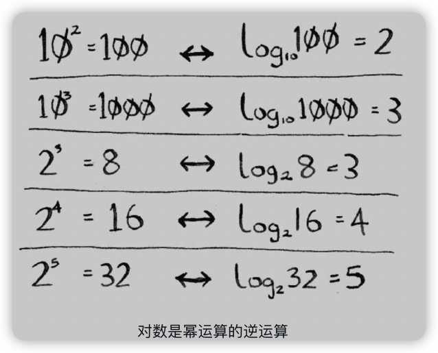

算法图解
----

https://www.manning.com/books/grokking-algorithms

https://github.com/egonschiele/grokking_algorithms

## 1 算法简介


### 1.2 二分查找

二分查找是一种算法，其输入是一个**有序**的元素列表。如果要查找的元素包含在列表中，二分查找返回其位置；否则返回null。

一般而言，对于包含n个元素的列表，用二分查找最多需要log2n步，而简单查找最多需要n步。

10100=2。对数运算是幂运算的逆运算。



### 1.3 大O表示法

算法的速度


随着元素数量的增加，二分查找需要的额外时间并不多，而简单查找需要的额外时间却很多。

简单查找的运行时间为O(n)，二分查找的运行时间为O(log n)。

大O表示法指出了最糟情况下的运行时间。例如，简单查找O(n)，表示最多查找n次，当然也有可能第1次就找到了。

#### 常见的大O运行时间

- O(log n)，也叫对数时间，如二分查找。
- O(n)，也叫线性时间，如简单查找。
- O(n ＊ log n)，如快速排序。
- O(n^2^)，如选择排序。
- O(n! )


#### 旅行商问题

一位旅行商，他准备需要前往n个城市，在所有路线中选取旅程最短的。

所有路线的数量就n的阶乘(n!)，大O表示为O(n!)


 算法运行时间并不以秒为单位，是从其增速的角度度量的，用大O表示法表示。


## 2 选择排序

很多算法仅在数据经过排序后才管用。

需要存储多项数据时，有两种基本方式——数组和链表。

### 数组和链表

Facebook存储用户信息时使用的既不是数组也不是链表。假设Facebook使用的是一种混合数据：**链表数组**。这个数组包含26个元素，每个元素都指向一个链表。例如，该数组的第一个元素指向的链表包含所有以A打头的用户名，第二个元素指向的链表包含所有以B打头的用户名，以此类推。


查找时，其速度比数组慢，但比链表快；而插入时，其速度比数组快，但与链表相当。因此，其查找速度比数组慢，但在各方面都不比链表慢。

另一种混合数据结构——散列表。这个练习应该能让你对如何使用简单数据结构创建复杂的数据结构有大致了解。

Facebook实际使用的是什么呢？很可能是十多个数据库，它们基于众多不同的数据结构：散列表、B树等。数组和链表是这些更复杂的数据结构的基石。


#### 选择排序

基本思想是: 首先在未排序的数列中找到最小(or最大)元素，然后将其存放到数列的起始位置；接着，再从剩余未排序的元素中继续寻找最小(or最大)元素，然后放到已排序序列的末尾。以此类推，直到所有元素均排序完毕。


## 3 递归

恨它的、爱它的以及恨了几年后又爱上它的

伪代码是对手头问题的简要描述，看着像代码，但其实更接近自然语言。

### 递归

在盒子里找钥匙

第一种方法：


```python
def look_for_key(main_box):
  pile=main_box.make_a_pile_to_look_through()
  while pile is not empty:
    box=pile.grab_a_box()
    for item in box:
      if item.is_a_box():
        pile.append(item)
      elif item.is_a_key():
        print "found the key!"
```

第二种方法，递归：


```python
def look_for_key(box):
  for item in box:
    if item.is_a_box():
      look_for_key(item)
    elif item.is_a_key():
      print "found the key!"
```

**递归只是让解决方案更清晰，并没有性能上的优势。**

> “如果使用循环，程序的性能可能更高；如果使用递归，程序可能更容易理解。如何选择要看什么对你来说更重要。”

### 3.2 基线条件和递归条件

由于递归函数调用自己，因此编写这样的函数时很容易出错，进而导致无限循环。

编写递归函数时，必须告诉它**何时停止递归**。正因为如此，每个递归函数都有两部分：

**递归条件**（recursive case）指的是函数调用自己；

**基线条件**（base case）指的是函数不再调用自己，从而避免形成无限循环。


### 3.3 栈

压入（插入）和弹出（删除并读取）

#### 调用栈

```python
def greet(name):
  print "hello, " + name + "! "
  greet2(name)
  print "getting ready to say bye..."
  bye()
def greet2(name):
  print "how are you, " + name + "? "
def bye():
  print "ok bye!"
```


当调用函数greet2时，函数greet只执行了一部分。也就是说**调用另一个函数时，当前函数暂停并处于未完成状态。该函数的所有变量的值都还在内存中。**

greet2调用完后，其内存块从栈顶移除；再调用bye，就添加bye的内存块。


#### 递归调用栈

```python
def fact(x):
  if x == 1:
    return 1
  else:
    return x * fact(x-1)
```

fact(3)调用栈变化：


> 每个fact调用都有自己的x变量。在一个函数调用中不能访问另一个的x变量。

使用栈很方便，缺点是：<u>存储详尽的信息可能占用大量的内存</u>。

🔖 **尾递归**

## 4 快速排序

### 分而治之

分而治之（divide and conquer, D&C）——一种著名的递归式问题解决方法。

使用D&C解决问题的过程包括两个步骤：

1. 找出基线条件，这种条件必须尽可能简单。
2. 不断将问题分解（或者说缩小规模），直到符合基线条件。

D&C要求，<u>每次递归调用都必须缩小问题的规模</u>。

> 问题：将1680m*640m土地均匀地分成方块，且分出的方块要尽可能大。


640*400的又可以划分为400的正方形和400 * 200。


因此，对于最初的那片土地，适用的最大方块为80m×80m。

**==D&C并非可用于解决问题的算法，而是一种解决问题的思路。==**

> 提示：编写涉及数组的递归函数时，基线条件通常是数组为空或只包含一个元素。陷入困境时，请检查基线条件是不是这样的。

🔖 数组求和：循环和递归，函数式编程


### 快速排序

C语言标准库中的函数qsort实现的就是快速排序。快速排序也使用了D&C。

数组进行快速排序。基线条件为数组为空或只包含一个元素。在这种情况下，只需原样返回数组——根本就不用排序。

选择一个数组元素作为**基准值（pivot）**。（可随机选择，暂时选择第一个元素）

[33, 15, 10]

**分区（partioning）**：比基准值小的元素，基准值， 比基准值大的元素


对包含三个元素的数组进行排序的步骤：

1. 选择基准值。
2. 将数组分成两个子数组：小于基准值的元素和大于基准值的元素。
3. 对这两个子数组进行快速排序。

四个元素 [33, 10, 15, 7] ：


......

不管如何选择基准值，都可对划分得到的两个子数组递归地进行快速排序。

> **==归纳证明==**是一种证明算法行之有效的方式，它分两步：基线条件和归纳条件。
>
> 例如，假设我要证明我能爬到梯子的最上面。
>
> 归纳条件：如果我站在一个横档上，就能将脚放到上一个横档上。换言之，如果我站在第二个横档上，就能爬到第三个横档。
>
> 基线条件是这样的，即我已经站在第一个横档上。

```python
def quicksort(array):
	if len(array) < 2:
		return array
	else:
		pivot = array[0]
		less = [i for i in array[1:] if i <= pivot]
		greater = [i for i in array[1:] if 0 > pivot]
		# print(less, '++', [pivot], '++', greater)
		return quicksort(less) + [pivot] + quicksort(greater)

print(quicksort([10, 5, 2, 3]))
# print(quicksort([10, 5, 2, 3, 6, 12, 1, 4]))
```

🔖 Python代码有问题

### 再谈大O表示法

快速排序的独特之处在于，其**速度取决于选择的基准值**。


快速排序的情况比较棘手，在最糟情况下，其运行时间为O(n^2^)，在平均情况下，是O(nlog n)。


## 5 散列表

杂货店商品价格

### 5.1 散列函数

**散列函数**：无论你给它什么数据，它都得到一个数字。这个数字的限制：

- 必须是一致的
- 不同的输入映射到不同的数字

使用散列函数和数组创建了一种被称为**散列表**（hash table）的数据结构。

**数组和链表**都被直接映射到内存，但散列表更复杂，它使用散列函数来确定元素的存储位置。

散列表也被称为<u>哈希表、散列映射、映射、字典和关联数组</u>。

### 5.2 应用案例

#### 将散列表用于查找

电话簿

```python
phone_book=dict()
# phone_book = {}
phone_book["jenny"]=653001234
phone_book["emergency"]=110
```

域名转换为iPhone地址的过程被称为DNS解析（DNS resolution），散列表是提供这种功能的方式之一。

#### 防止重复

投票站

#### 将散列表用作缓存


### 5.3 冲突

要明白散列表的性能，你得先搞清楚什么是冲突。

处理冲突的方式很多，最简单的办法如下：如果两个键映射到了同一个位置，就在这个位置存储一个链表。


如果多个元素映射到同一个位置，就会使散列表速度变慢。


最理想的情况是，散列函数将键均匀地映射到散列表的不同位置。

### 5.4 性能


要避免冲突，需要有：**较低的填装因子； 良好的散列函数**。

#### 填装因子

```
填装因子 = 散列表包含的元素数 / 位置总数
```

调整长度（resizing）

一个不错的经验规则是：一旦填装因子大于0.7，就调整散列表的长度。

#### 良好的散列函数

SHA函数


## 6 广度优先搜索

广度优先搜索（breadth-first search, BFS）能够找出**两样东西之间的最短距离**，不过最短距离的含义有很多！

- 编写国际跳棋AI，计算最少走多少步就可获胜；
- 编写拼写检查器，计算最少编辑多少个地方就可将错拼的单词改成正确的单词，如将READED改为READER需要编辑一个地方；
- 根据你的人际关系网络找到关系最近的医生。

### 6.1 图简介


**最短路径问题（shorterst-pathproblem）**

解决最短路径问题的算法被称为**广度优先搜索**。

### 6.2 图是什么

打牌欠钱


图由**节点（node）**和**边（edge）**组成。

图用于模拟不同的东西是如何相连的。

### 6.3 广度优先搜索

广度优先搜索是一种用于图的查找算法，可帮助回答两类问题。

- 第一类问题：从节点A出发，有前往节点B的路径吗？（在你的人际关系网中，有销售商吗？）
- 第二类问题：从节点A出发，前往节点B的哪条路径最短？（哪个芒果销售商与你的关系最近？）

从朋友中寻找销售商。朋友中找不到，就要在朋友的朋友中寻找。


检查名单中的每个人时，你都将其朋友加入名单。


#### 查找最短路径


在广度优先搜索的执行过程中，搜索范围从起点开始逐渐向外延伸，即先检查一度关系，再检查二度关系。


按添加顺序查找

**广度优先搜索不仅查找从A到B的路径，而且找到的是最短的路径。**

#### 队列

队列类似于栈，你不能随机地访问队列中的元素。队列只支持两种操作：入队和出队。

队列是一种先进先出（First In First Out, FIFO）的数据结构，而栈是一种后进先出（Last In First Out, LIFO）的数据结构。

### 6.4 实现图

```python
graph={}
graph["you"]=["alice", "bob", "claire"]
graph["bob"]=["anuj", "peggy"]
graph["alice"]=["peggy"]
graph["claire"]=["thom", "jonny"]
graph["anuj"]=[]
graph["peggy"]=[]
graph["thom"]=[]
graph["jonny"]=[]
```


有向图（directed graph）

无向图（undirected graph）

### 6.5 实现算法

```python

def search(name):
  search_queue = deque()										# 创建一个队列
	search_queue += graph["you"]							# 将你的邻居（一度关系）加入这个搜索队列中
  searched = [] 														# 记录检查过的人
  while search_queue:												# 只要队列不为空
  	person = search_queue.popleft()					# 就取出其中的第一个人
    if person not in searched:
      if person_is_seller(person):
    		print person + " is a mango seller!"
        return True
      else:
    		search_queue += graph[person] 				# 不会芒果销售商。将这个的朋友都加入搜索队列
        searched.append(person)
	return False

search("you")
```


```python
def person_is_seller(name):
  xxx
```

广度优先搜索的执行过程：


Peggy是两个朋友，这种情况会导致无限循环。因此，检查完一个人后，应将其标记为已检查，且不再检查他。可使用一个列表来记录检查过的人。

广度优先搜索的运行时间为O(人数+边数)，这通常写作**O(V+E)**，其中V为顶点（vertice）数，E为边数。🔖


如果任务A依赖于任务B，在列表中任务A就必须在任务B后面。这被称为**拓扑排序**，使用它可根据图创建一个有序列表。


这种没有往后指的边，是一种特殊的图，被称为**==树==**。


## 7 狄克斯特拉算法

狄克斯特拉算法（Dijkstra's algorithm）能够找出加权图中前往X的最短路径。

### 7.1 使用狄克斯特拉算法

1. 找出最便宜的节点，即可在最短时间内前往的节点。
2. 对于该节点的邻居，检查是否有前往它们的更短路径，如果有，就更新其开销。
3. 重复这个过程，直到对图中的每个节点都这样做了。
4. 计算最终路径。

权重（weight）


### 负权边


## 8 贪婪算法

### 8.1 教室调度问题


### 8.2 背包问题


### 8.3 集合覆盖问题


#### 8.4 NP完全问题


## 9 动态规划


## 10 K最近邻算法


### 创建推荐系统


## 11

### 树


### 反向索引


### 傅里叶变换


### 并行算法


### MapReduce


### 布隆过滤器和HyperLogLog


### SHA算法


### 局部敏感的散列算法


### Diffie-Hellman密钥交换


### 线性规划


