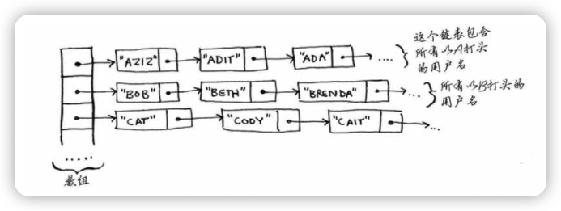
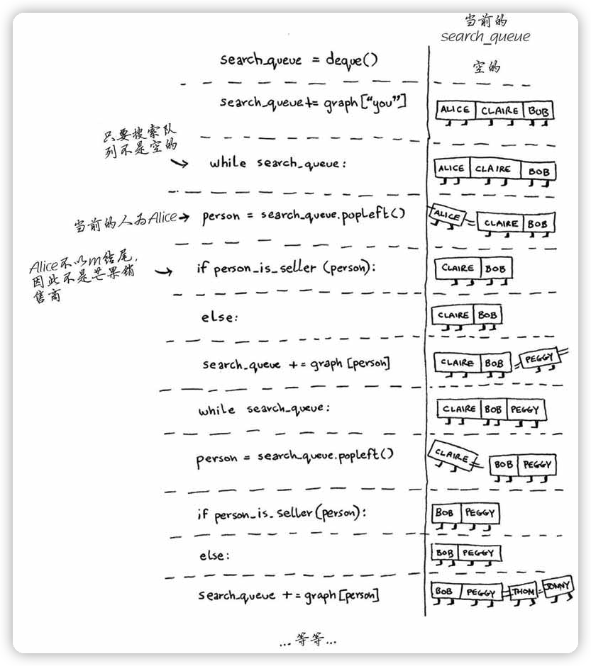
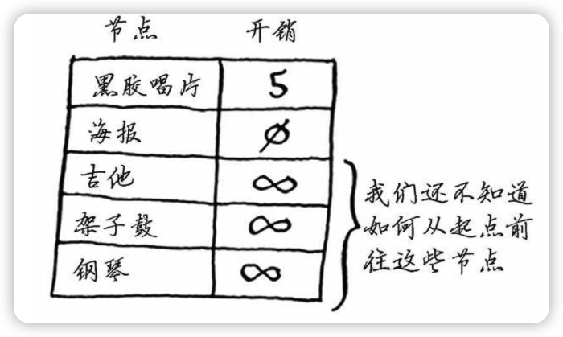

算法图解
----

https://www.manning.com/books/grokking-algorithms

https://github.com/egonschiele/grokking_algorithms

## 1 算法简介


### 1.2 二分查找

二分查找是一种算法，其输入是一个**有序**的元素列表。如果要查找的元素包含在列表中，二分查找返回其位置；否则返回null。

一般而言，对于包含n个元素的列表，用二分查找最多需要log2n步，而简单查找最多需要n步。

10100=2。对数运算是幂运算的逆运算。


### 1.3 大O表示法

算法的速度


随着元素数量的增加，二分查找需要的额外时间并不多，而简单查找需要的额外时间却很多。

简单查找的运行时间为O(n)，二分查找的运行时间为O(log n)。

大O表示法指出了最糟情况下的运行时间。例如，简单查找O(n)，表示最多查找n次，当然也有可能第1次就找到了。

#### 常见的大O运行时间

- O(log n)，也叫对数时间，如二分查找。
- O(n)，也叫线性时间，如简单查找。
- O(n ＊ log n)，如快速排序。
- O(n^2^)，如选择排序。
- O(n! )


#### 旅行商问题

一位旅行商，他准备需要前往n个城市，在所有路线中选取旅程最短的。

所有路线的数量就n的阶乘(n!)，大O表示为O(n!)


 算法运行时间并不以秒为单位，是从其增速的角度度量的，用大O表示法表示。


## 2 选择排序

很多算法仅在数据经过排序后才管用。

需要存储多项数据时，有两种基本方式——数组和链表。

### 数组和链表

Facebook存储用户信息时使用的既不是数组也不是链表。假设Facebook使用的是一种混合数据：**链表数组**。这个数组包含26个元素，每个元素都指向一个链表。例如，该数组的第一个元素指向的链表包含所有以A打头的用户名，第二个元素指向的链表包含所有以B打头的用户名，以此类推。



查找时，其速度比数组慢，但比链表快；而插入时，其速度比数组快，但与链表相当。因此，其查找速度比数组慢，但在各方面都不比链表慢。

另一种混合数据结构——散列表。这个练习应该能让你对如何使用简单数据结构创建复杂的数据结构有大致了解。

Facebook实际使用的是什么呢？很可能是十多个数据库，它们基于众多不同的数据结构：散列表、B树等。数组和链表是这些更复杂的数据结构的基石。


#### 选择排序

基本思想是: 首先在未排序的数列中找到最小(or最大)元素，然后将其存放到数列的起始位置；接着，再从剩余未排序的元素中继续寻找最小(or最大)元素，然后放到已排序序列的末尾。以此类推，直到所有元素均排序完毕。


## 3 递归

恨它的、爱它的以及恨了几年后又爱上它的

伪代码是对手头问题的简要描述，看着像代码，但其实更接近自然语言。

### 递归

在盒子里找钥匙

第一种方法：


```python
def look_for_key(main_box):
  pile=main_box.make_a_pile_to_look_through()
  while pile is not empty:
    box=pile.grab_a_box()
    for item in box:
      if item.is_a_box():
        pile.append(item)
      elif item.is_a_key():
        print "found the key!"
```

第二种方法，递归：


```python
def look_for_key(box):
  for item in box:
    if item.is_a_box():
      look_for_key(item)
    elif item.is_a_key():
      print "found the key!"
```

**递归只是让解决方案更清晰，并没有性能上的优势。**

> “如果使用循环，程序的性能可能更高；如果使用递归，程序可能更容易理解。如何选择要看什么对你来说更重要。”

### 3.2 基线条件和递归条件

由于递归函数调用自己，因此编写这样的函数时很容易出错，进而导致无限循环。

编写递归函数时，必须告诉它**何时停止递归**。正因为如此，每个递归函数都有两部分：

**递归条件**（recursive case）指的是函数调用自己；

**基线条件**（base case）指的是函数不再调用自己，从而避免形成无限循环。


### 3.3 栈

压入（插入）和弹出（删除并读取）

#### 调用栈

```python
def greet(name):
  print "hello, " + name + "! "
  greet2(name)
  print "getting ready to say bye..."
  bye()
def greet2(name):
  print "how are you, " + name + "? "
def bye():
  print "ok bye!"
```


当调用函数greet2时，函数greet只执行了一部分。也就是说**调用另一个函数时，当前函数暂停并处于未完成状态。该函数的所有变量的值都还在内存中。**

greet2调用完后，其内存块从栈顶移除；再调用bye，就添加bye的内存块。


#### 递归调用栈

```python
def fact(x):
  if x == 1:
    return 1
  else:
    return x * fact(x-1)
```

fact(3)调用栈变化：


> 每个fact调用都有自己的x变量。在一个函数调用中不能访问另一个的x变量。

使用栈很方便，缺点是：<u>存储详尽的信息可能占用大量的内存</u>。

🔖 **尾递归**

## 4 快速排序

### 分而治之

分而治之（divide and conquer, D&C）——一种著名的递归式问题解决方法。

使用D&C解决问题的过程包括两个步骤：

1. 找出基线条件，这种条件必须尽可能简单。
2. 不断将问题分解（或者说缩小规模），直到符合基线条件。

D&C要求，<u>每次递归调用都必须缩小问题的规模</u>。

> 问题：将1680m*640m土地均匀地分成方块，且分出的方块要尽可能大。


640*400的又可以划分为400的正方形和400 * 200。


因此，对于最初的那片土地，适用的最大方块为80m×80m。

**==D&C并非可用于解决问题的算法，而是一种解决问题的思路。==**

> 提示：编写涉及数组的递归函数时，基线条件通常是数组为空或只包含一个元素。陷入困境时，请检查基线条件是不是这样的。

🔖 数组求和：循环和递归，函数式编程


### 快速排序

C语言标准库中的函数qsort实现的就是快速排序。快速排序也使用了D&C。

数组进行快速排序。基线条件为数组为空或只包含一个元素。在这种情况下，只需原样返回数组——根本就不用排序。

选择一个数组元素作为**基准值（pivot）**。（可随机选择，暂时选择第一个元素）

[33, 15, 10]

**分区（partioning）**：比基准值小的元素，基准值， 比基准值大的元素


对包含三个元素的数组进行排序的步骤：

1. 选择基准值。
2. 将数组分成两个子数组：小于基准值的元素和大于基准值的元素。
3. 对这两个子数组进行快速排序。

四个元素 [33, 10, 15, 7] ：


......

不管如何选择基准值，都可对划分得到的两个子数组递归地进行快速排序。

> **==归纳证明==**是一种证明算法行之有效的方式，它分两步：基线条件和归纳条件。
>
> 例如，假设我要证明我能爬到梯子的最上面。
>
> 归纳条件：如果我站在一个横档上，就能将脚放到上一个横档上。换言之，如果我站在第二个横档上，就能爬到第三个横档。
>
> 基线条件是这样的，即我已经站在第一个横档上。

```python
def quicksort(array):
	if len(array) < 2:
		return array
	else:
		pivot = array[0]
		less = [i for i in array[1:] if i <= pivot]
		greater = [i for i in array[1:] if 0 > pivot]
		# print(less, '++', [pivot], '++', greater)
		return quicksort(less) + [pivot] + quicksort(greater)

print(quicksort([10, 5, 2, 3]))
# print(quicksort([10, 5, 2, 3, 6, 12, 1, 4]))
```

🔖 Python代码有问题

### 再谈大O表示法

快速排序的独特之处在于，其**速度取决于选择的基准值**。


快速排序的情况比较棘手，在最糟情况下，其运行时间为O(n^2^)，在平均情况下，是O(nlog n)。


## 5 散列表

杂货店商品价格

### 5.1 散列函数

**散列函数**：无论你给它什么数据，它都得到一个数字。这个数字的限制：

- 必须是一致的
- 不同的输入映射到不同的数字

使用散列函数和数组创建了一种被称为**散列表**（hash table）的数据结构。

**数组和链表**都被直接映射到内存，但散列表更复杂，它使用散列函数来确定元素的存储位置。

散列表也被称为<u>哈希表、散列映射、映射、字典和关联数组</u>。

### 5.2 应用案例

#### 将散列表用于查找

电话簿

```python
phone_book=dict()
# phone_book = {}
phone_book["jenny"]=653001234
phone_book["emergency"]=110
```

域名转换为iPhone地址的过程被称为DNS解析（DNS resolution），散列表是提供这种功能的方式之一。

#### 防止重复

投票站

#### 将散列表用作缓存


### 5.3 冲突

要明白散列表的性能，你得先搞清楚什么是冲突。

处理冲突的方式很多，最简单的办法如下：如果两个键映射到了同一个位置，就在这个位置存储一个链表。


如果多个元素映射到同一个位置，就会使散列表速度变慢。


最理想的情况是，散列函数将键均匀地映射到散列表的不同位置。

### 5.4 性能


要避免冲突，需要有：**较低的填装因子； 良好的散列函数**。

#### 填装因子

```
填装因子 = 散列表包含的元素数 / 位置总数
```

调整长度（resizing）

一个不错的经验规则是：一旦填装因子大于0.7，就调整散列表的长度。

#### 良好的散列函数

SHA函数


## 6 广度优先搜索

广度优先搜索（breadth-first search, BFS）能够找出**两样东西之间的最短距离**，不过最短距离的含义有很多！

- 编写国际跳棋AI，计算最少走多少步就可获胜；
- 编写拼写检查器，计算最少编辑多少个地方就可将错拼的单词改成正确的单词，如将READED改为READER需要编辑一个地方；
- 根据你的人际关系网络找到关系最近的医生。

### 6.1 图简介


**最短路径问题（shorterst-pathproblem）**

解决最短路径问题的算法被称为**广度优先搜索**。

### 6.2 图是什么

打牌欠钱


图由**节点（node）**和**边（edge）**组成。

图用于模拟不同的东西是如何相连的。

### 6.3 广度优先搜索

广度优先搜索是一种用于图的查找算法，可帮助回答两类问题。

- 第一类问题：从节点A出发，有前往节点B的路径吗？（在你的人际关系网中，有销售商吗？）
- 第二类问题：从节点A出发，前往节点B的哪条路径最短？（哪个芒果销售商与你的关系最近？）

从朋友中寻找销售商。朋友中找不到，就要在朋友的朋友中寻找。


检查名单中的每个人时，你都将其朋友加入名单。


#### 查找最短路径


在广度优先搜索的执行过程中，搜索范围从起点开始逐渐向外延伸，即先检查一度关系，再检查二度关系。


按添加顺序查找

**广度优先搜索不仅查找从A到B的路径，而且找到的是最短的路径。**

#### 队列

队列类似于栈，你不能随机地访问队列中的元素。队列只支持两种操作：入队和出队。

队列是一种先进先出（First In First Out, FIFO）的数据结构，而栈是一种后进先出（Last In First Out, LIFO）的数据结构。

### 6.4 实现图

```python
graph={}
graph["you"]=["alice", "bob", "claire"]
graph["bob"]=["anuj", "peggy"]
graph["alice"]=["peggy"]
graph["claire"]=["thom", "jonny"]
graph["anuj"]=[]
graph["peggy"]=[]
graph["thom"]=[]
graph["jonny"]=[]
```


**有向图（directed graph）**

**无向图（undirected graph）**

### 6.5 实现算法

```python

def search(name):
  search_queue = deque()										# 创建一个队列
	search_queue += graph["you"]							# 将你的邻居（一度关系）加入这个搜索队列中
  searched = [] 														# 记录检查过的人
  while search_queue:												# 只要队列不为空
  	person = search_queue.popleft()					# 就取出其中的第一个人
    if person not in searched:
      if person_is_seller(person):
    		print person + " is a mango seller!"
        return True
      else:
    		search_queue += graph[person] 				# 不会芒果销售商。将这个的朋友都加入搜索队列
        searched.append(person)
	return False

search("you")
```


```python
def person_is_seller(name):
  xxx
```

广度优先搜索的执行过程：



Peggy是两个朋友，这种情况会导致无限循环。因此，检查完一个人后，应将其标记为已检查，且不再检查他。可使用一个列表来记录检查过的人。

广度优先搜索的运行时间为O(人数+边数)，这通常写作**O(V+E)**，其中V为顶点（vertice）数，E为边数。🔖


如果任务A依赖于任务B，在列表中任务A就必须在任务B后面。这被称为**拓扑排序**，使用它可根据图创建一个有序列表。


这种没有往后指的边，是一种特殊的图，被称为**==树==**。


## 7 狄克斯特拉算法

狄克斯特拉算法（Dijkstra's algorithm）能够找出**==加权图中前往X的最短路径==**。


### 7.1 使用狄克斯特拉算法


狄克斯特拉算法包含4个步骤：

1. 找出最便宜的节点，即可在最短时间内前往的节点。
2. 对于该节点的邻居，检查是否有前往它们的更短路径，如果有，就更新其开销。
3. 重复这个过程，直到对图中的每个节点都这样做了。
4. 计算最终路径。

具体列子的**第一步**，假设起点到终点目前是无穷大。


**第二步**：计算起点经节点B前往其各个邻居所需的时间。发现有到A和终点的开销更小的路径，更新。


第三步：重复！计算起点经节点A前往其各个邻居所需的时间。发现到终点更小的路径（ 2 + 3 + 1 =6），更新。


对每个节点都运行了狄克斯特拉算法（除终点）。


### 7.2 术语

**==权重（weight）==**

带权重的图称为==**加权图（weighted graph）**==，不带权重的图称为**==非加权图（unweighted graph）==**。

要计算非加权图中的最短路径，可使用广度优先搜索。要计算加权图中的最短路径，可使用狄克斯特拉算法。


在无向图中，每条边都是一个环。狄克斯特拉算法只适用于有向无环图（directedacyclic graph, DAG）。

### 7.3 物品交换


图中的节点是大家愿意拿出来交换的东西，边的权重是交换时需要额外加多少钱。

> 哪种路径将乐谱换成钢琴时需要支付的额外费用最少？



**第一步**：找出最便宜的节点。

> 狄克斯特拉算法背后的关键理念：**找出图中最便宜的节点，并确保没有到该节点的更便宜的路径**！

**第二步**：计算前往该节点的各个邻居的开销。


**再次执行第一步**：下一个最便宜的节点是黑胶唱片——需要额外支付5美元。

**再次执行第二步**：更新黑胶唱片的各个邻居的开销。


下一个最便宜的是吉他，因此更新其邻居的开销。


更新最后节点架子鼓的开销。


通过沿父节点回溯，便得到了完整的交换路径。


### 7.4 负权边


如果有负权边，要找出最短路径，就不能使用狄克斯特拉算法，可使用**贝尔曼-福德算法（Bellman-Ford algorithm）**。

### 7.5 实现


需要三个散列表：


随着算法的进行，将不断更新costs和parents。

```python
graph["start"]={}
graph["satart"]["a"]=6
graph["satart"]["b"]=2
graph["a"]={}
graph["a"]["fin"]=1
graph["b"]={}
graph["b"]["a"]=3
graph["b"]["fin"]=5
graph["fin"]={} 		# 终点没有邻居
```

开销表：

```python
infinity=float("inf")   # python中表示无穷大的方式
costs={}
costs["a"]=6
costs["b"]=2
costs["fin"]=infinity
```

存储父节点的表：

```python
parents={}
parents["a"]="start"
parents["b"]="start"
parents["fin"]=None
```

最后需要一个数组，用于记录处理过的节点，因为对于同一个节点，不用处理多次。

```python
processed=[]
```

算法：


```python
node = find_lowest_cost_node(costs)			# 在未处理的节点中找出开销最小的节点
while node is not None:									# 循环在所有节点都被处理过后结束
  cost = costs[node]
  neighbors = graph[node]
  for n in neighbors.keys():						# 遍历当前节点的所有邻居
  	new_cost = cost + neighbors[n]
    if costs[n] > new_cost							#
    	cost[n] = new_cost
      parents[n] = node
  processed.append(node)
  node = find_lowest_cost_node(costs)
```

```python
def find_lowest_cost_node(costs):
  lowest_cost = float("inf")
  lowest_cost_node = None
  for node in cost:
    cost = costs[node]
    if cost < lowest_cost and node not in processed:
      lowest_cost = cost
      lowest_cost_node = node
  return lowest_cost_node
```


## 8 贪婪算法

### 8.1 教室调度问题

一间教室安排尽可能多的课程：


贪婪算法很简单：**每步都采取最优的做法**。每次都选择结束最早的课。

用专业术语说，就是每步都选择<u>局部最优解</u>，最终得到的就是<u>全局最优解</u>。

贪婪算法并非在任何情况下都行之有效，但它易于实现！

### 8.2 背包问题

假设你是个贪婪的小偷，背着可装35磅（1磅≈0.45千克）重东西的背包，在商场伺机盗窃各种可装入背包的商品。怎么往背包中装入价值最高的商品？

> 启示：**==在有些情况下，完美是优秀的敌人==**。有时候，你只需找到一个能够大致解决问题的算法，此时贪婪算法正好可派上用场，因为它们实现起来很容易，得到的结果又与正确结果相当接近。


### 8.3 集合覆盖问题

假设你办了个广播节目，要让全美50个州的听众都收听得到。为此，你需要决定在哪些广播台播出。在每个广播台播出都需要支付费用，因此你力图在尽可能少的广播台播出。

每个广播台都覆盖特定的区域，不同广播台的覆盖区域可能重叠。


<u>如何找出覆盖全美50个州的最小广播台集合呢？</u>听起来很容易，但其实非常难。具体方法如下。

1. 列出每个可能的广播台集合，这被称为**幂集**（power set）。可能的子集有2^n^个。（n是广播台数目）
2. 在这些集合中，选出覆盖全美50个州的最小集合。

问题是计算每个可能的广播台子集需要很长时间。由于可能的子集有2^n^个，因此运行时间为O(2^n^)。

假设每秒可计算10个子集，所需的时间将如下：


利用贪婪算法可得到非常接近的解：

1. 选出这样一个广播台，即它覆盖了最多的未覆盖州。即便这个广播台覆盖了一些已覆盖的州，也没有关系。
2. 重复第一步，直到覆盖了所有的州。

这是一种**==近似算法==（approximation algorithm）**。在获得精确解需要的时间太长时，可使用近似算法。判断近似算法优劣的标准如下：

- 速度有多快；
- 得到的近似解与最优解的接近程度。

上面例子中，贪婪算法的运行时间为O(n^2^)。


```python
# 创建一个包含要覆盖的州
states_needed = set(["mt", "wa", "or", "id", "nv", "ut", "ca", "az"])
# 广播台
stations={}
stations["kone"]=set(["id", "nv", "ut"])
stations["ktwo"]=set(["wa", "id", "mt"])
stations["kthree"]=set(["or", "nv", "ca"])
stations["kfour"]=set(["nv", "ut"])
stations["kfive"]=set(["ca", "az"])
# 最终选择广播台
final_stations=set()

while states_needed:
  best_station=None
  states_covered=set()
  for station, states_for_station in stations.items():
    covered = states_needed & states_for_station
    if len(covered) > len(states_covered):
      best_station = station
      states_covered = covered
  
  states_needed -= states_covered
  final_stations.add(best_station)
```


🔖

### 8.4 NP完全问题

旅行商问题和集合覆盖问题有一些共同之处：你需要计算所有的解，并从中选出最小/最短的那个。这两个问题都属于**NP完全问题**。

NP完全问题的简单定义是，**以难解著称的问题**。很多非常聪明的人都认为，**根本不可能编写出可快速解决这些问题的算法**。

#### 如何识别NP完全问题

- 元素较少时算法的运行速度非常快，但随着元素数量的增加，速度会变得非常慢。
- 涉及“所有组合”的问题通常是NP完全问题。
- 不能将问题分成小问题，必须考虑各种可能的情况。这可能是NP完全问题。
- 如果问题涉及序列（如旅行商问题中的城市序列）且难以解决，它可能就是NP完全问题。
- 如果问题涉及集合（如广播台集合）且难以解决，它可能就是NP完全问题。
- 如果问题可转换为集合覆盖问题或旅行商问题，那它肯定是NP完全问题。

## 9 动态规划🔖

### 9.1 背包问题

每个动态规划算法都从一个网格开始。

动态规划从小问题着手，逐步解决大问题。这里解决的子问题将帮助你解决大问题。

### 9.2 背包问题FAQ

#### 再增加一件商品将如何呢

#### 行的排列顺序发生变化时结果将如何

#### 可以逐列而不是逐行填充网格吗

#### 增加一件更小的商品将如何呢

#### 可以偷商品的一部分吗

使用动态规划时，要么考虑拿走整件商品，要么考虑不拿，而没法判断该不该拿走商品的一部分。

#### 旅游行程最优化


这也是一个背包问题！但约束条件不是背包的容量，而是有限的时间；不是决定该装入哪些商品，而是决定该去游览哪些名胜。

#### 处理相互依赖的情况

没办法建模。动态规划功能强大，它能够解决子问题并使用这些答案来解决大问题。但**仅当每个子问题都是离散的，即不依赖于其他子问题时**，动态规划才管用。

#### 计算最终的解时会涉及两个以上的子背包吗

#### 最优解可能导致背包没装满吗


### 9.3 最长公共子串

- 动态规划可帮助你在给定约束条件下找到最优解。在背包问题中，你必须在背包容量给定的情况下，偷到价值最高的商品。
- 在问题可分解为彼此独立且离散的子问题时，就可使用动态规划来解决。


- 每种动态规划解决方案都涉及网格。
- 单元格中的值通常就是你要优化的值。在前面的背包问题中，单元格的值为商品的价值。
- 每个单元格都是一个子问题，因此你应考虑如何将问题分成子问题，这有助于你找出网格的坐标轴。

#### 绘制网格

- 单元格中的值是什么？
- 如何将这个问题划分为子问题？
- 网格的坐标轴是什么？

#### 填充网格

**费曼算法（Feynman algorithm）**：

1. 将问题写下来。
2. 好好思考。
3. 将答案写下来。

#### 揭晓答案


#### 最长公共子序列


## 10 K最近邻算法🔖

### 10.1 橙子还是柚子


K最近邻（k-nearest neighbours, **KNN**）算法

要对东西进行分类时，可首先尝试这种算法。

### 10.2 创建推荐系统

#### 特征抽取

要计算两点的距离，可使用毕达哥拉斯公式。 $\sqrt{(x_{1}-x_{2})^{2} + (y_{1}-y_{2})^{2}}$


如果你是Netflix用户，Netflix将不断提醒你：多给电影评分吧，你评论的电影越多，给你的推荐就越准确。其中的原因：**你评论的电影越多，Netflix就越能准确地判断出你与哪些用户类似。**

#### 回归（regression）

使用KNN来做两项基本工作——分类和回归：

- 分类就是编组；
- 回归就是预测结果（如一个数字）。


#### 挑选合适的特征

使用KNN时，挑选合适的特征进行比较至关重要。所谓合适的特征，就是：

- 与要推荐的电影紧密相关的特征；
- 不偏不倚的特征（例如，如果只让用户给喜剧片打分，就无法判断他们是否喜欢动作片）。


### 10.3 机器学习简介

KNN算法真的是很有用，堪称你进入神奇的机器学习领域的领路人！

#### OCR

OCR，光学字符识别（optical character recognition）。

OCR的第一步是查看大量的数字图像并提取特征，这被称为**训练（training）**。

#### 创建垃圾邮件过滤器

朴素贝叶斯分类器（Naive Bayesclassifier）

#### 预测股票市场


## 11 更多算法

### 11.1 树

二叉查找树（binary search tree），对于其中的每个节点，左子节点的值都比它小，而右子节点的值都比它大。

在二叉查找树中查找节点时，平均运行时间为O(log n)，但在最糟的情况下所需时间为O(n)。


### 11.2 反向索引🔖

一个散列表，将单词映射到包含它的页面。这种数据结构被称为反向索引（inverted index），常用于创建搜索引擎。


### 11.3 傅里叶变换

给它一杯冰沙，它能告诉你其中包含哪些成分。

给定一首歌曲，傅里叶变换能够将其中的各种频率分离出来。

如果能够将歌曲分解为不同的频率，就可强化你关心的部分，如<u>强化低音并隐藏高音</u>。

傅里叶变换非常适合用于处理信号，可使用它来压缩音乐。将音频文件分解为**音符**。傅里叶变换能够准确地指出各个**音符对整个歌曲的贡献**，让你能够将不重要的音符删除。这就是**MP3**格式的工作原理！

数字信号并非只有音乐一种类型。JPG也是一种压缩格式，原理类似。

傅里叶变换还被用来地震预测和DNA分析。

使用傅里叶变换可创建类似于Shazam这样的音乐识别软件。

傅里叶变换的用途极其广泛。

### 并行算法


### 11.5 MapReduce

分布式算法：一种特殊的并行算法。

Apache Hadoop

分布式算法非常适合用于在短时间内完成海量工作，其中的MapReduce基于两个简单的理念：**映射（map）函数和归并（reduce）函数**。


### 11.6 布隆过滤器和HyperLogLog

判断网页是否已搜集？

布隆过滤器是一种概率型数据结构，它提供的答案有可能不对，但很可能是正确的。

使用散列表能保证答案绝对可靠，但必须存储Google搜集过的所有URL。

布隆过滤器的优点在于占用的存储空间很少。

HyperLogLog是一种类似于布隆过滤器的算法。


### 11.7 SHA算法

#### 比较文件

另一种散列函数是**安全散列算法（secure hash algorithm, SHA）**函数。给定一个字符串，SHA返回其散列值。


#### 检查密码

SHA实际上是一系列算法：SHA-0、SHA-1、SHA-2和SHA-3。本书编写期间，SHA-0和SHA-1已被发现存在一些缺陷。

当前，最安全的密码散列函数是**bcrypt**，但没有任何东西是万无一失的。


### 11.8 局部敏感的散列算法

SHA是局部不敏感的，就是一个字符串修改一个字符，在通过SHA计算散列值变化非常大。

有时候希望散列函数是局部敏感的。在这种情况下，可使用**==Simhash==**。如果你对字符串做细微的修改，Simhash生成的散列值也只存在细微的差别。这让你能够通过比较散列值来判断两个字符串的相似程度，这很有用！

- Google使用Simhash来判断网页是否已搜集。
- 老师可以使用Simhash来判断学生的论文是否是从网上抄的。
- Scribd允许用户上传文档或图书，以便与人分享，但不希望用户上传有版权的内容！这个网站可使用Simhash来检查上传的内容是否与小说《哈利·波特》类似，如果类似，就自动拒绝。

需要检查两项内容的相似程度时，Simhash很有用。


### 11.9 Diffie-Hellman密钥交换

> 如何对消息进行加密，以便只有收件人才能看懂呢？


### 11.10 线性规划

线性规划用于在给定约束条件下最大限度地改善指定的指标。

